> IntelliJ IDEA 2020.3 在调试器中添加了交互式提示和内联监视，改进了对 Java 15 的支持，并且引入了对 Git 暂存的支持以及其他各种功能。

## 用户体验

### 新的欢迎屏幕
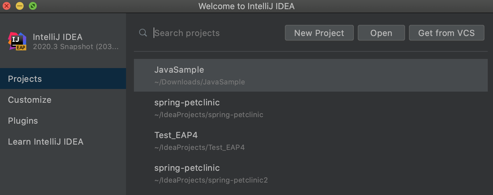 IntelliJ IDEA 欢迎屏幕已重新设计。 初始向导已替换为包含四个选项卡的快速访问屏幕：用于管理项目的 _Projects_、用于设置 IDE 界面的 _Customize_、用于插件安装的 _Plugins_ 以及用于访问帮助和学习资源的 _Learn IntelliJ IDEA_。

### IDE 主题已与操作系统设置同步
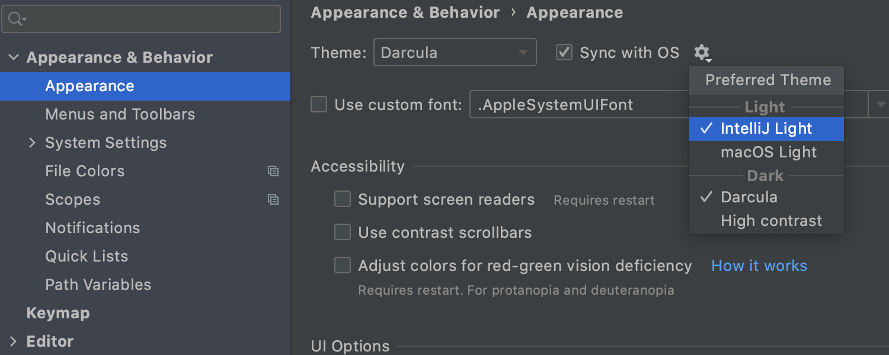 IntelliJ IDEA 现在可以将其主题与您的操作系统主题同步。 要启用此功能，请转到 _Settings / Preferences | Appearance & Behavior | Appearance_，然后勾选 _Sync with OS_ 复选框。 点击 _Sync with OS_ 旁边的齿轮图标来选择您的首选主题。

### 阅读器模式
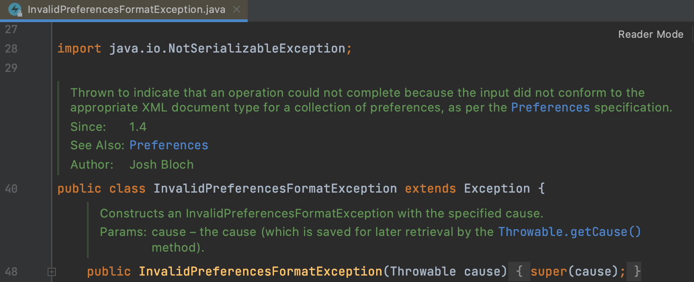 现在，默认会在_阅读器模式_下打开只读文件和外部库中的文件。 在此模式下，注释看起来像启用了格式化的文本和字体连字，这有助于使代码更易于用户阅读。 您可以在 _Settings / Preferences | Editor | Reader Mode_ 中自定义阅读器模式设置。

### Search Everywhere 更新
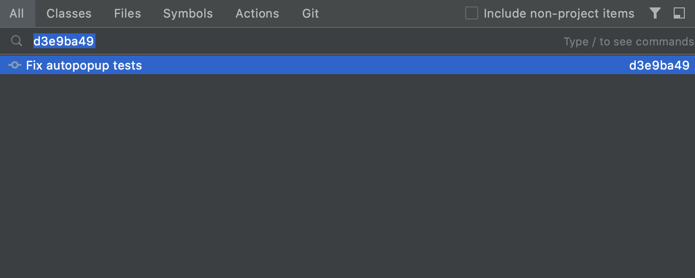 我们在 _Search Everywhere_ 对话框中添加了一个新的 _Git_ 选项卡。 现在，您可以在 _Search Everywhere_ 对话框中查找提交哈希和消息、标记以及分支。 您还可以在搜索字段中执行简单的数学计算。

### 预览选项卡
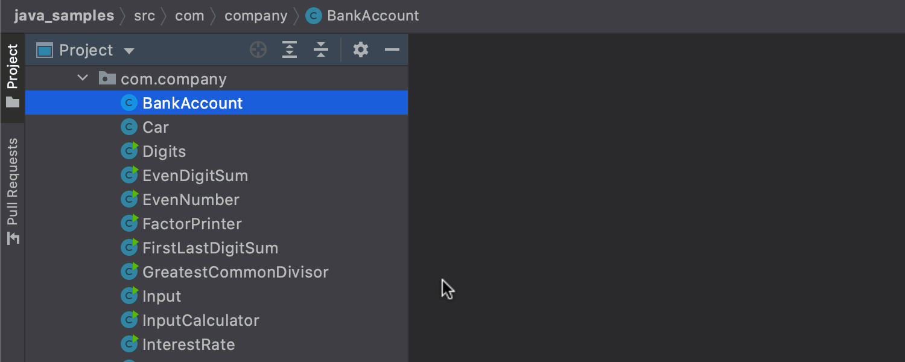 现在，您只需点击一下即可在预览选项卡中打开文件。 在预览选项卡中打开文件时，文件的名称以斜体显示。 如果您开始编辑此文件，它将不再是预览，而是变为一个普通文件。 如果点击另一个文件在预览模式下将其打开，它将显示在同一个选项卡中，替换之前打开的文件。 要启用此功能，请点击 _Project 视图_中的齿轮图标，然后选择 _Enable Preview Tab_。

## 编辑器

### 新的 Extract method 布局
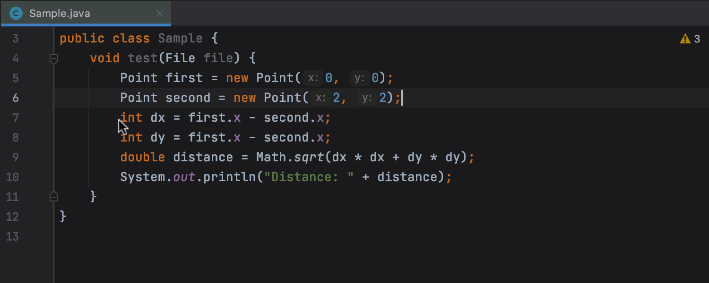 我们简化了提取 Java 方法的过程 - 只需在 Mac 上按 ⌥⌘M、在 Windows 或 Linux 上按 Ctrl+Alt+M 或者选择 _Refactor / Extract / Introduce / Method…_，IDE 便会立即执行提取。

### 以更直观的方式访问 Rename 设置
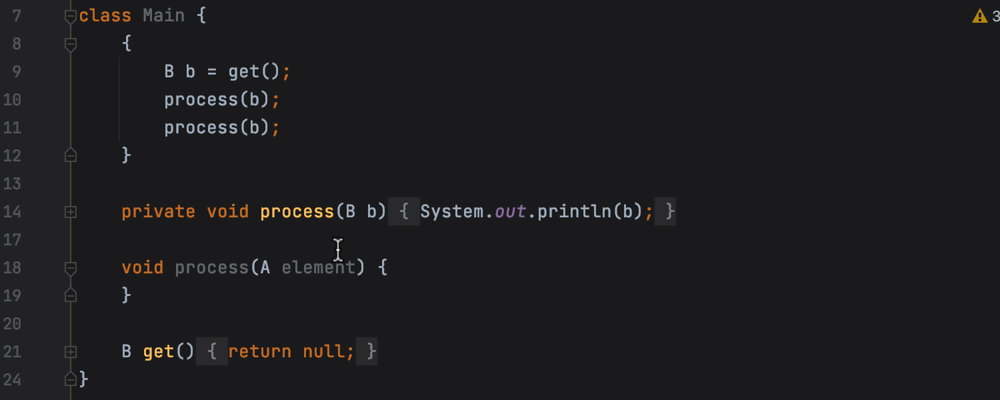 通过内嵌提示中显示的新 Rename 偏好设置，现在可以选择是要重命名注释和字符串文字中的实例还是可打印文本中的实例。 要调用此提示，请在 Mac 上按 ⇧F6 或在 Windows 和 Linux 上按 Shift+F6，然后按 _Tab_。 您可以在 _Settings / Preferences | Keymap_ 中更改 _Show Options Popup for In-place Refactoring_ 的快捷键。

### 拖放选项卡
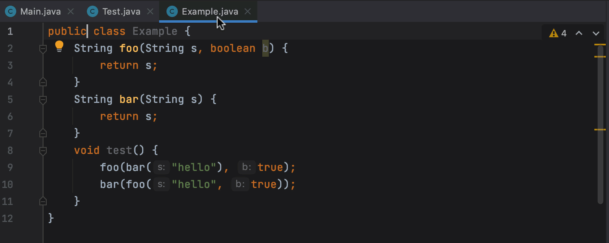 现在，如果要在处理项目时打开多个选项卡，可以拖放文件选项卡以水平或垂直拆分编辑器。 此外，我们还引入了 _Open in Right Split_ 操作，此操作可在文件处于打开状态时垂直拆分编辑器。 可从 _Project_ 视图或其他导航弹出窗口（例如 _Recent Files_、_Search Everywhere_ 和 _Navbar_）中调用此操作。

### 固定的选项卡改进
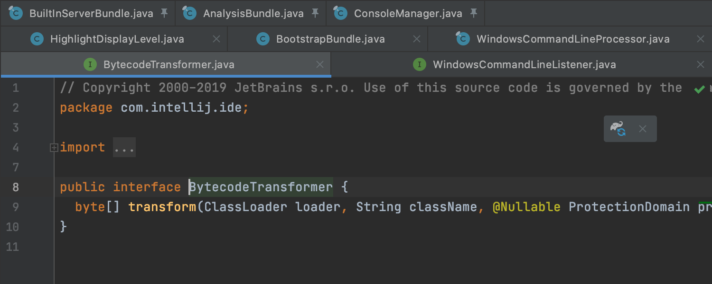 在 v2020.3 中，对于固定的选项卡，将显示新的固定图标。 当您点击它时，便会取消固定文件。 您还可以通过将选项卡拖放到其他固定或取消固定的文件上，以此来固定和取消固定选项卡。 如果您倾向于打开许多选项卡，则可以将所有固定的选项卡都放在一行中。 为此，请转到 _Settings / Preferences | Editor | General | Editor Tabs_，然后勾选 _Show pinned tabs in a separate row_ 复选框。

### 改进了 Markdown 编辑和预览
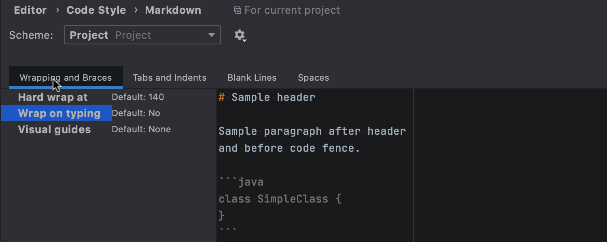 [Markdown 工具](https://www.jetbrains.com/help/idea/markdown.html)现在具有更好的预览 UI 和改进的 UX。 您可以在 _Settings / Preferences | Editor | Code Style | Markdown_ 中自定义 Markdown 格式。 在 Mac 上按 ⌘+Alt+L 或者在 Windows 或 Linux 上按 Ctrl+Alt+L 来应用格式设置。 编辑器右上角的 _Auto-Scroll Preview_ 按钮允许您同步滚动预览窗格和编辑器。 我们还添加了对 [Mermaid.js](https://mermaid-js.github.io/mermaid/#/) 的支持。

### 将 IntelliJ IDEA 设置为打开文件的默认应用程序
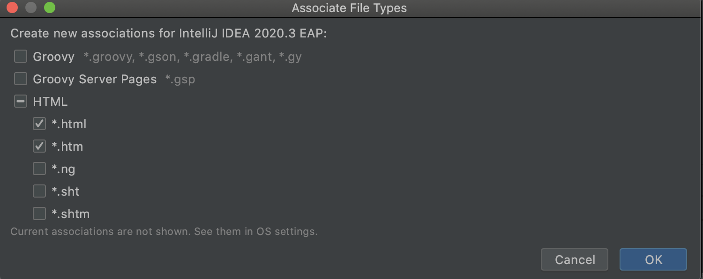 现在，您可以将 IntelliJ IDEA 设置为打开文件的默认应用程序。 在 _Preferences | Settings / Editor / File Types_ 中，点击 _Associate file types with IntelliJ IDEA_… 按钮。 在打开的对话框中，选择要在 IDE 中打开的文件的扩展名。 如果您使用 macOS，则需要重新启动计算机才能应用这些变更。

### 每个模板多个文件
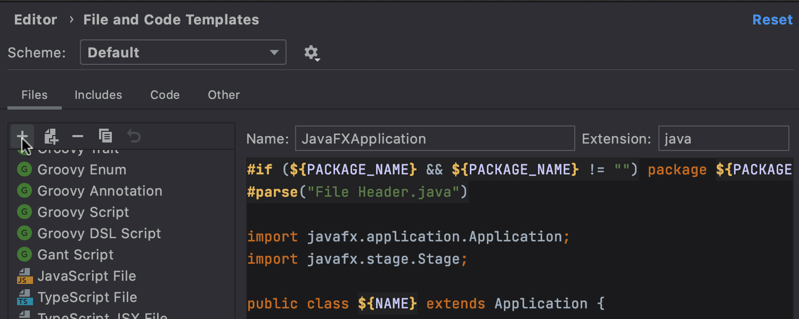 在 _Preferences / Settings | Editor | File and Code Templates_ 中，现在可以添加会创建多个文件的模板。 首先，点击 + 新建一个模板。 要向其中添加另一个文件，请点击 + 旁边的 _Create Child Template File_ 图标。 在 _File name_ 字段中，您可以使用 _Description_ 部分中列出的变量输入模式以生成文件名和路径。

## 调试器
### 交互式提示
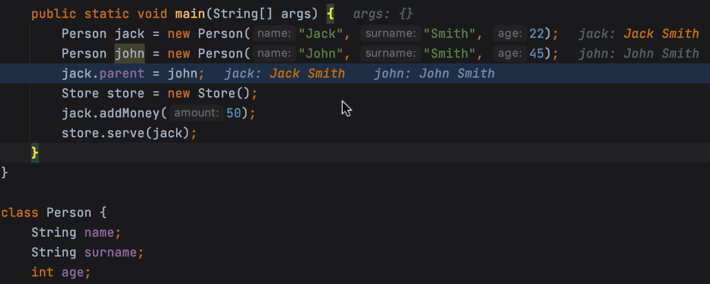 当您的应用程序在调试模式下运行时，您可以点击变量来获取内联提示，提示中包含可以更改其值的相关字段。 点击此新内联提示中的 _Create Renderer_ 可打开一个对话框，您将能够在其中配置所有调试器视图中内联值的显示。

### 内联监视
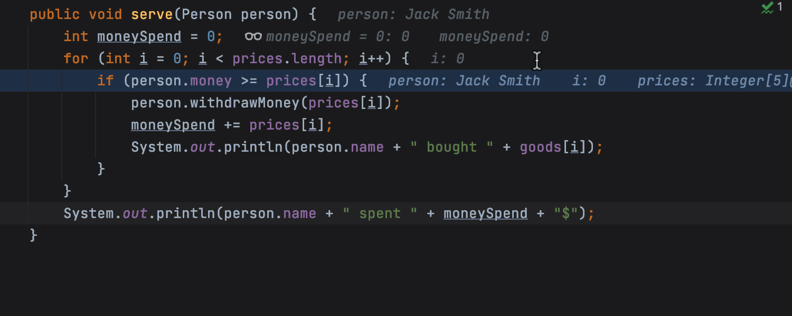 我们添加了一种新型监视表达式，这种表达式将与特定的上下文相关联并显示在编辑器中。 要创建这些新的监视表达式，可以在内联提示弹出窗口中点击 _Add as Inline Watch_，从上下文菜单中选择 _Add Inline Watch_，或者右键点击编辑器中的变量。 您可以在 _Debug_ 工具窗口的 _Variables_ 选项卡中的新 _Inline Watches_ 节点中管理内联监视。

### Java 调试器中的基本内存分析
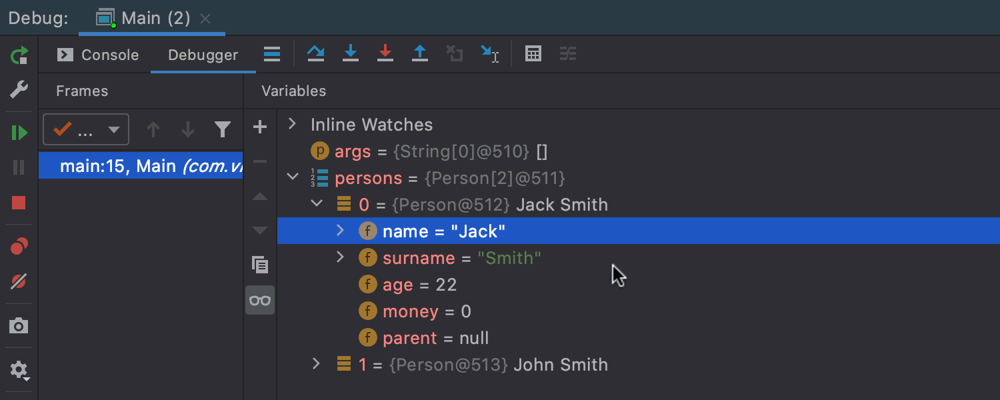 现在，当调试器运行时，可以使用基本的分析选项。 从 _Debug_ 工具窗口的上下文菜单中调用新的分析功能。 第一个功能是 _Show referring objects_，用于查找从对象到 GC 根的最短路径。 第二个功能是 _Calculate retained size_，用于计算对象的保留大小并显示其保留集。

## 版本控制

### Git 暂存支持
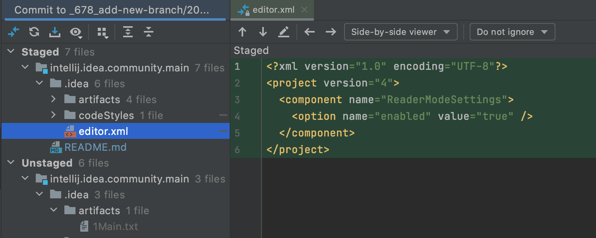 现在，您可以直接从 IDE 暂存变更。 要启用此功能，请转到 _Settings / Preferences | Version Control | Git_，然后勾选 _Enable staging area_ 复选框。 点击 + 图标，将文件添加到 _Commit_ 视图的新 _Staged_ 节点中。 您还可以直接从间距或在 Diff 视图中暂存变更。

### 重新排列了 VCS 菜单
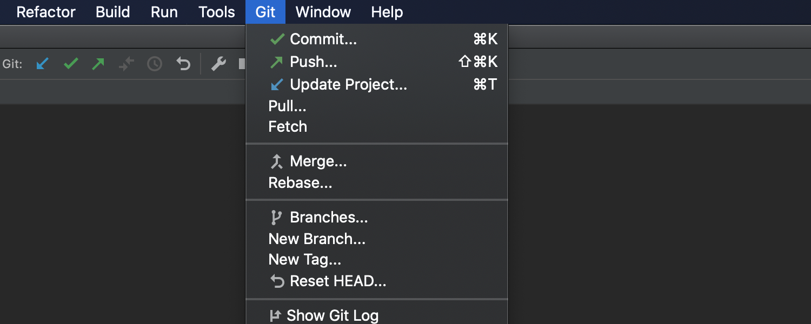 现在，将根据您当前使用的版本控制系统来命名 VCS 菜单。 我们移除了对项目进行版本控制最有用的操作以外的所有其他操作，使菜单变得更加简洁。 如果您的项目仅使用 Git，则 VCS 菜单将如上图所示。

### 改进了分支
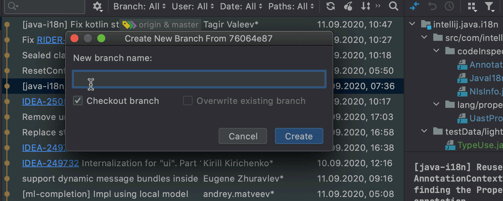 创建新分支时，IDE 会自动更正分支名称中未被接受的符号。 我们重新设计了当前分支的上下文菜单，以显示相关操作。 对于远程分支，我们将 _Merge into Current 和 Rebase Current onto Selected_ 操作分别重命名为 _Pull into Current Using Merge_ 和 _Pull into Current Using Rebase_。

## 