 本节主要介绍在设置中的 Appearances 板块的各个配置和含义。如果想了解更加详细的信息，可以往下观看

## 1. 配置主题
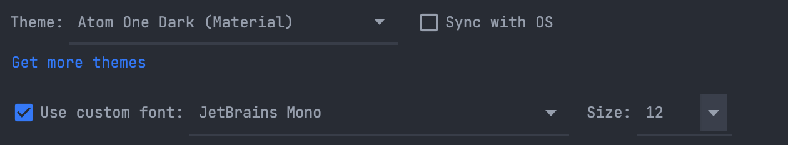 这个小板块主要是可以针对主题 字体 和字号进行配置，点击 Get more themes 会跳往主题商店。也可以点击 Sync with OS 编辑器会默认跟随系统的主题进行 Light 和 Dark 的切换。

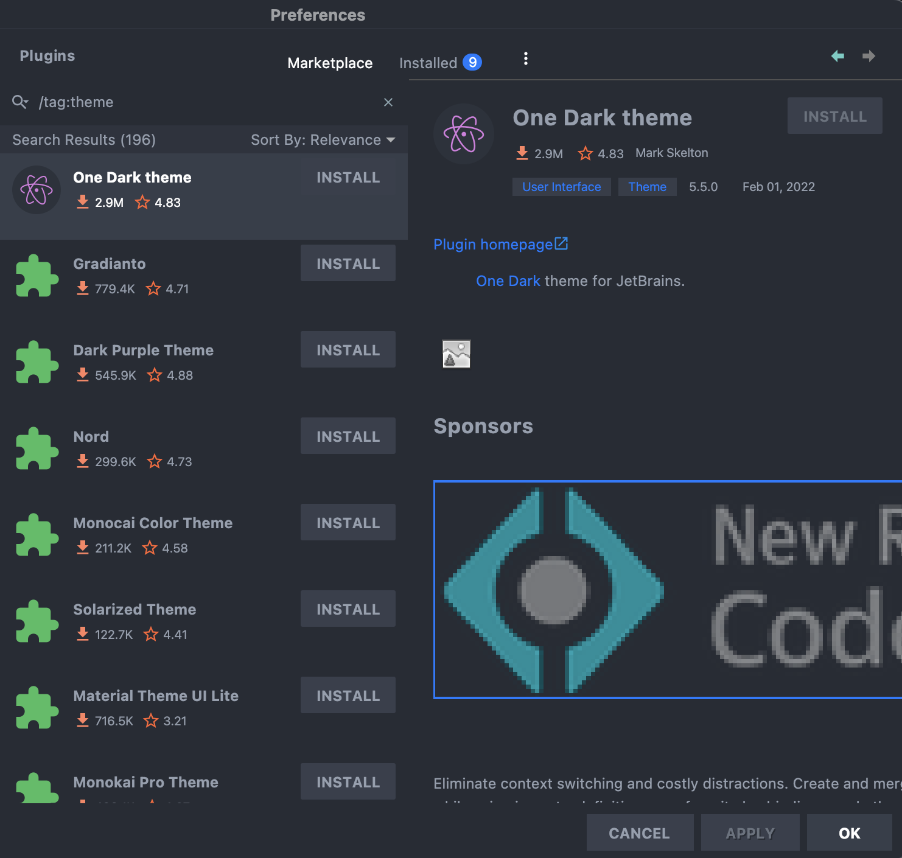 点击跳往主题商店。

## 2. Accessibility | 可达性
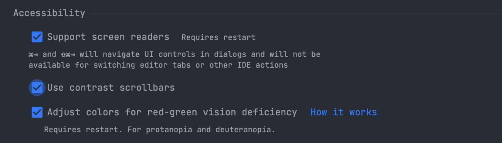 主要重点讲一下第三个模式，针对「红绿色盲 患者，编辑器会对颜色做响应的优化调整。

## 3. UI Options
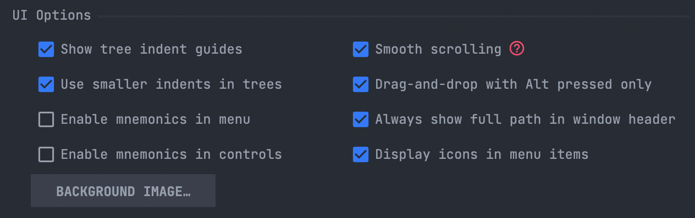 本模块更多是对于显示的区别
### show Tree identity guides
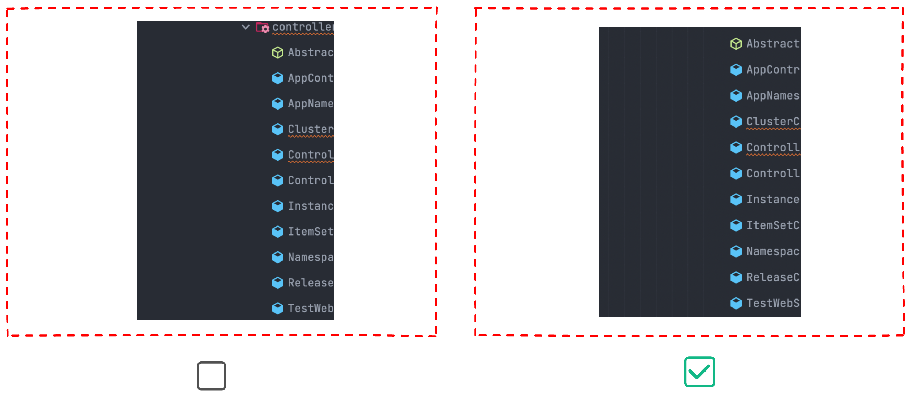
### Use smaller indents in trees
减少工具窗口边框和树视图中文本之间的空间量。 不过我在试验的时候 发现区别不是很大 基本上可以忽略。

### Enable mnemonics in menu
在菜单中启用助记符「我也不太明白是什么意思」

### Enable mnemonics in controls
在控件中启用助记符「我也不太明白是什么意思」

### Smooth scrolling
平滑滚动 UI 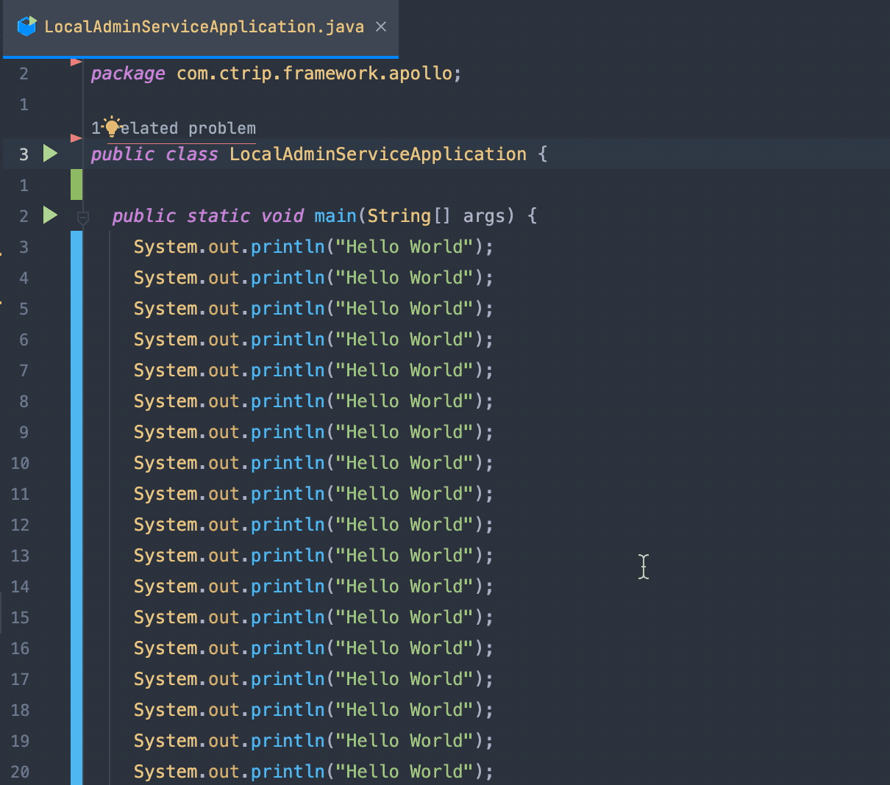 **未开启**

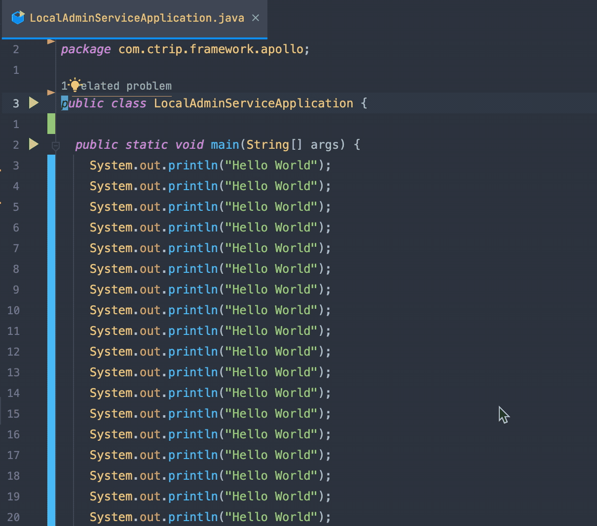 **开启后**

### Drag-and-drop with Alt pressed only
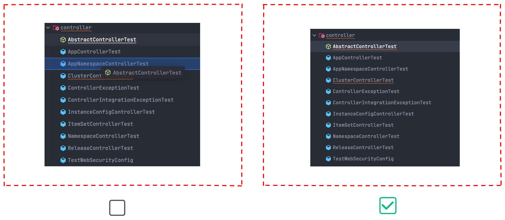

### Always show full path in window header
始终在窗口标题中显示完整路径 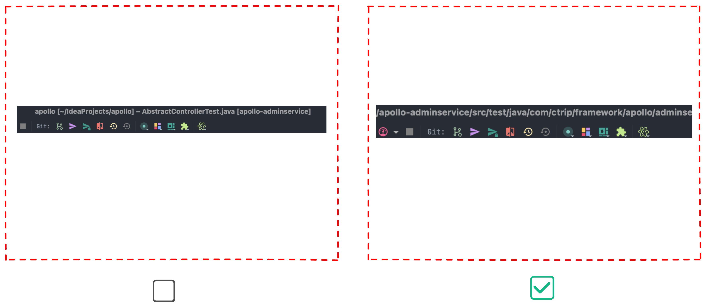
### Display icons in menu items
在菜单项中显示图标 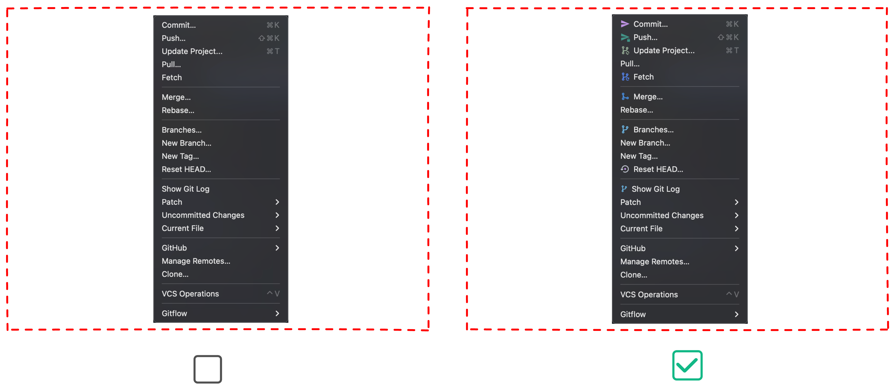

## 4. Tool windows
工具窗口 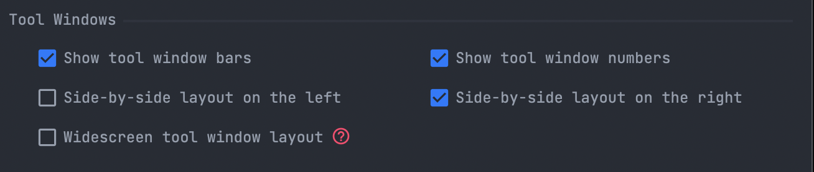
### Show tool windown bars
显示工具栏 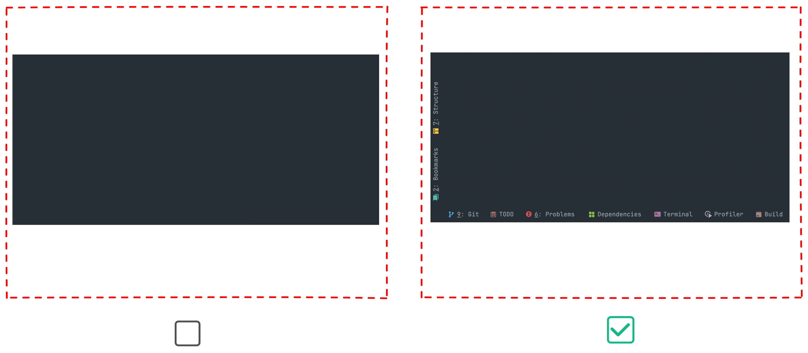
### Show tool window numbers
显示工具栏序列号 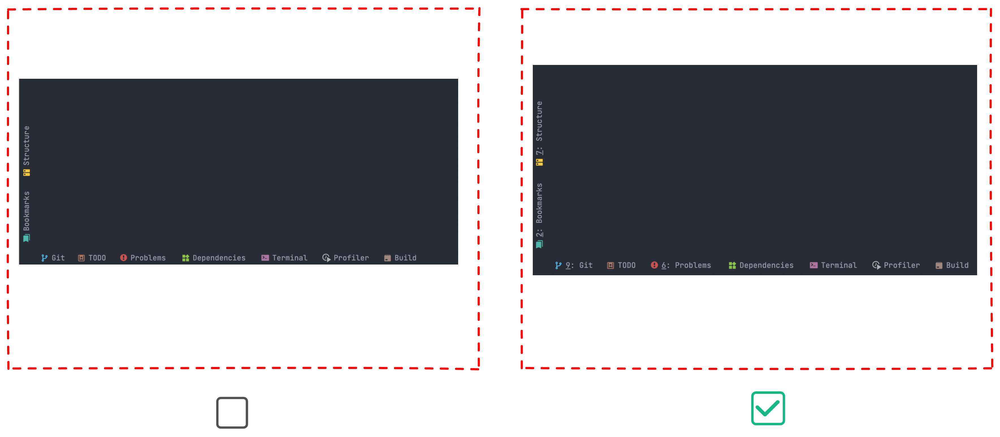
### Widescreen tool window layout
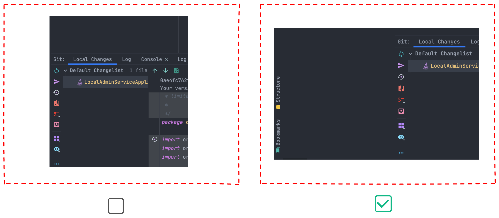

## 5. Persentation Mode
演示模式 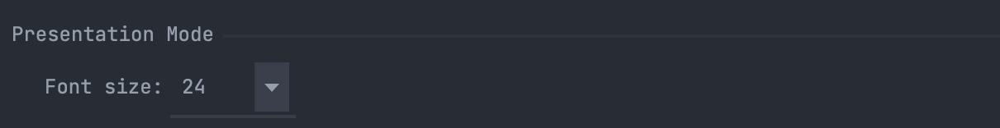 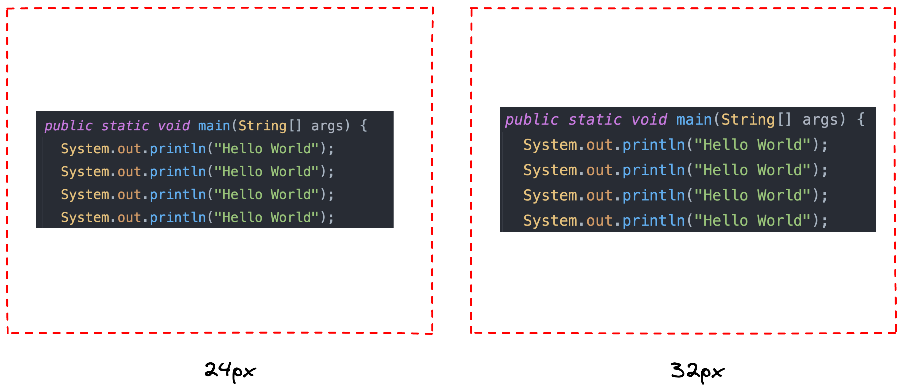

## 6. 其他

> 这是我是用「IntelliJ IDEA」的第五年，因为自己比较热爱去探索一些可以减少繁琐工作的方法，所以对「IntelliJ IDEA」 了解的会稍微多一些，工作 自己也经常会整理一些文档，但是因为自己总体来说比较懒散，所以一直没有将整理的文章完成的梳理。
> 
> 所以今年我自己搭建了这个公众号给自己定了 工作日 每天早上 9 点分享技巧，原生程序员写作 肯定会有写的不好 或者逻辑不同的地方，如果你有任何意见或者你有建议欢迎添加我的微信一起讨论。
> 
> 