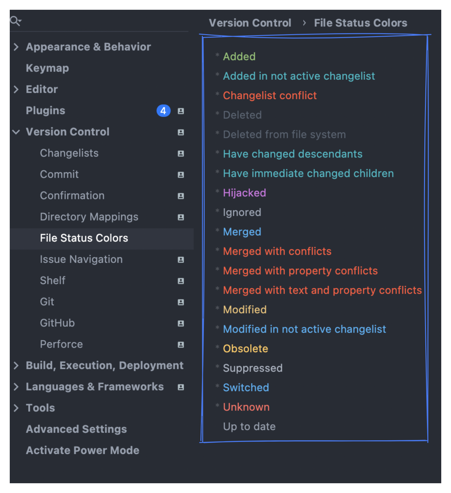

这是本周分享的第二篇文章。

第一篇文章中主要介绍了在「IntelliJ IDEA」中如何初始化项目

以及如何进行 commit ，从工作区到本地库。

今天主要分享的内容为 Git Add & Git Push

## Git Add

昨天分享了对文件的修改之后进行 Commit 操作的介绍。

对于已经存在的文件，「IntelliJ IDEA」在处理的时候会自动 add。

不需要像命令行那样 git add xxx，但是有一种情况例外，那就是这个文件是新创建的。<br /><br />在「IntelliJ IDEA」中第一次创建新文件时会弹窗提示是否将文件添加到 Git 中。

如上图所示。会提醒你是否将当前新增文件添加到 vcs 版本控制中，如果勾选是则以后每次新增文件的时候「IntelliJ IDEA」相当于自动会添加 add 操作 不用手动处理。<br /><br />勾选添加之后 文件颜色由刚添加时的 红色变为了蓝色。

个人建议如果不是项目就是那种非常特殊的那种，还是可以打开这个开关。

不然就是很有可能出现。本来在你本地运行的好好的。同事拉取下来的时候不能运行。<br /><br />看半天原来是文件没有提交。

毕竟每天同步代码是我们每天必须会去做的事。

如果这个问题不注意那么就很有可能经常会出现 还是挺烦人的。

<br />如果是不小心关闭掉了设置 可以在这里设置回来, 在 When files are created 选项下勾选 Add silently，就可以默认添加了。

<br />新的文件在项目中也是非常容易看出来的，在文件列表中 修改的的文件会呈现淡黄色。尔新增的文件则是谈绿色。如果是没有添加到工作目录的文件则是 红色。


<br />如果是文件已经添加了，但是还不在暂存区，这个手动在要添加文件或者文件夹下选着右键 Git -> add to vsc

<br />如果你有特殊的需求，在文件的某些状态下你想要改变颜色，那么可以去设置里面进行查看，这里面也列举了每一种状态对应的颜色。

## Push
<br />我们将代码提交到本地库之后，其实就相当于一个小型的本地的 Git 管理系统了，不过还不够，毕竟我们的项目是团队开发，我们还需要将我们自己的版本库与团队结合。

我们需要将本地分支推送到对应的远程分支，对应的 Git 命令为
```shell
git push origin <branchName>;
```


而在「IntelliJ IDEA」中出发触发这个操作，总共有 n 种路径，看图<br /><br />本质上小结能够触发 Commit 的位置差不多，因为 commit 后面就是 Push 他们是紧密相关的。


- 这里可以看到此次提交的内容
- 以及此次提交的多少次commit
- 还可以选择是否推送 tag  如果有
- 右侧可以看到对应的 每次的 commit 对应的文件列表。


<br />我们也可以通过快捷键 command + shift + k 触发 push 操作


正常来说我们都是一个项目对应一个地址，在也不保证一些特殊情况，你需要配置两个 Git r。对应的命令为 
```shell
git remote add newAddress https://xxx
```

<br />在「IntelliJ IDEA」菜单中点击 Git -> Manage Remotes， 在弹框中新增地址。

## 总结
到这里，我们就算是完成了一个完成的从 **项目初始化**，添加项目到**工作区**，提交到**本地库**。看完这两节我相信在项目里面的基本操作你已经具备了，能完成基本的工作。

明天我将从场景触发，来更加深入介绍 Git 的使用。

明三主题：Git Log 以前明明是好的功能，但是这次发版之后却出 Bug 了，为啥？<br />周四主题：Git Merge 各种花式解决冲突，再也不怕。<br />周五主题：Git Branch 各种花里胡哨的工作流，总有适合你的一种。