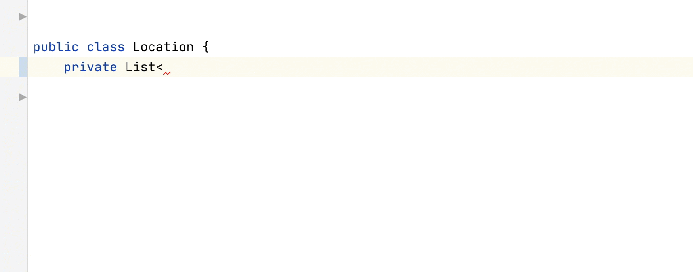
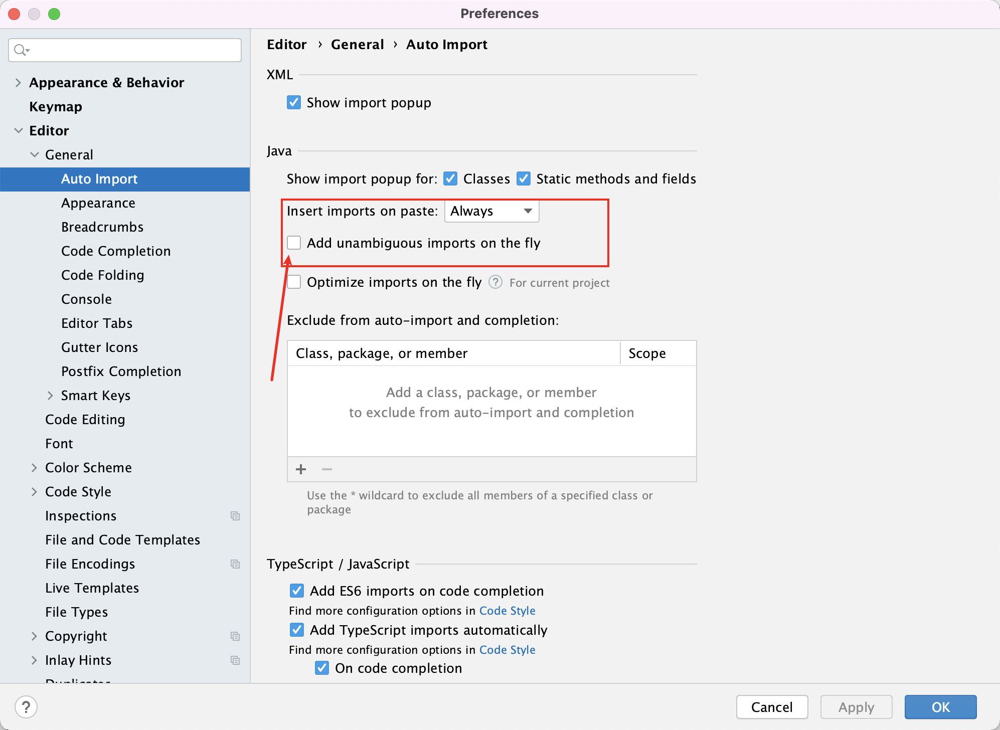
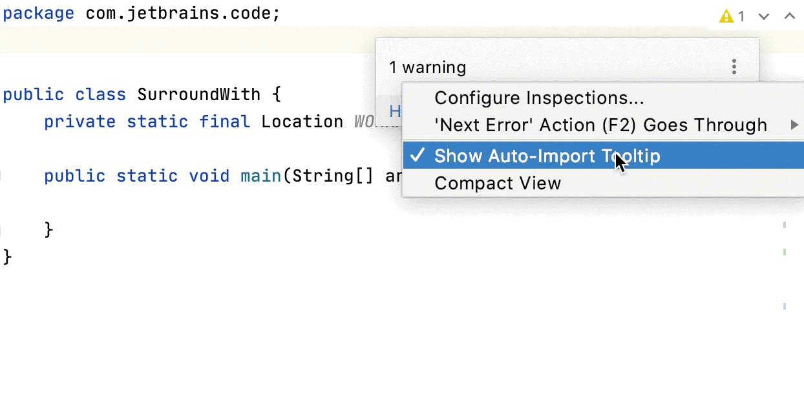
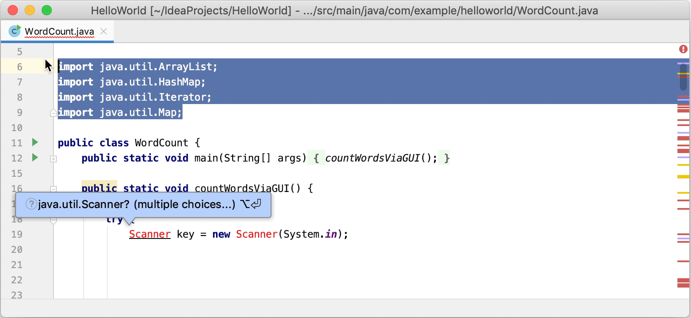
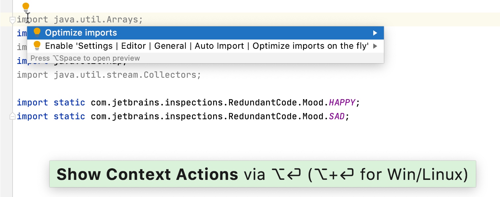

# 自动导入

当你引入一个新的类时，如果 IDE 没有引入该类，那么 IDE 会显示一个弹出窗口，建议您添加缺少的 import 语句，这样就不必手动添加。 按 Option + Enter 大家建议列表

要更改导入弹出窗口的背景颜色，请按 Ctrl+Alt+S 并转至 Editor | 配色方案| 一般| 弹出窗口和提示| 问题提示 。

## 自动添加导入语句

## 禁用导入弹出窗口

禁用弹出窗口时，未解析的引用带有下划线并标记有红色灯泡图标。要查看建议列表，请单击此图标（或按 Alt+Enter），然后选择 Import class。

### 禁用所有弹出窗口

- 将鼠标悬停在编辑器右上角的检查窗口小部件上，单击 ，然后禁用“显示自动导入工具提示”选项。 

### 禁用类或静态方法和字段的弹出窗口

1. 在“设置/首选项”对话框中 Ctrl+Alt+S ，单击“ 编辑器”。一般| 自动导入 。
1. 确保为显示导入弹出窗口设置选择了必需的选项（复选框，类和静态方法及字段均默认启用）。

## 导入软件包而不是单个类

IntelliJ IDEA 建议默认情况下导入单个类。您可以更改设置以导入整个程序包。

1. 在设置/首选项对话框中 Ctrl+Alt+S ，选择 代码样式| Java | 进口 。
1. 清除“使用单个类导入”复选框，然后应用更改。

## 禁用通配符导入

当 IntelliJ IDEA 从同一包中导入的类的数量达到限制（`5`默认情况下）时，IDE 会修改语句以导入整个包，而不是从此包中导入多个单个类：

### 禁用通配符导入以始终导入单个类

1. 在设置/首选项对话框中 Ctrl+Alt+S ，选择 代码样式| Java | 进口 。
1. 确保已启用“使用单个类导入”选项。
1. 在类计数采用进口与“_”和 名计数使用带有“_”静态导入区域，指定那绝对超过一类的课程包中的数量和名称的数值（例如，`999`）。

要将导入语句替换为文件中的单个类导入而不更改设置，请将插入符号放在导入语句中，按 Alt+Enter （或使用意图操作图标），然后选择“替换为单个类导入”。

## 从自动导入中排除类和包

导入建议列表可能包括不需要的类和软件包。您可以从自动导入中排除多余的条目，以便建议列表仅包含相关项目。

1. 在“设置/首选项”对话框中 Ctrl+Alt+S ，单击“ 编辑器”。自动导入 。
1. 在“从自动导入和完成中排除”部分中，单击 Alt+Insert，然后指定要排除的类或程序包。 您还可以选择是要从当前项目中还是从所有项目（全局）中排除项目。

### 即时排除课程或课程包

1. 按 Alt+Enter 缺少的班级以打开导入建议列表。
1. 单击包旁边的向右箭头，然后选择要排除的项目（类或整个包）。
1. 在“自动导入” 对话框的“从自动导入和完成中排除”部分中，选择是要从当前项目中还是从所有项目中排除项目，然后应用更改。

## 优化进口

“优化导入”功能可帮助您根据 “设置” /“首选项” |“设置”中的规则，一次删除当前文件或目录中所有文件中未使用的导入并组织导入语句。编辑器 代码样式| <语言> | 进口 。

### 优化所有进口

1. 在“项目”工具窗口（“ 视图” |“工具”窗口|“项目” ）中选择文件或目录。
1. 请执行以下任一操作：
   - 在主菜单中，选择 代码| 优化导入 （或按 Ctrl+Alt+O）。
   - 从上下文菜单中，选择“优化导入”。
1. （如果已选择目录）选择是要优化目录中所有文件的导入，还是仅优化本地修改的文件（如果您的项目受版本控制），然后单击运行。

### 在单个文件中优化导入

1. 将插入符号放在导入语句中，然后按 Alt+Enter 或使用 图标。
1. 选择优化导入。

### 自动优化修改文件中的导入

如果您的项目处于版本控制下，则可以指示 IntelliJ IDEA 在将已修改文件提交到 VCS 之前对其进行优化。

1. 从主菜单中，选择 VCS |。提交 （或按 Ctrl+K）。
1. 单击， 然后在“提交之前”区域中，选择“优化导入”复选框。

### 即时优化进口

您还可以将 IDE 配置为自动优化导入。IntelliJ IDEA 将根据 “设置/首选项”中的规则删除或修改导入语句 。编辑器 代码样式| <语言> | 在编辑器中工作时导入 。

1. 在“设置/首选项”对话框中 Ctrl+Alt+S ，单击“ 编辑器”。一般| 自动导入 。
1. 启用“即时优化导入”选项并应用更改。
