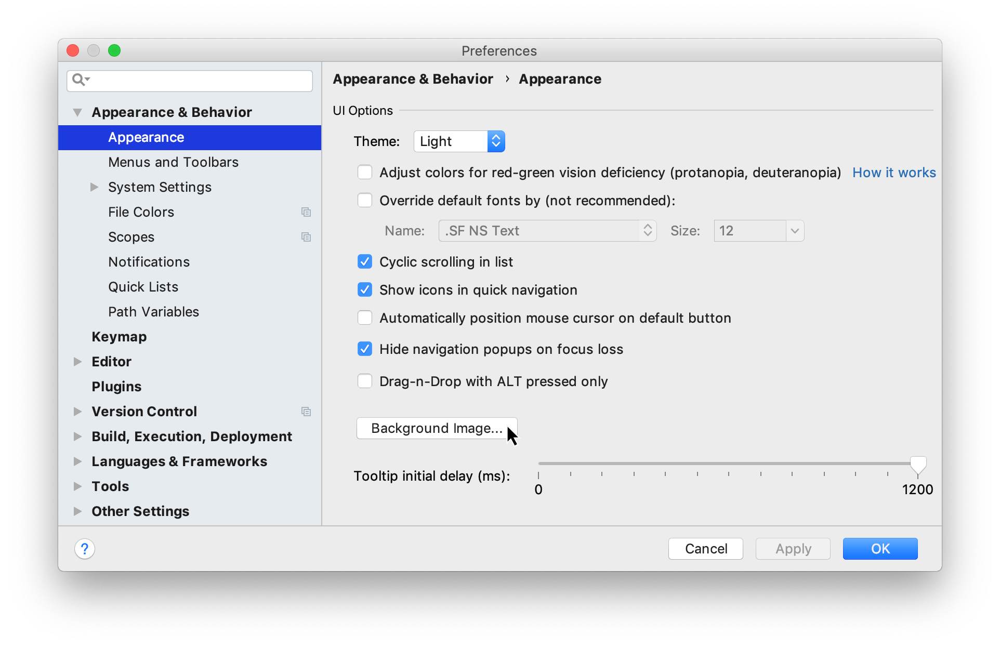
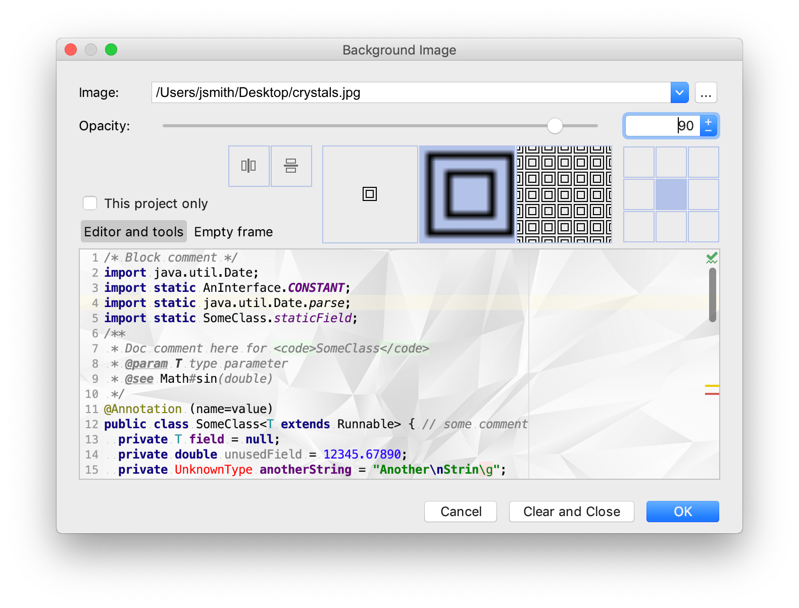

您可以将任何图像设置为 IntelliJ IDEA 中的编辑器和所有工具窗口的自定义背景。

打开 Settings/Preferences 对话框 something，选择 Appearance & Behavior | Appearance，然后单击 Background Image 按钮。

在“背景图像”对话框中，指定您要使用的图像作为背景，其不透明度、填充和放置选项。如果有必要，垂直或水平镜像。您可以为编辑器和工具窗口以及空框架(编辑器中没有打开任何文件时)设置单独的映像。 