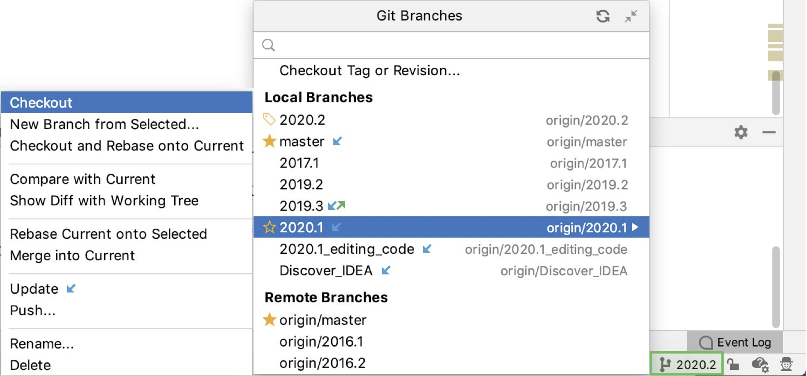
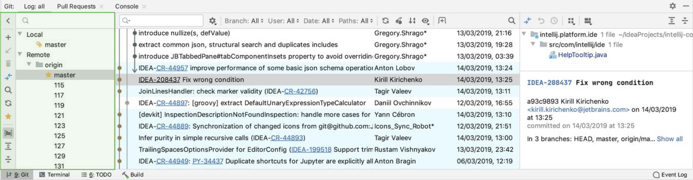
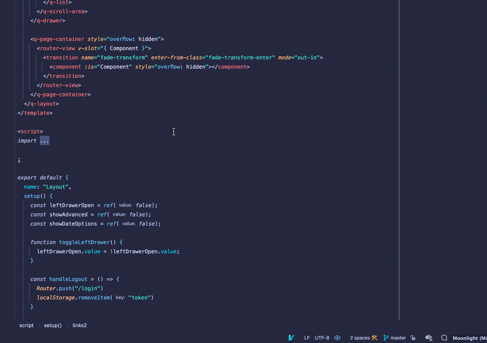
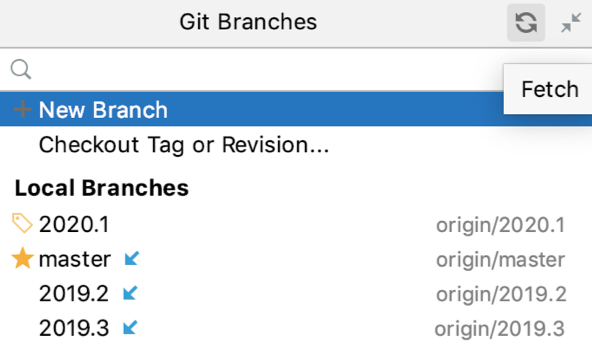
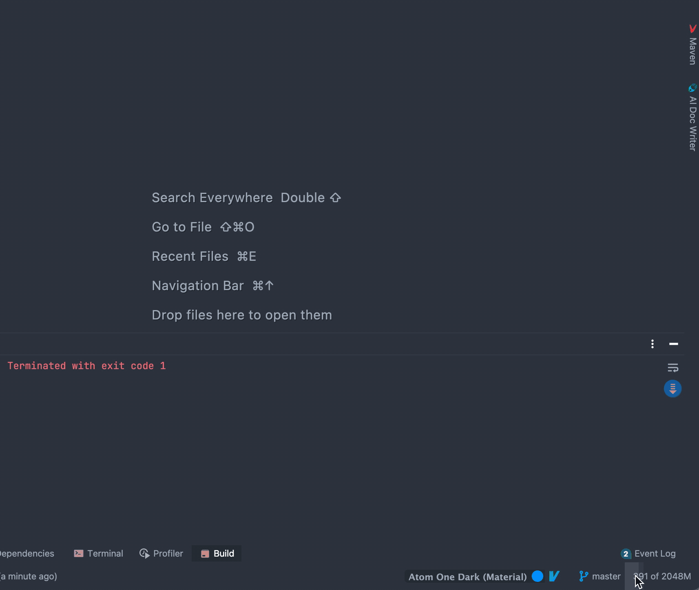
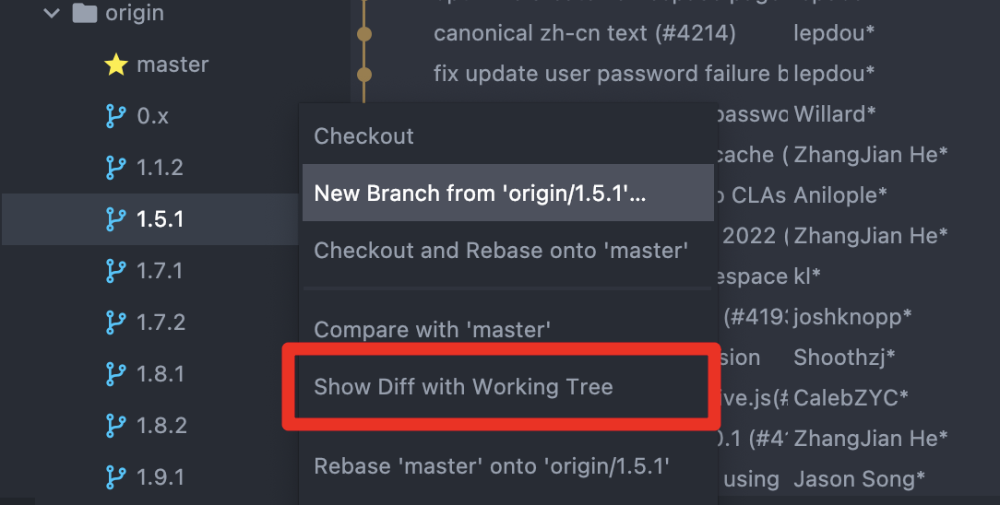
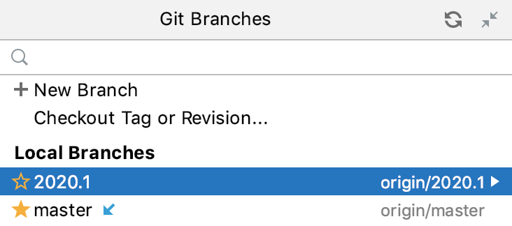
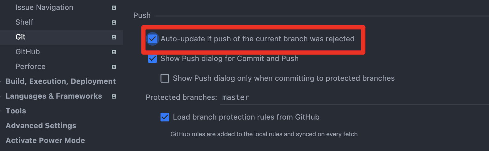

 在 「IntelliJ IDEA」 中，所有带有分支的操作都在 Git Branches 弹出窗口中执行：点击下方的分支图标，所有的分支操作都在这个 dialog 中处理。

 在 Log 界面左侧 也可以展开 对多个分支进行管理。

## 1. create new branch
### 1.1 从当前分支创建一个新分支

1. 在Branches弹出窗口中，选择New Branch或在Git工具窗口工具窗口的Branches窗格中右键单击当前分支，然后选择New Branch。

2. 在打开的对话框中，指定分支名称，如果要切换到该分支，请确保选中Checkout 分支选项。新分支将从当前分支 HEAD 开始。

### 1.2 从选定的分支创建一个新分支

1. 在分支弹出窗口或Git工具窗口的分支窗格中，选择要从中启动新分支的本地或远程分支，然后从 Selected 中选择 New Branch。
1. 在打开的对话框中，指定分支名称，如果要切换到该分支，请确保选中Checkout 分支选项。

### 1.3 从选定的提交创建一个新分支

1. 在[日志视图](https://www.jetbrains.com/help/idea/log-tab.html)中，选择要作为新分支起点的提交，然后从上下文菜单中选择新分支。
1. 在打开的对话框中，指定分支名称，如果要切换到该分支，请确保选中Checkout 分支选项。

## 2. checkout new branch
### 2.1 签出一个分支作为一个新的本地分支
如果您想在其他人创建的分支上工作，您需要检查它以创建该分支的本地副本。 要确保您拥有远程分支的完整列表，请在分支弹出窗口中单击Fetch ： 

1. 在“分支”弹出窗口或Git工具窗口的“分支”窗格中，从 Remote Branches 或 Common Remote Branches （如果您的项目有多个根并启用[同步分支控制](https://www.jetbrains.com/help/idea/manage-branches.html#synchronous_branch_control)）或从Repositories |中选择要在本地签出的分支。远程分支（如果已禁用）。
1. 从操作列表中选择Checkout 。
1. 如有必要，为此分支输入一个新名称，或保留与远程分支对应的默认名称，然后单击OK。新的本地分支将设置为跟踪原始远程分支。

## 3. 在分支之间切换

## 4. 比较分支
### 4.1 将分支与当前分支进行比较

 比较当前分支和历史分支做了哪些修改，比如说比较当前功能分支与主分支相比。

### 5.2 将分支与工作树进行比较

 对于我们本地还没有 push 到远程的更改，我们可以选择使用 show diff with working tree, 这样可以比较对应分支和本地的区别

## 5. 将文分支标为 收藏夹

## 6. 推送被拒绝自动 update
 用 Git 新手经常会存在，自己还没有 pull 就在 push 了，这样会导致 push 失败，勾选这个设置之后在 reject 之后会自动 update

## 7. 通过 action 打开 Branch 控制窗口
