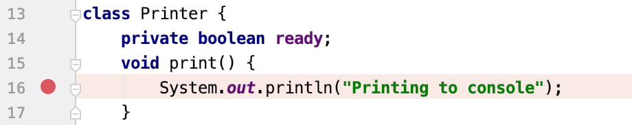
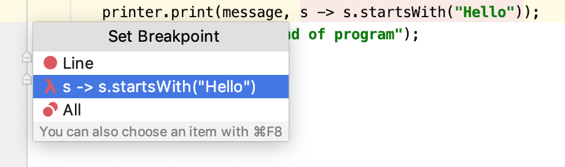
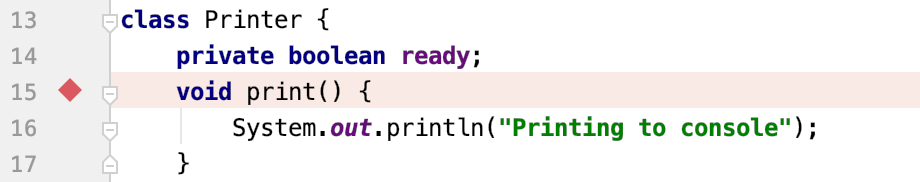
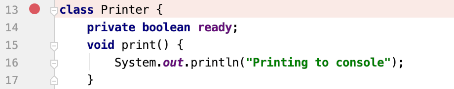
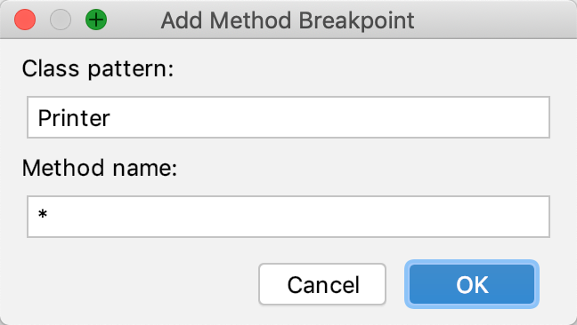
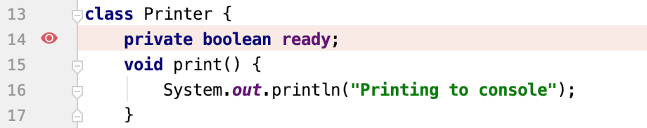
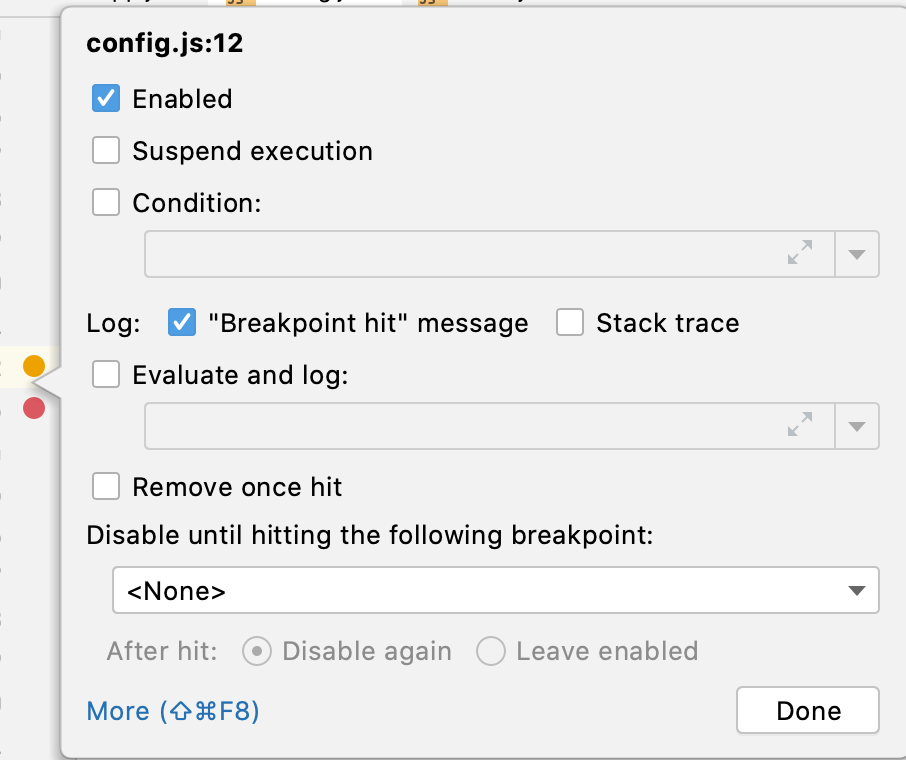

断点是特殊的标记，可在特定点挂起程序执行。这使您可以检查程序状态和行为。断点可以很简单（例如，在到达某一行代码时暂停程序），也可以涉及更复杂的逻辑（针对[附加条件进行](https://www.jetbrains.com/help/idea/using-breakpoints.html#breakpoint_condition)检查，编写[日志消息](https://www.jetbrains.com/help/idea/using-breakpoints.html#log)等）。

## 断点类型
IntelliJ IDEA 中提供以下类型的断点：

- 行断点：到达设置断点的代码行时挂起程序。可以在任何可执行代码行上设置此类断点。<br />
- 方法断点：在进入或退出指定方法或其实现之一时挂起程序，使您可以检查方法的进入/退出条件。<br />
- 字段观察点：读取或写入指定字段时挂起程序。这使您可以对与特定实例变量的交互做出反应。例如，如果在复杂过程的最后，您在其中一个字段上的值显然是错误的，则设置字段观察点可能有助于确定故障的来源。<br />
- 异常断点：Throwable抛出程序或其子类时挂起程序 。它们全局适用于异常条件，并且不需要特定的源代码引用。

## 设置断点

### 设置行断点
单击要设置断点的可执行代码行中的装订线。或者，将插入号放在该行上，然后按 ⌘F8。<br /><br />如果该行包含 lambda 表达式，则可以选择是要设置常规的行断点，还是仅应在调用 lambda 时挂起程序。<br />

### 设置方法断点

- 单击声明方法所在行的装订线。或者，将插入号放在该行上，然后按 ⌘F8。<br />
- 要在调用某个类的默认构造函数时挂起程序，请在声明该类的行上单击装订线，或在该行处插入插入符号，然后按 ⌘F8。<br />
- 要匹配多个类或方法，请 在“**调试”**工具窗口的左侧单击“ **查看断点”** ，然后单击“ **添加”** 并指定类和方法。使用相匹配的开始，结束，或整个标识符。  ⌘N`*`<br />

### 设置字段 监听


## 管理断点
### 删除断点

- 左键单击
- Ctrl + F8

### 静音断点

### 启动/禁用断点

### 移动/复制断点

- 要移动断点，请将其拖到另一行。
- 要复制断点，请按住断点^ 并将其拖到另一行。这将在目标位置创建具有相同参数的断点。
## 
## 断点状态
| 线 | 方法 | 领域 | 例外 | 异常 |
| Regular |  |  |  |  |
| --- | --- | --- | --- | --- |
| 禁用断点 |  |  |  |  |
| 已验证 |  |  |  |  |
| Muted |  |  |  |  |
| Inactive/dependent |  |  |  |  |
| Muted inactive/dependent |  |  |  |  |
| Muted disabled |  |  |  |  |
| Non-suspending |  |  |  |  |
| Verified non-suspending |  |  |  |  |
| 无效 |  |  |  |  |


## 🧐👩‍💻🙋🏻‍♂️
> 你不知道的小技巧

### 方法断点
<br />可以对断点添加 条件。这样只有在满足特定条件下才会进入断点

### printf 调试
在开发中我们总是会使用 下面这样的方式打印日志
```java
public class Test {
	public static void main(String[] args) {
    	System.out.println("prev log");
        method();
        System.out.println("post log");
    }
}
```
实际上上面的 print 语句都可以用 **非暂停断点** 来进行日志输出

### 通过断点查看程序执行时间