设置专题已更新

- [Setting/Appearances](https://mp.weixin.qq.com/s/roxbrc_eHS_ab4QM09yAKg)
- [Setting/Menu-and-Tools](https://mp.weixin.qq.com/s/czH3F5ywEurBk8IIxrNqvg)

## 背景

之前工作的时候 我遇到了过一件怪事，那个时候用的电脑是刚买的 M1 Pro 。 就是正常的使用 JetBrains 旗下的 DataGrip 连接测试环境的 MySQL，但是那个时候有一个非常奇怪的现象。

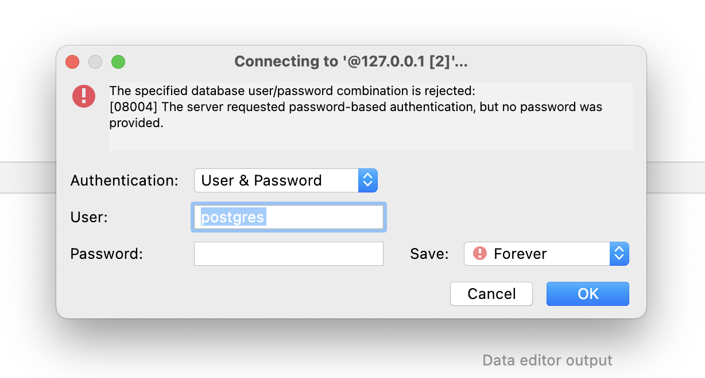 就是我每次登陆就算是选择了记住密码，但是下一次还是需要重新输入密码。

这个问题困扰了好久, 我一直以为是他们官方没有对 M1 适配好，然后我就去官方网站上去提了一个问题，述说了我遇到的情况。 
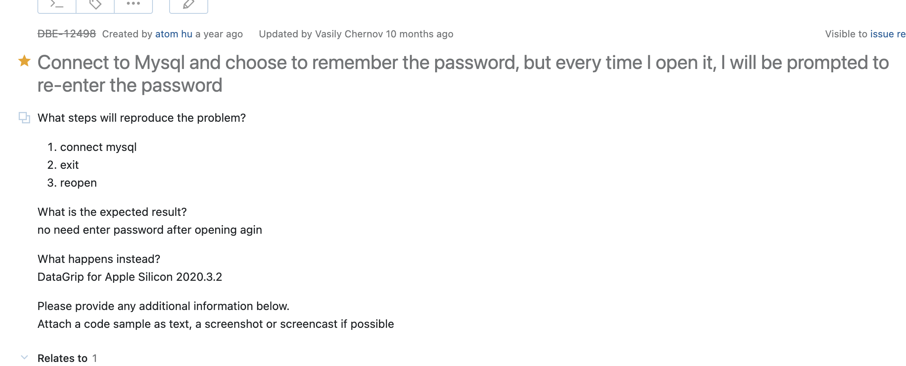

> 意思就是当我在连接 MySQL 的时候选择了记住密码，但是每次我打开它，还是让我再次输入密码。

下面是官方人员的回答  回答中让我去到 Setting -> Apperarance & Behavior | System Settings 选择 KeePass 选项。 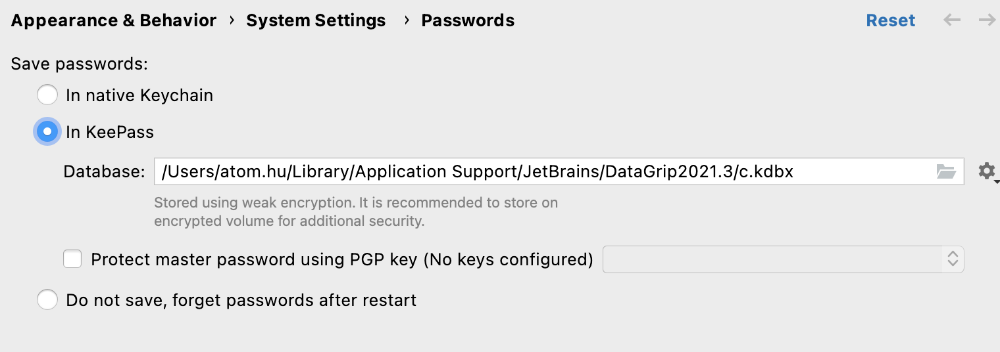 就是上面的这个选项，我最开始也不知道为啥莫名其妙的事勾选的 Do not save。

至此 我的问题得到圆满解决。

## Sytem Setting

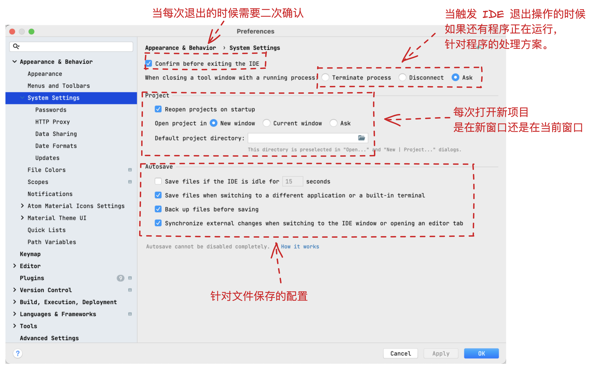 今天主要讲解在设置板块下的配置。

### 退出确认

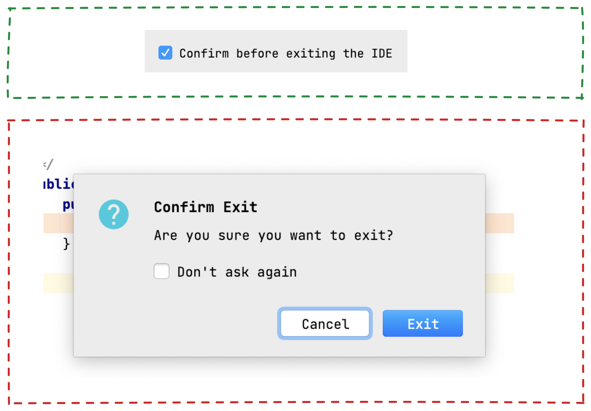 如上图所示，次配置主要是针对在退出项目的时候是否有提醒。这个就依据大家的习惯，就我个人的经验来看的话，我是不太需要这个配置。感觉还是挺麻烦的 哈哈哈哈哈哈。

### 运行服务退出确认

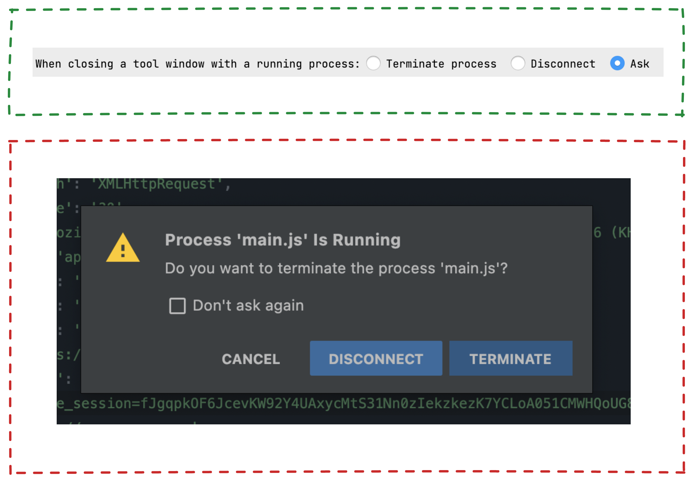 此设置的场景在与我们的代码正在运行，这个时候就触发了程序退出。我们需要选择这个时候应该对程序做何种处理，是直接 终止程序 还是中断联系 的配置。

> 这里需要注意一个问题，就是端口占用问题有的时候我们选择错误，比如正在运行 springboot 应用，但是我们在退出程序的时候选择了 disconnect ，那么就会导致我们的 Java 程序并没有退出，这样就会存在下次我们在运行应用的时候 提示 端口被占用。

### 重开项目

 次配置是在每次打开项目的时候从新打开最后一次打开的项目。

### 打开项目

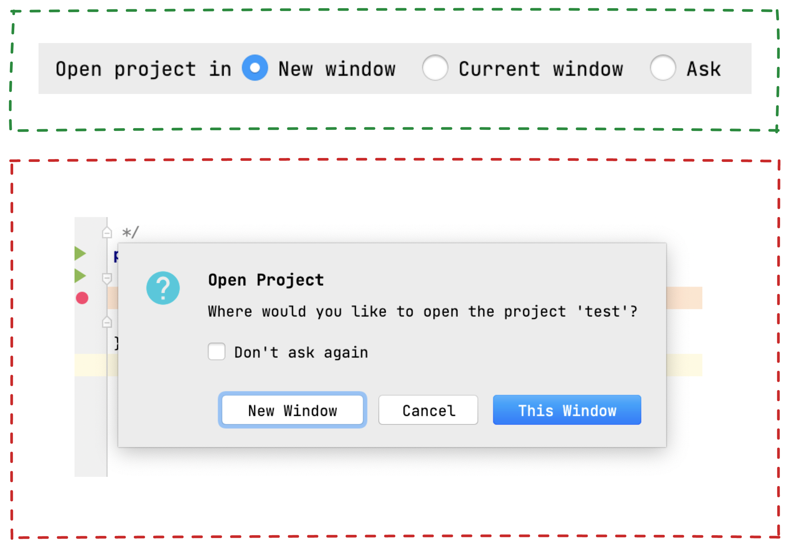 主要正对打开项目是在当前窗口，还是在新窗口。

### 自动保存

 此段配置项主要针对文件的自动保存，涉及的配置有

- IDE 空闲超过 15 s，自动保存文件
- 切换到其他应用程序，自动保存文件
- 在保存前备份
- 切换到 IDE 窗口或打开编辑器选项卡同时更新外部文件

上面的配置还是建议就跟官方保持一致就可以了。

## 密码配置

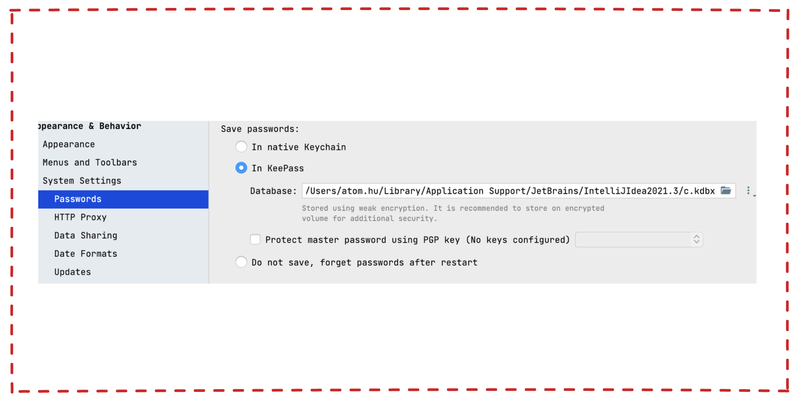 这里就是在开篇的背景出现的问题就是因为这里的配置导致。这里基本上也不用懂，只是心理大概有数，遇到问题知道排查方向。

## Http Proxy

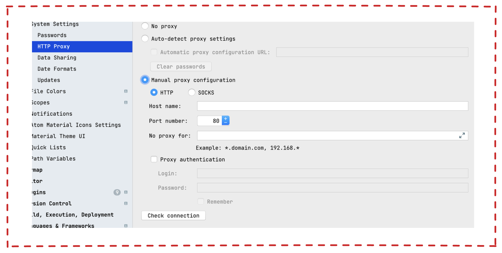 这里可以用来配置 IDE 的 Proxy。我公司会有一些国外的业务 有一部分测试 DB 都是在 外国，加上国内网络环境稍微慢了一点点。这个时候就可以配置 对应的代理地址，这样使用起来会舒服一点。

## 是否分享数据

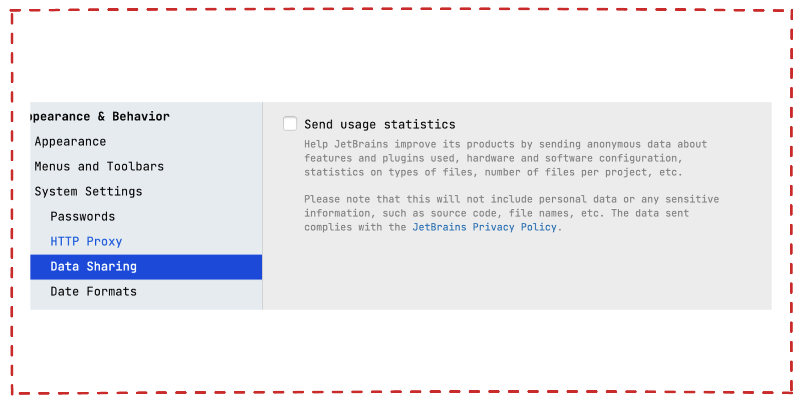 直接关闭

## 更新配置

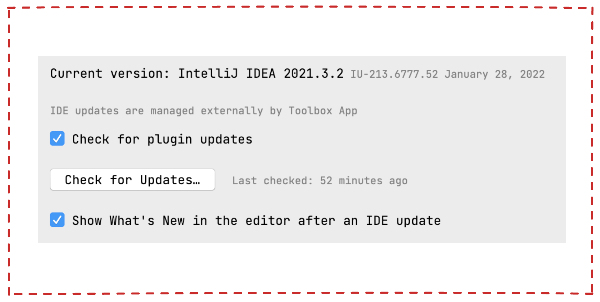 配置是否检查插件更新，显示 IDE 更新后编辑器中的新增内容
