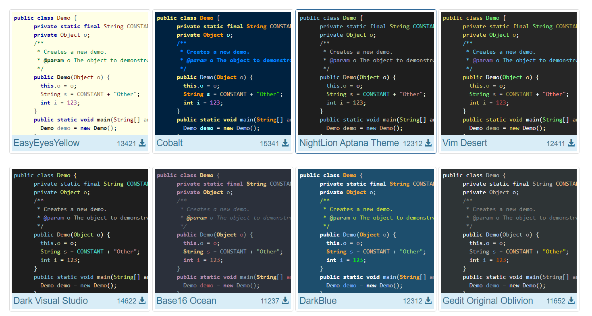

作为一名开发人员，您需要使用大量文本资源: 编辑器中的源代码、搜索结果、调试器信息、控制台输入和输出等等。颜色和字体样式用于格式化这个文本，并帮助您更好地理解它一目了然。

IntelliJ IDEA 使用颜色方案定义首选颜色和字体。  您可以使用预定义的配色方案，也可以根据自己的喜好进行自定义。还可以共享配色方案。

## 选择一个配色方案
> Setting | Editor | Color Scheme

