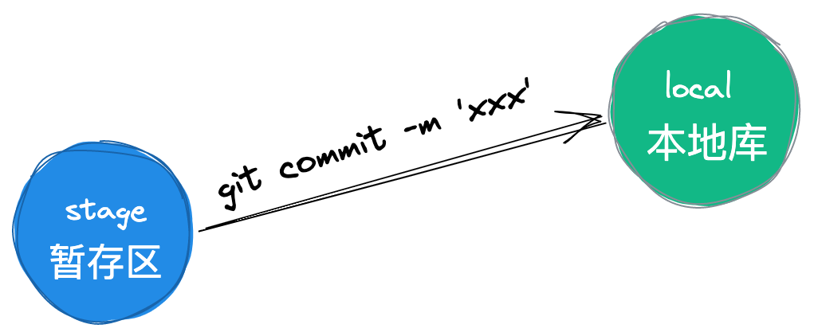

## 背景

本周主要介绍 在 「IntelliJ IDEA」 中 Git 的使用。

希望通过本周的更文，能够让大家在 「IntelliJ IDEA」中能够处理项目遇到的各种问题，同时我将列举在项目中常见的 Git 问题以及解决方案。

本文主要通过 Git 命令和「IntelliJ IDEA」中的操作相结合的方式。

因为本质上所有的「IntelliJ IDEA」的操作都是对应了命令的。

首先这篇文章适合平常大部分时间都在使用 JetBrains 系列的软件，团队主要的协作方式是使用 Git，然后你对基本的 Git 的操作没啥问题。

这是第一篇文章，主要介绍一些简单的操作。
## 
## 场景假设
在正式开始前，我们需要做一些场景假设，这样更好的可以贴近公司的项目，以及模拟更多的异常情况。

这是我们演示的项目：「[awesome-Intellij-IDEA](https://github.com/xiaoxiunique/awesome-IntelliJ-IDEA) 」就将它比喻为我们公司正在做的项目。<br /><br />我目前正在使用的「IntelliJ IDEA」 的版本为 2021.3.2, 「Git」 版本为 2.30.1。

## git init
一般来说我们在公司里面刚开始会遇到两种情况。

<br />一种是开发老项目，我们需要去云端拉取代码, 然后切换到对应的 dev 分支进行开发。

<br />一种是创建新项目，并推代码去云端。

<br />另一种是新项目已经开发了一端时间，但是一直没有上传云端，现在需要上传。

针对第一种老项目情况命令行就比较简单，就直接 git clone 一下就可以了，这里介绍一下在「IntelliJ IDEA」 中的几种 clone 方式<br /><br />上面演示的是在启动页面，直接点击右上角的 GET FROM VCS，然后填入项目地址即可。


针对直接就是新项目的情况，其实还是直接使用命令行方便一点。
```shell
git init -y;
git add .;
git commit -m 'init';
git push origin [master|main];
```

如果是老项目，但是云端地址已经创建了。需要注意在 commit 之前需要 pull 一下。
```shell
git init -y;
git add .;
git commit -m 'init';
git pull;
git push origin [master|main];
```

## git commit
代码拉取下来之后，紧接着我们就会进行我们的业务开发，当一个 feature 开发完毕之后，我们就需要将代码进行提交进入后续的 flow。

「首先我们需要先进行 commit 操作」<br /><br /><br />一个小插曲，看上图 当前我修改了文件，进行了一次格式化，并在最下方添加了内容，这个时候的文件状态还属于在工作目录。

查看图片中标注的状态可知

- 当文件被修改之后在目录中文件的颜色会变为淡黄色。
- 当编辑器代码行被修改之后左侧会呈现淡蓝色。
- 当代码被删除之后，左侧会出现一个小三角形。
- 当新增代码时，左侧为 淡绿色。

而且编辑器左侧有颜色的部分都是可点击的。<br />

回到整理，现在我们模拟的是对代码进行了就修改，那么修改完毕之后我们就需要将代码从「工作区」添加到本地库<br /><br />对应的就是 git commit 的命令。<br /><br />总共有 8 种方式可以 commit

- 在项目名上右键
- 在某个文件夹上右键，这个是只会 commit 这个文件夹下的文件
- 通过唤醒 VCS Operations Dialog 进行 commit
- 分别点击菜单栏 Git -> Commit 和工具栏小飞机图标
- 在编辑区域 右键 Git 提交
- 和 快捷键 Command + K
- 还有可以通过 Search Actions，搜索 commit 提交

当进行 Commit 之后我们会看到下面格式的弹窗<br /><br />图片上应该标的很清晰了，大家就看图片吧，做好对应的配置和填写好对应的 commit message 之后，就可以点击下方的 commit 了。<br /><br />commit 完成之后在查看文件的状态，就看到所有的刚才的展示都已经没有了.

## 总结
今天分享了在「IntelliJ IDEA」中 commit 提交代码的方法，成功的将代码从工作目录提交到了本地库。知识点很小，但是足够全面。

明天将会分享在  中查看项目的 push，log，以及 甩锅神器。