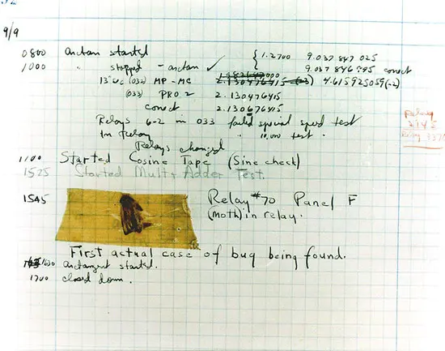
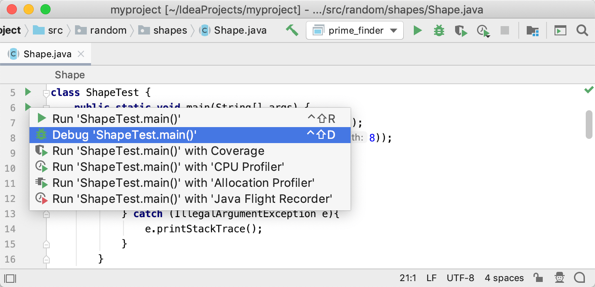
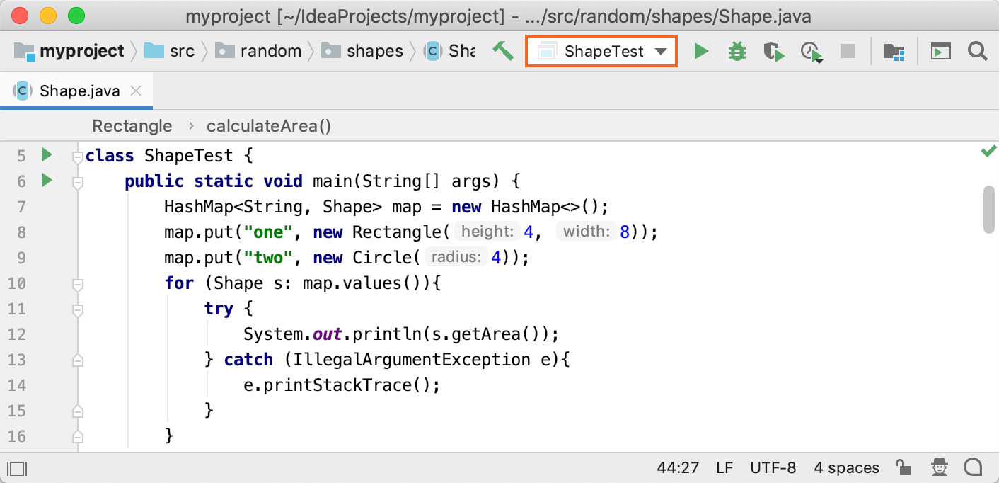
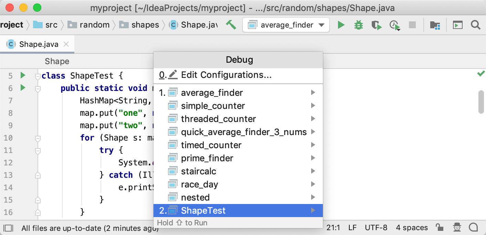
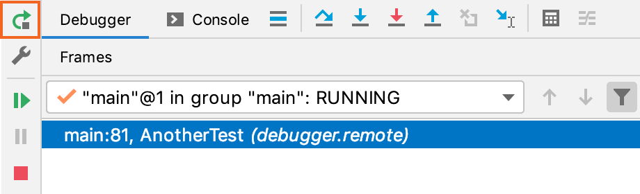
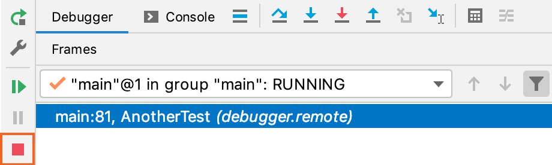

## 前言
1947 年 9 月 9 日，一名美国的科学家格蕾丝.霍普和她的同伴在对 Mark II 计算机进行研究的时候发现，一只飞蛾粘在一个继电器上，导致计算机无法正常工作，当他们把飞蛾移除之后，计算机又恢复了正常运转。于是他们将这只飞蛾贴在了他们当时记录的日志上，对这件事情进行了详细的记录，并在日志最后写了这样一句话：First actual case of bug being found。这是他们发现的第一个真正意义上的 bug，这也是人类计算机软件历史上，发现的第一个 bug，而他们找到飞蛾的方法和过程，就是 debugging 调试技术。

调试（英语：Debug）是发现和减少[计算机程序](https://zh.wikipedia.org/wiki/%E8%AE%A1%E7%AE%97%E6%9C%BA%E7%A8%8B%E5%BA%8F)或电子仪器设备中[程序错误](https://zh.wikipedia.org/wiki/%E7%A8%8B%E5%BA%8F%E9%94%99%E8%AF%AF)的一个过程。

## 启动调试器
启动调试器会话与正常模式下的程序非常相似。调试器位于幕后，因此您无需配置任何特定内容即可启动调试器会话。如果能够从 IntelliJ IDEA 运行程序，则也可以使用相同的配置对其进行调试。

- 如果您没有运行/调试配置，并且您的程序不需要一个配置，请单击 该方法在类附近的装订线中的 **“运行”** `然后选择“**调试”**。这将为您创建一个临时运行/调试配置。之后，您可以根据需要自定义并保存此临时配置。这是从尚未定义的入口点调试程序的最快方法。 
- 如果您已经具有运行/调试配置，并且当前在运行/调试配置列表中将其选中，请按 ⌃D 
- 如果您已经具有运行/调试配置，并且未选中它，或者要在调试之前调整某些配置，请按 ⌃⌥D。之后，选择所需的配置或继续 **编辑配置**。 

   
## 
## 暂停/恢复调试器会话
当调试器会话正在运行时，您可以根据需要使用“**调试”**工具窗口的工具栏上的按钮暂停/恢复它：

- 要暂停调试器会话，请单击。
- 要恢复调试器会话，请单击 ⌥⌘R。

## 重新启动调试器会话

## 
## 终止调试器会话
