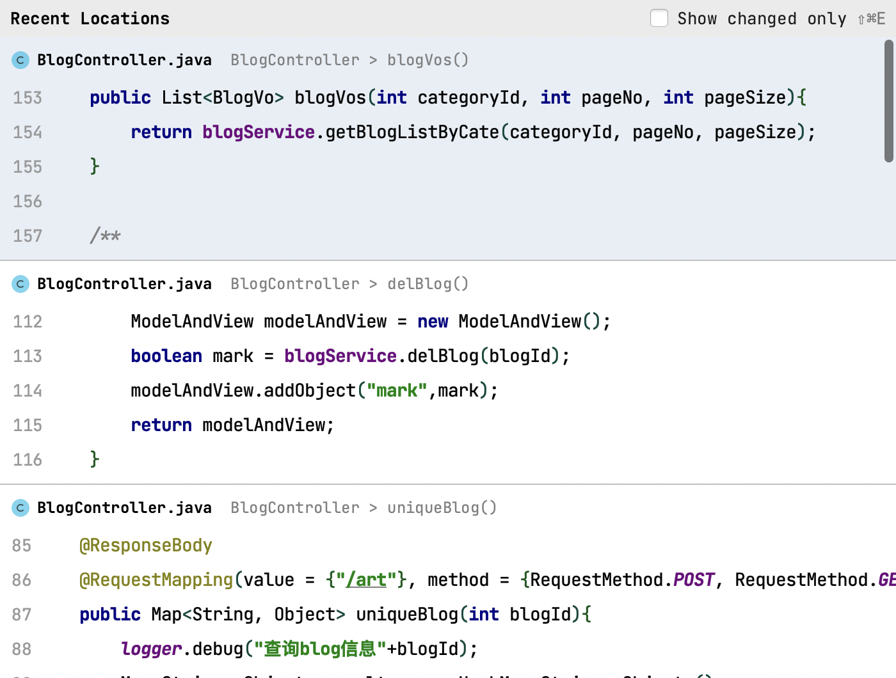
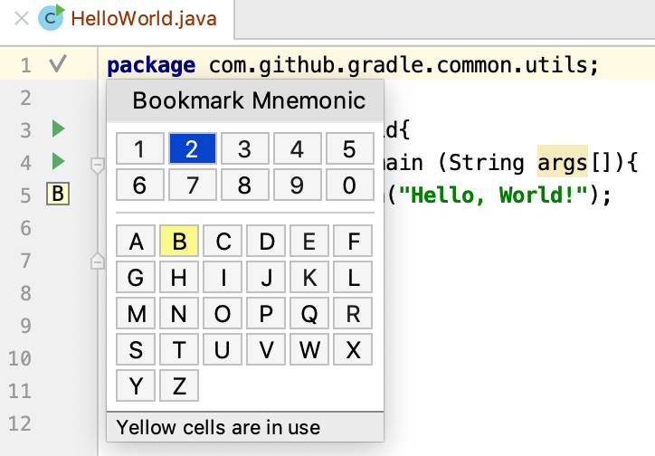
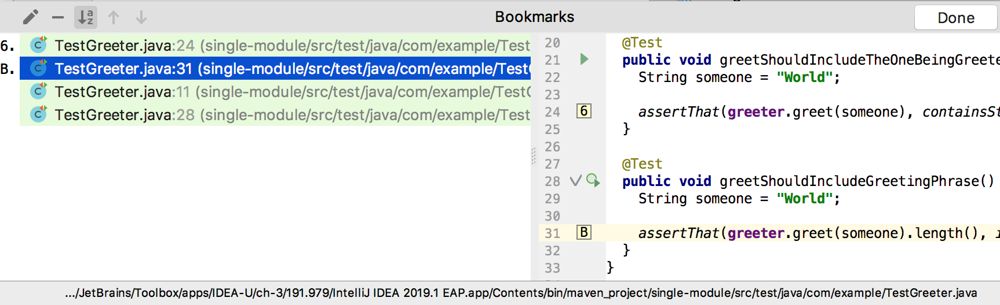
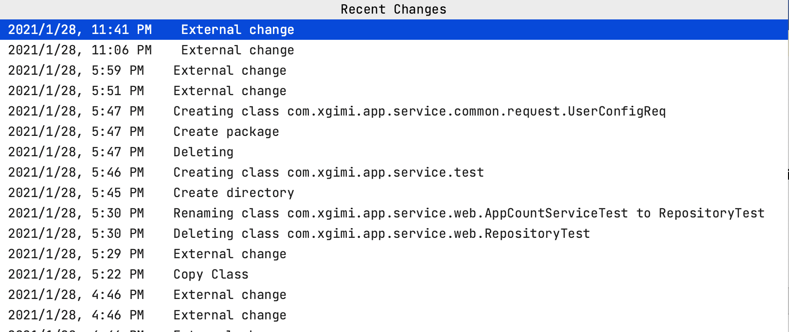
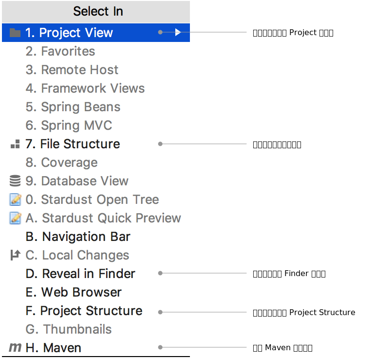
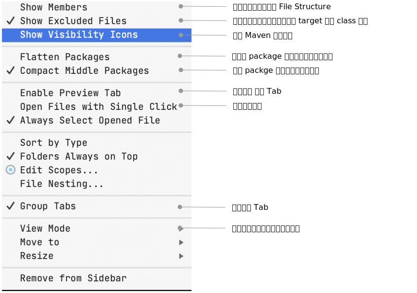
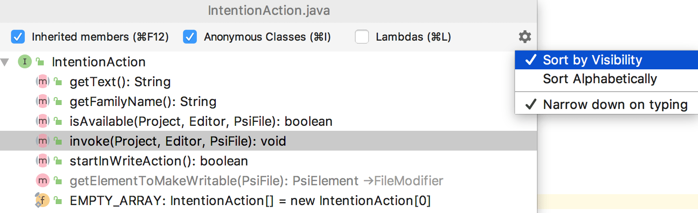
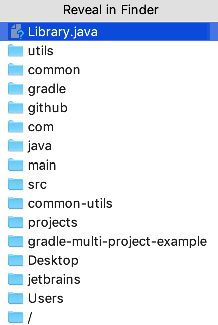
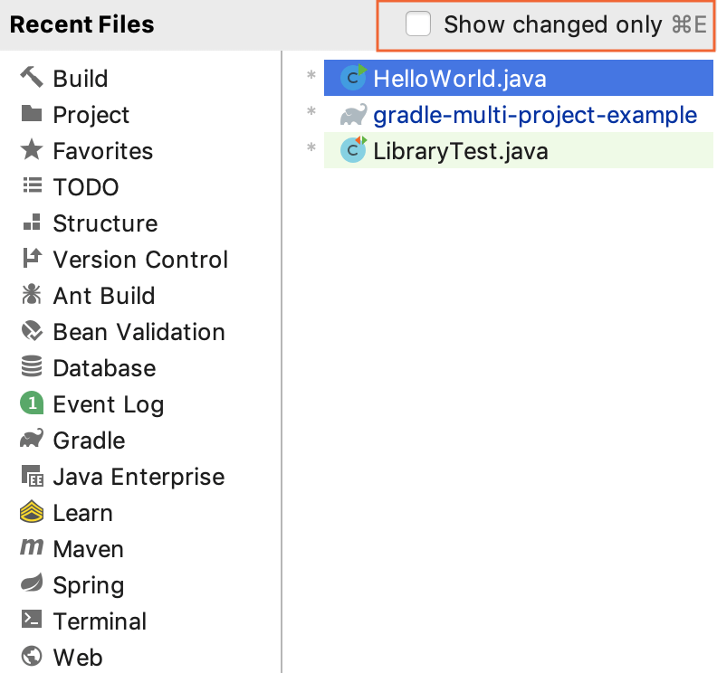

### 在当前位置光标处 前后跳转

- command + [
- commend + ]

### 跳到最后一次编辑的地方 #效率
这个快捷键非常有用，可以在你正在编码的时候 不得不去看看其他文件的结构，当你观看完之后可以立即回到之前正在编辑的地方。

- command + shift + <-

### 查看 类 或 方法位置的定义

- ctrl + shift + Q

### 查看最近的地方

- command + shift + E

### 添加书签
**Option + F3** 

### 搜索书签
Command + F3 

### 查看最近  当前项目的变更
**Option + Shift + C** 

### 使用弹出式选择栏导航 #效率
> Option + F1

### Project Setting

### 跳转到 错误处

- F2

### 当前类的结构视图  #效率

- Command + F12

### 打开 Structure 视图

- Command + 7

### 打开当前文件 在 Finder 中

- Command + Option + F12

### 显示最近的文件

- Commend + E

