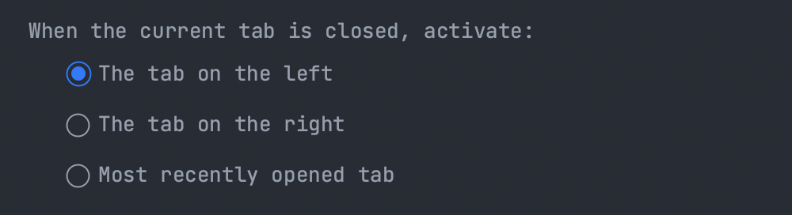
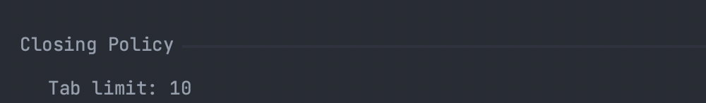
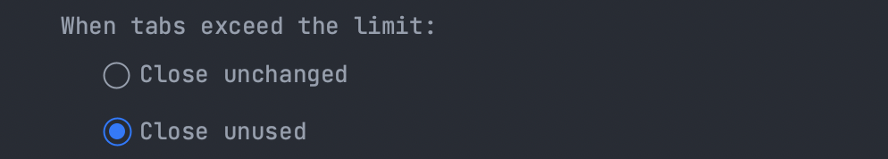
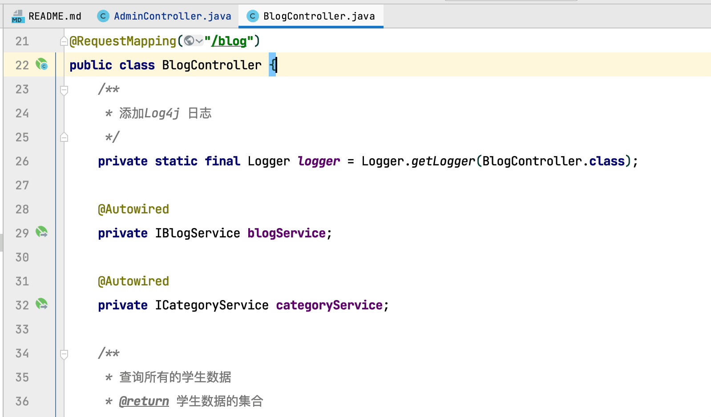
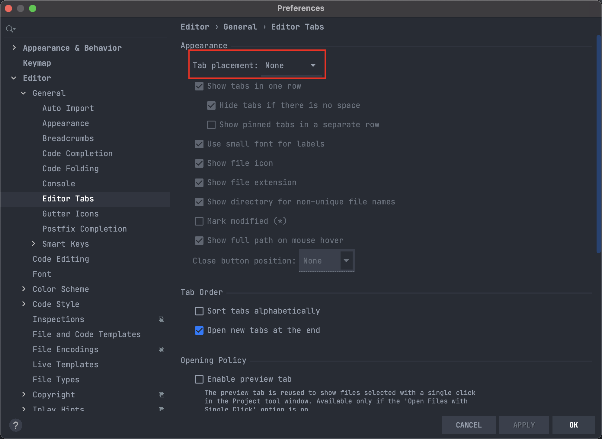
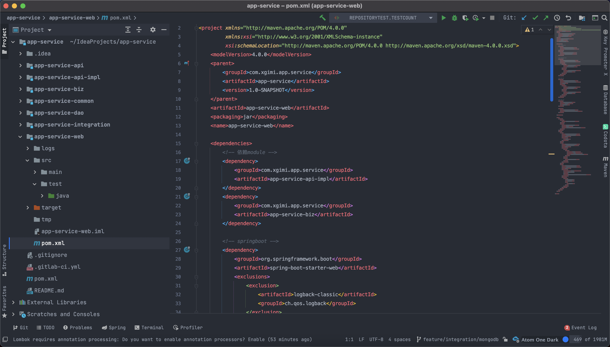

对 编辑器 Tab 进行设置
> 位置：Settings | Editor | General | Editor Tabs
> 或者直接在 Tab 栏上 右键 选择 Configure Editor Tabs

### 当当前 Tab 被关闭时

- 激活 关闭 Tab 左边第一个
- 激活 关闭 Tab 右边第一个
- 最近 打开的 Tab

### Tab 关闭策略
设置 Tab 最大可以运行展示 多少个 

当 Tab 数量超过 最大显示数时，关闭没有使用的 Tab

> ### Switch between tabs
> - To move between tabs, press ⇧⌘] or ⇧⌘[.
> - You can also switch between recently viewed tabs or files. In the editor, press ⌃⇥. Keep pressing ^ for the **Switcher** window to stay open. Use ⇥ to switch between tabs and other files.

### 在两个 Tab 之间移动 #效率

- ⇧⌘]  向右移动
- ⇧⌘[  向左移动

可以设置隐藏 Tab ，我自己感觉在隐藏之后 真个界面感觉清爽了很多。 

### 修改完之后的 样子

这样上方没有了 最近使用的 Tab 之后，可能有的通过会觉得不太方便，但是其实这样直接用 Command + E 选择最近使用文件，使用键盘选择，个人人为比鼠标点击 更加快捷方便一点。只不过可能需要多习惯一下。