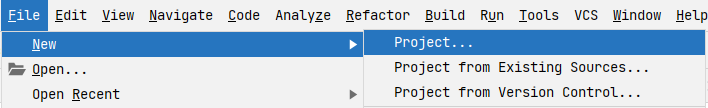
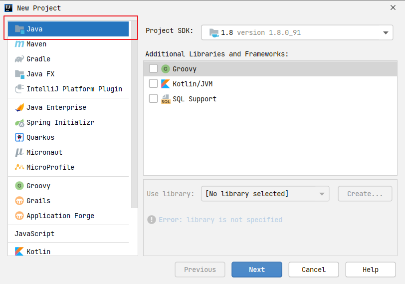
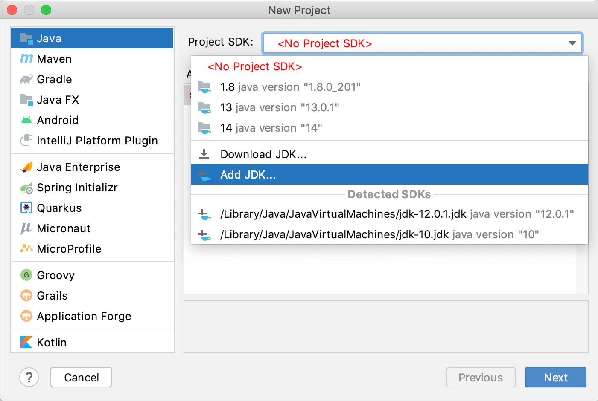
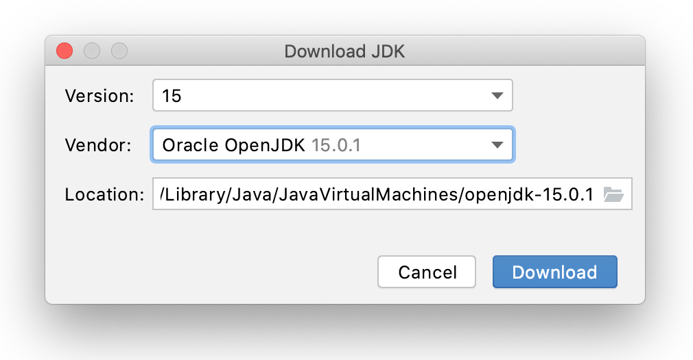
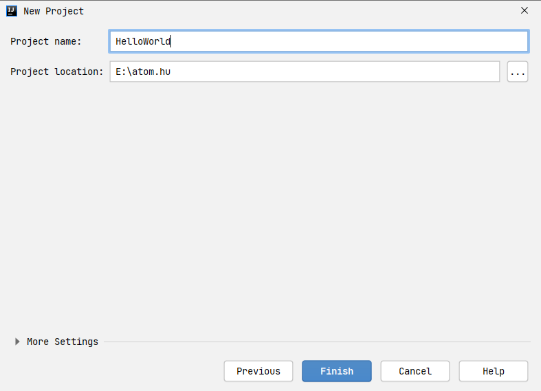
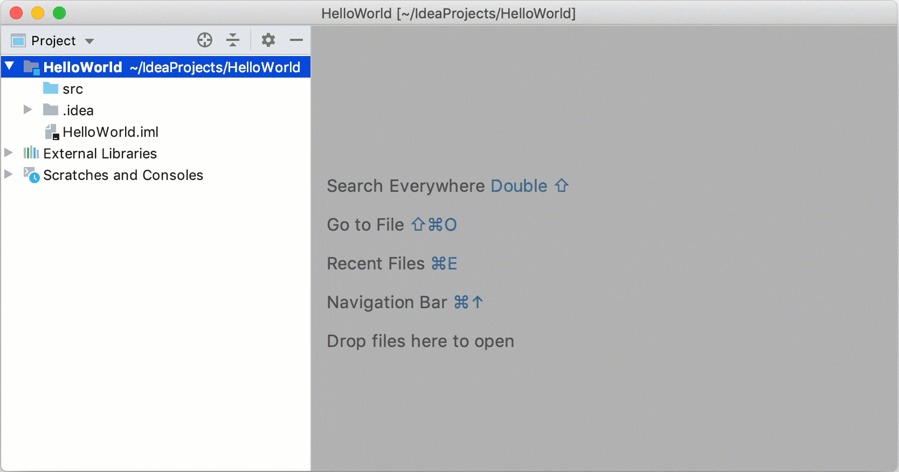
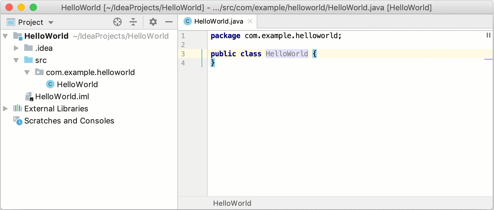
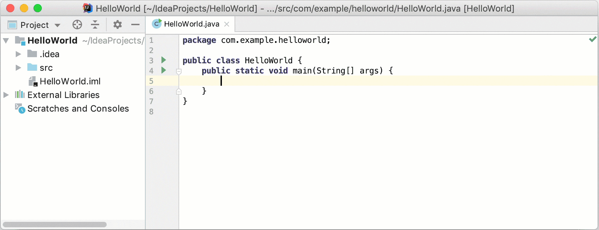
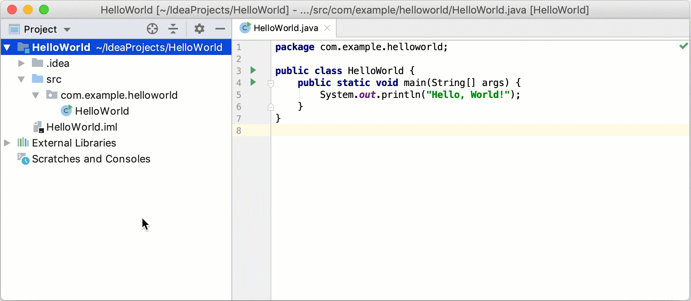

一般来说一个新手在刚安装 IntelliJ IDEA 的时候，其实无从下手，不知道怎么开始，所以本小节内容是将创建一个 Java 项目，运行 HelloWorld。

## 创建 Project
在 IntelliJ IDEA 中，一个项目可以帮助您将源代码、测试、使用的库、构建说明和个人设置组织到一个单元中 启动 IntelliJ IDEA。如果打开欢迎屏幕，请单击 New Project 。否则，从主菜单中选择 File | New | Project。

在 New Project 向导中，从左侧的列表中选择 Java。 

如何还没有配置 JDK 需要配置一下  配置 JDK

如果没有安装的话 也可以在这里 直接在线安装  下载 JDK

因为只是一个简单的 Java 项目，所以不需要使用任何库或框架，直接点击下一步即可，然后为项目命名 HelloWorld  为项目命名 HelloWord

## 创建 Class

 创建 HelloWorld.java

## 创建 Package

 创建 Package

## 编码 HelloWorld

 通过动态模板增加 main 方法

 输出 HelloWorld
## 
## 运行代码

