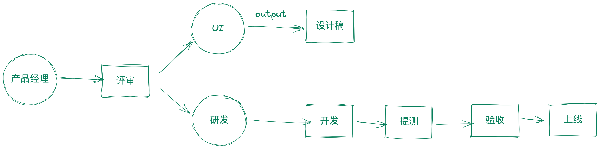
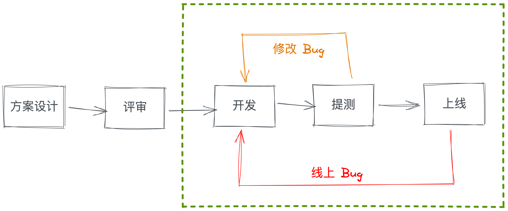
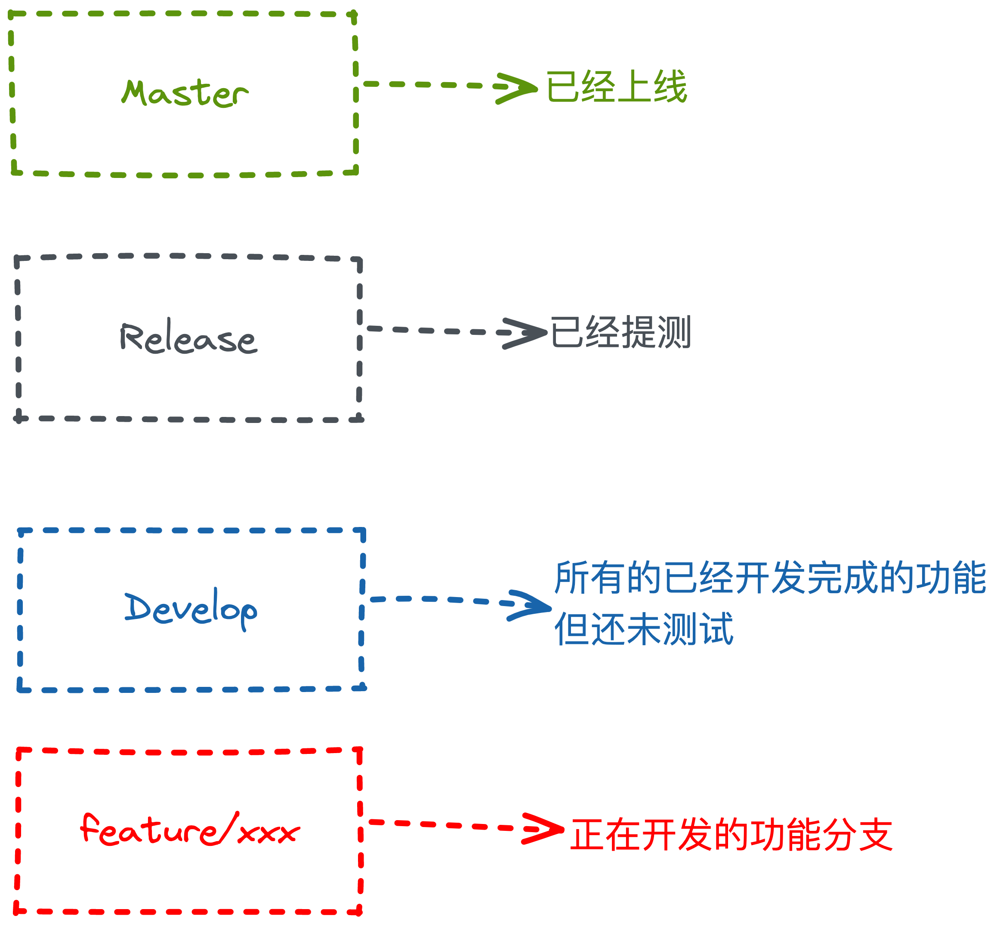
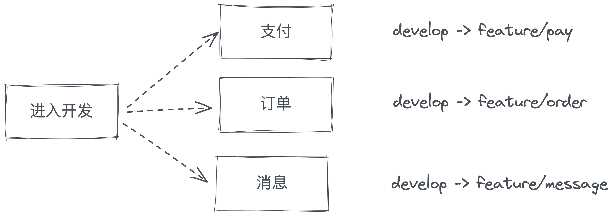
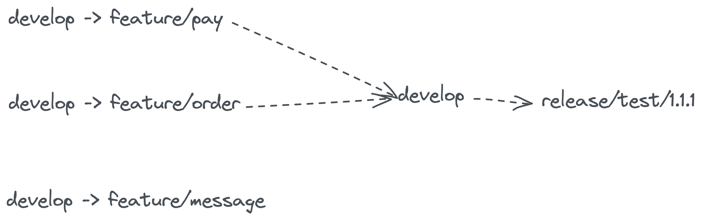
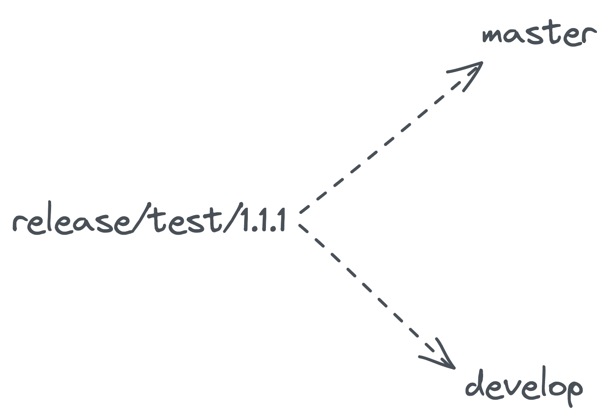
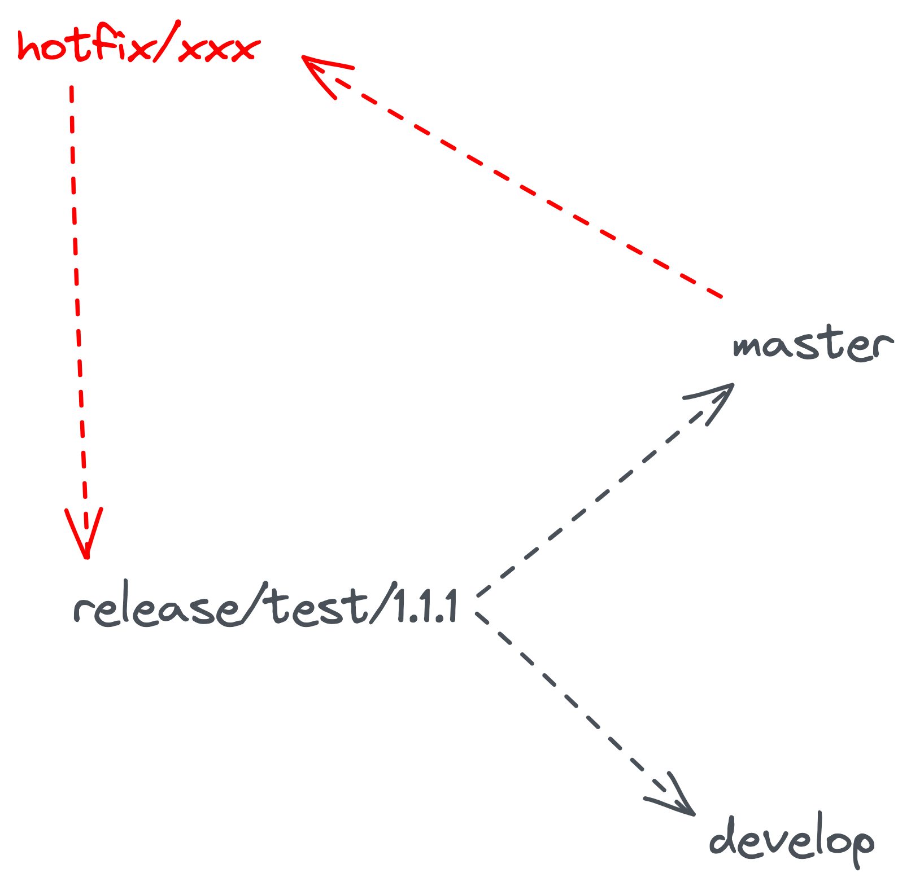
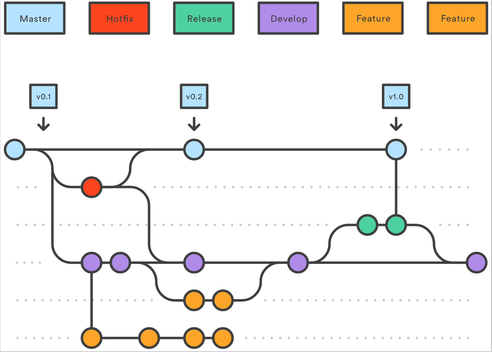
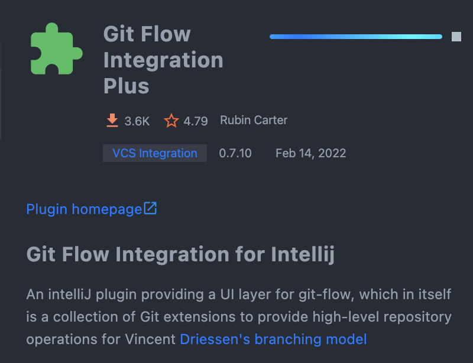

> 一个小插曲，20 年的时候我们组来了一个电子科技大学的实习生，3 个月的时间，刚进来的时候应用层啥都不是很了解，到后面走之前已经能够独立负责 我司 海外电商服务器维护和新功能添加，最后还在我们的 leader 的要求下，阅读了 redis 的源码，在走之前给我们做了一次分享。
> 
> 但是当我们问他在这里最大的收获是啥的时候，他说「**我在这里最大的收获就是将 Git 学会了」**

## 背景
前面几个小结介绍了 Git 的基本操作

- [commit in「IntelliJ IDEA」](https://mp.weixin.qq.com/s/KzidXL6lU59_WihW8ckKbw)
- [add & push in「IntelliJ IDEA」](https://mp.weixin.qq.com/s/80b5prFFwtFJ17AP2DOV-A)
- [log in「IntelliJ IDEA」](https://mp.weixin.qq.com/s/IkN-gxblz_-EV9jSB9qLyA)
- [branch in「IntelliJ IDEA」](https://mp.weixin.qq.com/s/O1XsxQ4QUWP8ItiyWoF3uA)
- [rebase in「IntelliJ IDEA」](https://mp.weixin.qq.com/s/2jiNJjVjRvi_GBU62Tnz4w)

上面的其实算是对 Git 的一个基本操作，基本上学会上面的内容，应付工作肯定是没有什么问题的。不过我们想要更好的管理工作，管理代码，那么我们需要学会一些 Git 的工作流，这样才能让我们工作的更加顺利。

## Git 工作流
工作流，我们可以先讲讲为什么会有工作流，可以可先看看一个产品的研发周期是怎样的。  上面是一个简化版的流程图，可以看研发部分，我们从评审需求后 介入研发工作，总体来说会经过这几步操作

- 方案设计
- 方案评审
- 进入开发
- 提测
- 预发布
- 上线

 在上图的流程中真正涉及到编码环节的是虚线框中的部分，因为他对应到不同的状态 **开发**，**提测**，**上线，**所以一般在工作中我们也用不同的代码分支进行区分。

 上面的分支 语义只供参考，因为每个工资的规定不一样，有的以 master 为上线版本，有的以 release 为上线版本。不过本质差别不是很大。

## 开发产品
下面我们结合产品研发周期 和 git 工作流看看他们怎么进行配合的。  在完成「需求评审」之后，我们正式进入开发环境，通过对需求进行拆解，我们这次总共新增了 3 个模块，所以我们需要 3 个 功能分支。

 3 个模块同时进行开发，但是顺序和速度肯定是不相同的，所以我们假定「支付」和「订单」模块提交完成，进入测试阶段，他们讲合并回 develop 分支 通过 develop 分支 签出 relase 分支进行提测。

在提测后「测试同学」提出的 Bug 的修复，我们需要在 release 分支上进行。

在测试过程中「消息模块 feature/message」开发完成后我们也是按照相应的步骤合并回 develop 在手动 merge 到现在正在测试的分支

 在我们所有的功能分支完成测试后，我们将 release 的变动分别合并到 master 和 develop 分支。

 上线之后遇到 Bug ，我们将从 master 分支签出 hotfix 分支，进行修改，然后提测环节就跟以前一样，提测完成后分别合并到 develop 和 master 分支。使用 master 分支进行上线。

## Git flow
### master
【线上的分支】 - 是线上版本分支，也可以理解为随时可以发布的稳定版本，要求在每次版本封版后由主程序员合并release分支代码进来，开发人员不可以随意操作。
### develop
【开发基础分支】 - 包含待上线的新内容，是你进行任何新的开发的基础分支。当你开始一个新的功能分支时，它将是开发的基础，由此拉出feature分支准备新功能开发。另外，该分支也汇集所有已经完成的功能，并等待经过release分支测试通过后最终被整合到 master 分支中。
### release
【上线分支】 - 当开发结束后用来提测并且为本次版本最终上线的分支，所有测试阶段的bug全部在此分支修复，测试结束后合并到 master 和 develop 分支中。 当准备将develop上的新内容发布到生产环境时，需要拉release分支。release分支可以隔离develop后续对本次上线的影响。当release拉出来后，不用担心其它的东西会合过来，只需要在这上面专注测试和修复bug。
### feature
【新功能开发分支】 - 开发新功能时以develop分支为基础建立新的feature分支进行单独开发。当需要此功能的时候，只需要将该 feature 分支合并入 develop 分支，下次一并提测即可。 这样设计可以避免这个功能在尚未开发完成或者通过测试的时候混入发布的版本，而导致不可预知的不稳定。当然也可以同时开启多个 feature 分支进行不同新功能开发，在合适的时候合并提测即可。
### hotfix
【线上紧急bug分支】 - 用来修复线上的紧急bug，应由 master 拉出，并在修复完成后合并入 master 和 develop 保证两分支的bug已修复。

## Git Flow in「IntelliJ IDEA」
在「IntelliJ IDEA」中使用 Git Flow 我们主要是依赖一个插件.  安装插件之后需要重启「IntelliJ IDEA」 生效

[https://plugins.jetbrains.com/plugin/7315-git-flow-integration](https://plugins.jetbrains.com/plugin/7315-git-flow-integration)
## 总结

> 这是我是用「IntelliJ IDEA」的第五年，因为自己比较热爱去探索一些可以减少繁琐工作的方法，所以对「IntelliJ IDEA」 了解的会稍微多一些，工作 自己也经常会整理一些文档，但是因为自己总体来说比较懒散，所以一直没有将整理的文章完成的梳理。
> 
> 所以今年我自己搭建了这个公众号给自己定了 工作日 每天早上 9 点分享技巧，原生程序员写作 肯定会有写的不好 或者逻辑不同的地方，如果你有任何意见或者你有建议欢迎添加我的微信一起讨论。
> 
> 