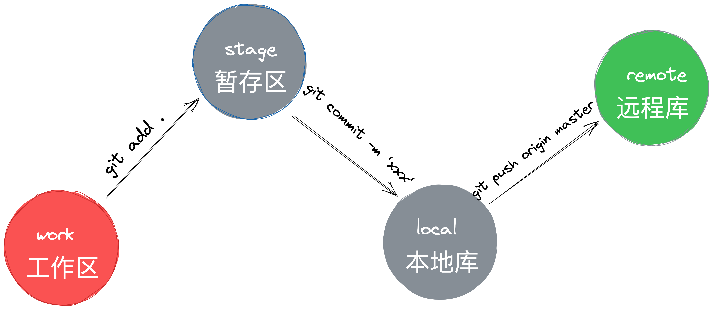
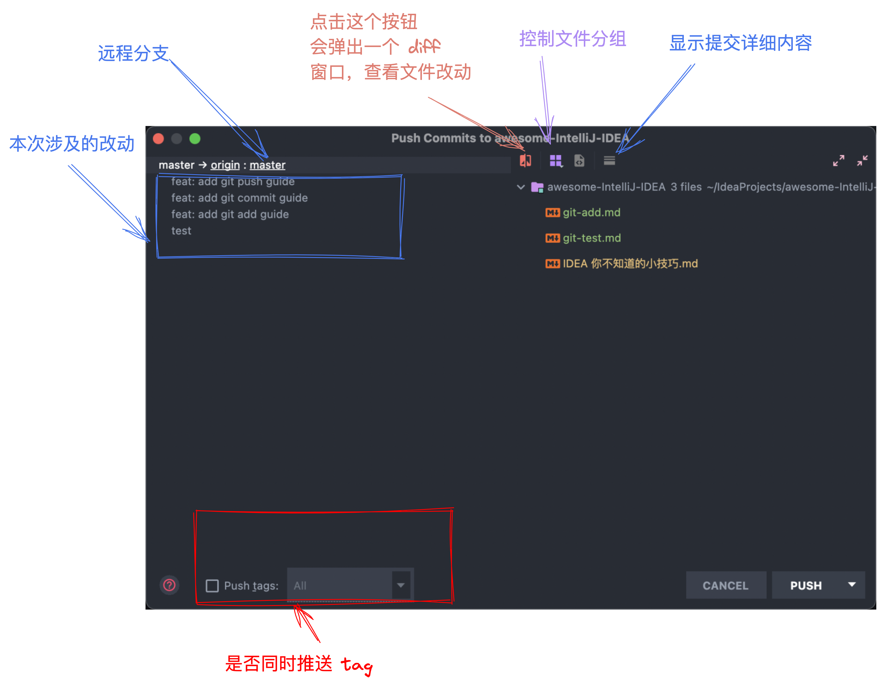
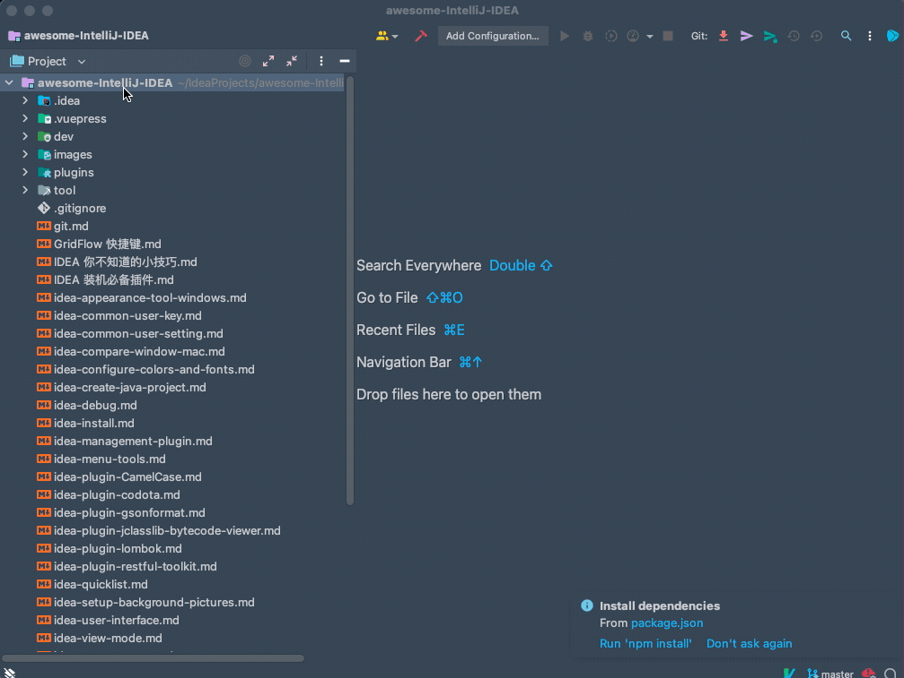
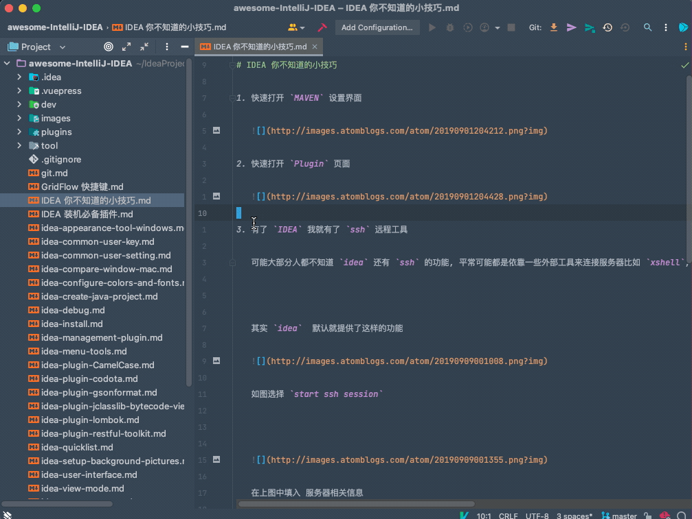
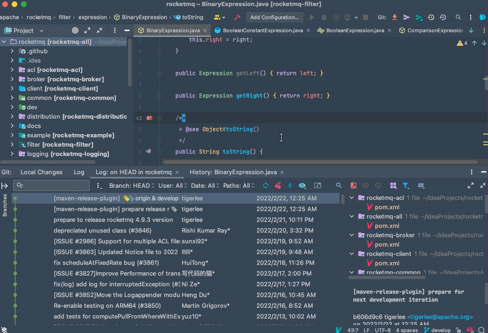
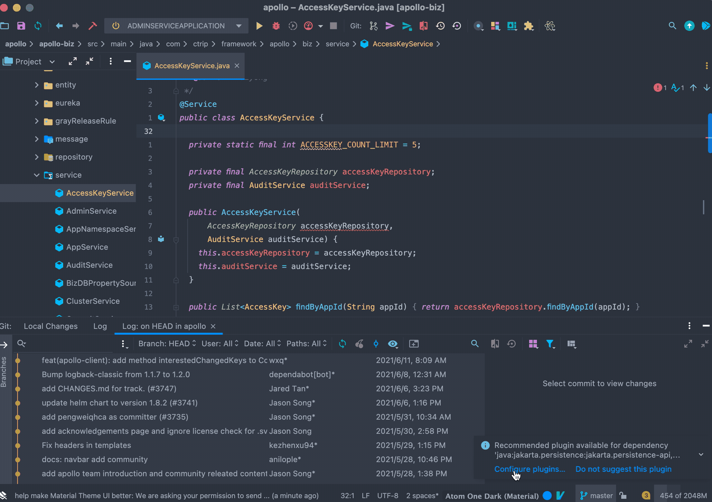
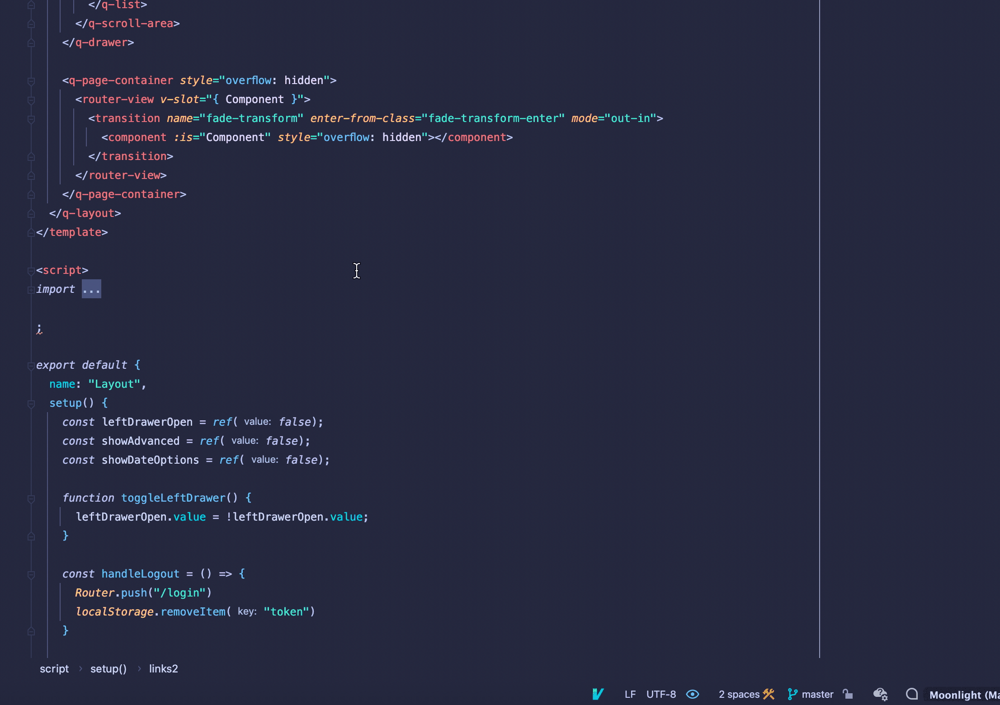
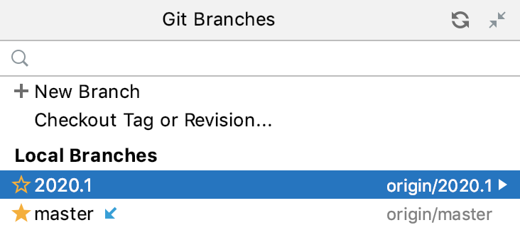

# Commit

本周主要介绍 在 「IntelliJ IDEA」 中 Git 的使用。

希望通过本周的更文，能够让大家在 「IntelliJ IDEA」中能够处理项目遇到的各种问题，同时我将列举在项目中常见的 Git 问题以及解决方案。

本文主要通过 Git 命令和「IntelliJ IDEA」中的操作相结合的方式。

因为本质上所有的「IntelliJ IDEA」的操作都是对应了命令的。

首先这篇文章适合平常大部分时间都在使用 JetBrains 系列的软件，团队主要的协作方式是使用 Git，然后你对基本的 Git 的操作没啥问题。

这是第一篇文章，主要介绍一些简单的操作。
## 
## 场景假设
在正式开始前，我们需要做一些场景假设，这样更好的可以贴近公司的项目，以及模拟更多的异常情况。

这是我们演示的项目：「[awesome-Intellij-IDEA](https://github.com/xiaoxiunique/awesome-IntelliJ-IDEA) 」就将它比喻为我们公司正在做的项目。<br /><br />我目前正在使用的「IntelliJ IDEA」 的版本为 2021.3.2, 「Git」 版本为 2.30.1。

## git init
一般来说我们在公司里面刚开始会遇到两种情况。

<br />一种是开发老项目，我们需要去云端拉取代码, 然后切换到对应的 dev 分支进行开发。

<br />一种是创建新项目，并推代码去云端。

<br />另一种是新项目已经开发了一端时间，但是一直没有上传云端，现在需要上传。

针对第一种老项目情况命令行就比较简单，就直接 git clone 一下就可以了，这里介绍一下在「IntelliJ IDEA」 中的几种 clone 方式<br /><br />上面演示的是在启动页面，直接点击右上角的 GET FROM VCS，然后填入项目地址即可。


针对直接就是新项目的情况，其实还是直接使用命令行方便一点。
```shell
git init -y;
git add .;
git commit -m 'init';
git push origin [master|main];
```

如果是老项目，但是云端地址已经创建了。需要注意在 commit 之前需要 pull 一下。
```shell
git init -y;
git add .;
git commit -m 'init';
git pull;
git push origin [master|main];
```

## git commit
代码拉取下来之后，紧接着我们就会进行我们的业务开发，当一个 feature 开发完毕之后，我们就需要将代码进行提交进入后续的 flow。

「首先我们需要先进行 commit 操作」<br /><br /><br />一个小插曲，看上图 当前我修改了文件，进行了一次格式化，并在最下方添加了内容，这个时候的文件状态还属于在工作目录。

查看图片中标注的状态可知

- 当文件被修改之后在目录中文件的颜色会变为淡黄色。
- 当编辑器代码行被修改之后左侧会呈现淡蓝色。
- 当代码被删除之后，左侧会出现一个小三角形。
- 当新增代码时，左侧为 淡绿色。

而且编辑器左侧有颜色的部分都是可点击的。<br />

回到整理，现在我们模拟的是对代码进行了就修改，那么修改完毕之后我们就需要将代码从「工作区」添加到本地库<br /><br />对应的就是 git commit 的命令。<br /><br />总共有 8 种方式可以 commit

- 在项目名上右键
- 在某个文件夹上右键，这个是只会 commit 这个文件夹下的文件
- 通过唤醒 VCS Operations Dialog 进行 commit
- 分别点击菜单栏 Git -> Commit 和工具栏小飞机图标
- 在编辑区域 右键 Git 提交
- 和 快捷键 Command + K
- 还有可以通过 Search Actions，搜索 commit 提交

当进行 Commit 之后我们会看到下面格式的弹窗<br /><br />图片上应该标的很清晰了，大家就看图片吧，做好对应的配置和填写好对应的 commit message 之后，就可以点击下方的 commit 了。<br /><br />commit 完成之后在查看文件的状态，就看到所有的刚才的展示都已经没有了.
## 
# Add & Push
这是本周分享的第二篇文章。

第一篇文章中主要介绍了在「IntelliJ IDEA」中如何初始化项目

以及如何进行 commit ，从工作区到本地库。

今天主要分享的内容为 Git Add & Git Push

## Git Add

昨天分享了对文件的修改之后进行 Commit 操作的介绍。

对于已经存在的文件，「IntelliJ IDEA」在处理的时候会自动 add。

不需要像命令行那样 git add xxx，但是有一种情况例外，那就是这个文件是新创建的。<br /><br />在「IntelliJ IDEA」中第一次创建新文件时会弹窗提示是否将文件添加到 Git 中。

如上图所示。会提醒你是否将当前新增文件添加到 vcs 版本控制中，如果勾选是则以后每次新增文件的时候「IntelliJ IDEA」相当于自动会添加 add 操作 不用手动处理。<br /><br />勾选添加之后 文件颜色由刚添加时的 红色变为了蓝色。

个人建议如果不是项目就是那种非常特殊的那种，还是可以打开这个开关。

不然就是很有可能出现。本来在你本地运行的好好的。同事拉取下来的时候不能运行。<br /><br />看半天原来是文件没有提交。

毕竟每天同步代码是我们每天必须会去做的事。

如果这个问题不注意那么就很有可能经常会出现 还是挺烦人的。

<br />如果是不小心关闭掉了设置 可以在这里设置回来, 在 When files are created 选项下勾选 Add silently，就可以默认添加了。

<br />新的文件在项目中也是非常容易看出来的，在文件列表中 修改的的文件会呈现淡黄色。尔新增的文件则是谈绿色。如果是没有添加到工作目录的文件则是 红色。


<br />如果是文件已经添加了，但是还不在暂存区，这个手动在要添加文件或者文件夹下选着右键 Git -> add to vsc

<br />如果你有特殊的需求，在文件的某些状态下你想要改变颜色，那么可以去设置里面进行查看，这里面也列举了每一种状态对应的颜色。

## Push
<br />我们将代码提交到本地库之后，其实就相当于一个小型的本地的 Git 管理系统了，不过还不够，毕竟我们的项目是团队开发，我们还需要将我们自己的版本库与团队结合。

我们需要将本地分支推送到对应的远程分支，对应的 Git 命令为
```shell
git push origin <branchName>;
```


而在「IntelliJ IDEA」中出发触发这个操作，总共有 n 种路径，看图<br /><br />本质上小结能够触发 Commit 的位置差不多，因为 commit 后面就是 Push 他们是紧密相关的。



- 这里可以看到此次提交的内容
- 以及此次提交的多少次commit
- 还可以选择是否推送 tag  如果有
- 右侧可以看到对应的 每次的 commit 对应的文件列表。


<br />我们也可以通过快捷键 command + shift + k 触发 push 操作


正常来说我们都是一个项目对应一个地址，在也不保证一些特殊情况，你需要配置两个 Git r。对应的命令为 
```shell
git remote add newAddress https://xxx
```

<br />在「IntelliJ IDEA」菜单中点击 Git -> Manage Remotes， 在弹框中新增地址。

# Log
## 背景
日志在我们软件中尤其重要，如果你没有日志，很难想象你的开发生活能怎样进行下去。

试想一下如果后端服务上线后，用户在线上发现异常，然后现在日志没有啥也没有，那就可以直接当场死亡了。

对于 Git 也一样，这是我们每天都在使用的东西，无论是修改 Bug 也好，还是添加新功能也好 每天都会有很多的更新，那么 log 在整个 Git 的提交中也是非常的重要。

## Git 基础
在 命令行中我们可以使用 git log 查看项目日志<br />
```shell
git log
```
如果感觉这样这样比较杂乱的感觉，那么可以使用<br />
```shell
git log --oneline
```
<br />也可以使用 git reflog 查看带提交编号的 log

对于我这样的手残党来说，处理一些简单的 log 还是可以，要是在复杂一点那就不行了。我自己更多的还是在「IntelliJ IDEA」中进行查看。
## 「IntelliJ IDEA」基本操作
<br />查看整个项目日志<br /><br />查看单文件日志

<br />也可以点击右上方按钮, 查看当文件

<br />查看当前文件最近修改人,  这个真的算是非常效率的一个功能了，这个我敢说很多人都不知道。

<br />查看分支日志

<br />查看某个人提交记录

<br />在 git log 历史中搜索内容, 如果提交日志比较规范的话 就可以通过日志搜索看到最近修复了哪些 Bug，和新增了哪些配置。

## 回滚到指定位置
<br />如上图所示，我们在 Apollo 项目这里，直接回退到第一次代码提交的位置，这样我们可以看一看他地址第一次提交的样子，这样在阅读源码的时候非常有用，一般最开始的样子比较简单，容易看懂，理解了大致结构之后，后面也会比较好理解。

## 从指定位置迁出分支

<br />有的时候为了排查问题，我们需要从历史上某个点来排查，这个时候最好是从某个

# Branch
<br />在 「IntelliJ IDEA」 中，所有带有分支的操作都在 Git Branches 弹出窗口中执行：点击下方的分支图标，所有的分支操作都在这个 dialog 中处理。

<br />在 Log 界面左侧 也可以展开 对多个分支进行管理。

## 1. create new branch
### 1.1 从当前分支创建一个新分支


1. 在Branches弹出窗口中，选择New Branch或在Git工具窗口工具窗口的Branches窗格中右键单击当前分支，然后选择New Branch。

2. 在打开的对话框中，指定分支名称，如果要切换到该分支，请确保选中Checkout 分支选项。新分支将从当前分支 HEAD 开始。

### 1.2 从选定的分支创建一个新分支


1. 在分支弹出窗口或Git工具窗口的分支窗格中，选择要从中启动新分支的本地或远程分支，然后从 Selected 中选择 New Branch。
1. 在打开的对话框中，指定分支名称，如果要切换到该分支，请确保选中Checkout 分支选项。

### 1.3 从选定的提交创建一个新分支


1. 在[日志视图](https://www.jetbrains.com/help/idea/log-tab.html)中，选择要作为新分支起点的提交，然后从上下文菜单中选择新分支。
1. 在打开的对话框中，指定分支名称，如果要切换到该分支，请确保选中Checkout 分支选项。

## 2. checkout new branch
### 2.1 签出一个分支作为一个新的本地分支
如果您想在其他人创建的分支上工作，您需要检查它以创建该分支的本地副本。<br />要确保您拥有远程分支的完整列表，请在分支弹出窗口中单击Fetch ：<br />

1. 在“分支”弹出窗口或Git工具窗口的“分支”窗格中，从 Remote Branches 或 Common Remote Branches （如果您的项目有多个根并启用[同步分支控制](https://www.jetbrains.com/help/idea/manage-branches.html#synchronous_branch_control)）或从Repositories |中选择要在本地签出的分支。远程分支（如果已禁用）。
1. 从操作列表中选择Checkout 。
1. 如有必要，为此分支输入一个新名称，或保留与远程分支对应的默认名称，然后单击OK。新的本地分支将设置为跟踪原始远程分支。


## 3. 在分支之间切换

## 4. 比较分支
### 4.1 将分支与当前分支进行比较

<br />比较当前分支和历史分支做了哪些修改，比如说比较当前功能分支与主分支相比。


### 5.2 将分支与工作树进行比较

<br />对于我们本地还没有 push 到远程的更改，我们可以选择使用 show diff with working tree, 这样可以比较对应分支和本地的区别

## 5. 将文分支标为 收藏夹


## 6. 推送被拒绝自动 update
<br />用 Git 新手经常会存在，自己还没有 pull 就在 push 了，这样会导致 push 失败，勾选这个设置之后在 reject 之后会自动 update

## 7. 通过 action 打开 Branch 控制窗口


# 总结
> 这是我是用「IntelliJ IDEA」的第五年，因为自己比较热爱去探索一些可以减少繁琐工作的方法，所以对「IntelliJ IDEA」 了解的会稍微多一些，工作 自己也经常会整理一些文档，但是因为自己总体来说比较懒散，所以一直没有将整理的文章完成的梳理。
> 
> 所以今年我自己搭建了这个公众号给自己定了 工作日 每天早上 9 点分享技巧，原生程序员写作 肯定会有写的不好 或者逻辑不同的地方，如果你有任何意见或者你有建议欢迎添加我的微信一起讨论。
> 
> 