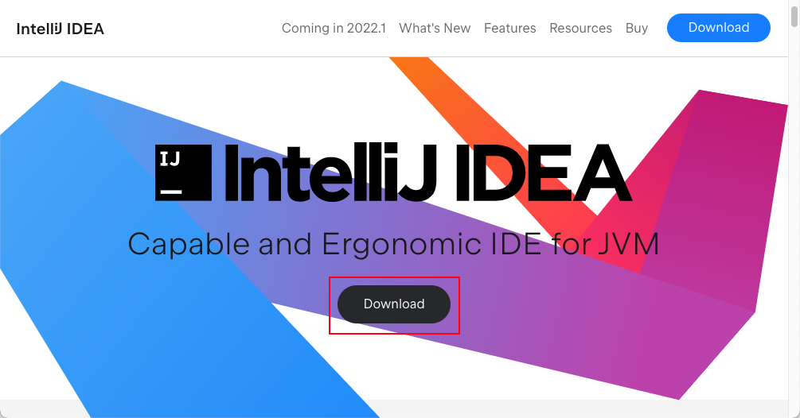
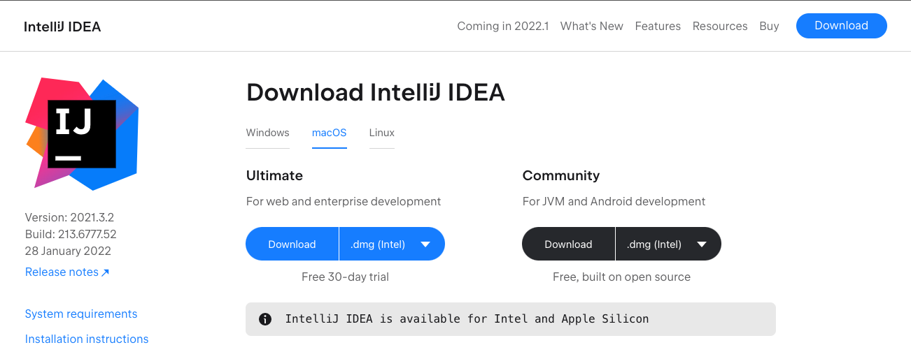
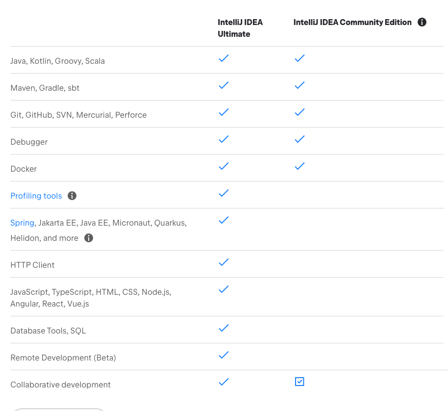
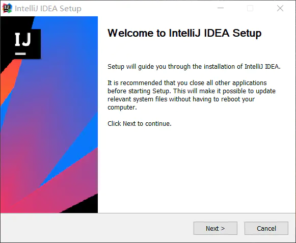
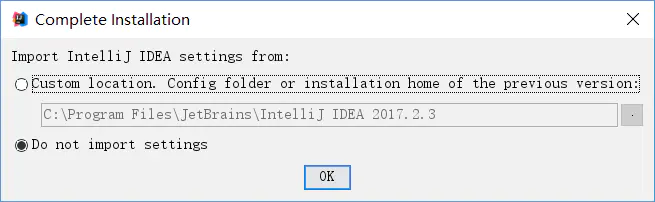

## 前言
在下载 IntelliJ IDEA 前最好是安装好以下环境

- JDK 1.8
- Maven
- Git
## 
## 电脑配置要求
**MacOS**

- macOS 10.14 or higher
- 2GB RAM minimum, 8 GB RAM recommended
- 2.5GB hard  disk space, SSD recommended
- 1024*728 minimum screen resolution

**Windows**

- 64-bit versions of Microsoft Windows 10, 8
- 2 GB RAM minimum, 8 GB RAM recommended
- 2.5 GB hard disk space, SSD recommended
- 1024x768 minimum screen resolution

**Linux**

- GNOME or KDE desktop
- 2 GB RAM minimum, 8 GB RAM recommended
- 2.5 GB hard disk space, SSD recommended
- 1024x768 minimum screen resolution

## 下载
[IntelliJ IDEA 官网下载地址](https://www.jetbrains.com/idea/) 如果你想要下载其他版本，访问这个地址 [IntelliJ IDEA Other Version](https://www.jetbrains.com/idea/download/other.html) 
> 因为某些特殊原因，可能你到了高版本就不能使用。这个时候可能就需要下载一个低版本的。

 打开官网下载安装包，点击 Donwload

 左侧是 [专业版]，右侧是 [社区版], 我这里是 macOS 系统，你可以根据你自己当下的系统在上方 tab 进行切换

 专业版对很多工具做了集成开箱即用。社区版只提供最基础的功能。

  **

第一次打开它它会问你是否导入之前的设置，主要有情况会使用到

- 你之前电脑上之前安装过其他版本，现在重新安装了高版本
- 这是一台新电脑，你将你以前电脑的 Idea 配置导出，后倒入当前设备上