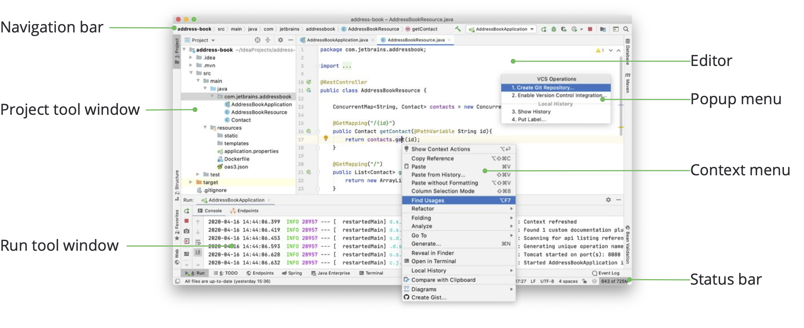
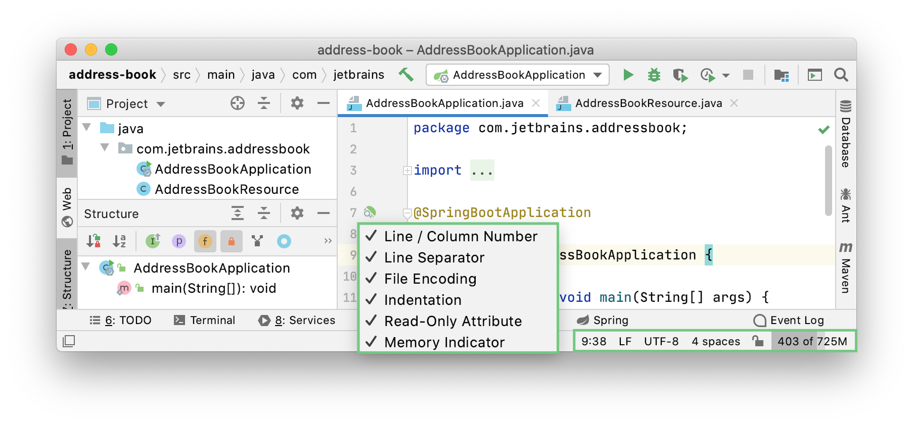
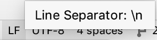
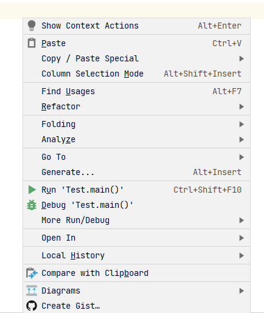
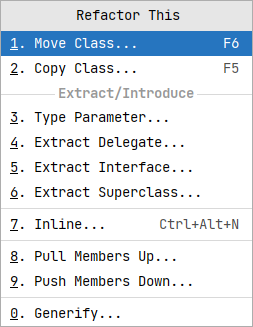

当你在 IntelliJ IDEA 中打开一个项目时，默认的用户界面如下所示 

我将从以下 8 个面板来讲述界面内容

1. Editor
1. Navigation bar
1. Status bar
1. Project Tool window
1. Context menu
1. Popup menu
1. Run Tool Windows

## Editor 

这里是我们 “改变世界的地方” 因为一句句代码从当前窗口产生。

## Navigation bar

顶部的导航栏是 Project 工具窗口的一个快速替代选项，在该窗口中，您可以导航项目的结构并打开文件进行编辑。 使用导航栏右侧的按钮来构建  、运行 和调试  应用程序，访问项目结构.svg)设置 .svg)。它还包含运行任何东西 按钮。

## Status bar

| 小部件 | 描述 |
| --- | --- |
| **52:11** | 行号和列号除以冒号表示编辑器中当前插入符号的位置。单击数字可跳转到特定的行和列。如果在编辑器中选择代码片段，IntelliJ IDEA 还会显示所选片段中的字符数和换行符。 |
|  | 单击可在编辑器中更改当前文件的行尾。 |
|  | 单击可在编辑器中更改当前文件的编码。 |
|   | 点击设置当前文件是否可读。 |
|  | 如果版本控制工具开启，那么这个小组件显示当前版本控制分支，点击可以 进行版本控制 |
|  | 单击可更改当前文件中使用的缩进样式。 |
|  | 显示 IntelliJ IDEA 在堆内存总量中消耗的内存量。有关更多信息，请参阅增加 IDE 的内存堆。 |

## Tool window
工具窗口提供了补充编辑代码的功能。例如，“项目工具”窗口显示项目的结构，“运行工具”窗口显示应用程序运行时的输出。

默认情况下，工具窗口停靠在主窗口的侧面和底部。您可以根据需要对它们进行排列、取消停靠、调整大小、隐藏等等。右键单击工具窗口的标题，或单击其排列选项标题中的“显示选项”菜单按钮。

您可以**指定快捷方式**来快速访问您经常使用的工具窗口。其中一些默认情况下有快捷方式。例如，要打开“项目工具”窗口，请按 Alt+1；要打开“终端工具”窗口，请按 Alt+F12。

## context menu
 右键菜单

您可以右键单击界面的各个元素以查看当前上下文中可用的操作。 例如，右键单击项目工具窗口中与该文件相关的操作的文件，或在编辑器中右键单击以查看应用于当前代码片段的操作。 大多数这些操作也可以从屏幕顶部的主菜单或主窗口执行。带有快捷方式的操作在操作名称旁边显示快捷方式。

## Popup menu
 Refactor 弹出层

弹出菜单提供与当前上下文相关的操作的快速访问。以下是一些有用的弹出菜单及其快捷方式：

- `Alt+Insert` 打开生成弹出窗口，用于根据上下文生成样板代码。
- `Ctrl+Alt+Shift+T` 打开这个弹出窗口的重构，其中包含上下文可用的重构列表。
- `Alt+Insert` 在“项目工具”窗口中打开新弹出窗口，用于向项目添加新文件和目录。
- `Alt+` ` 打开 “VCS 操作” 弹出菜单，其中包含版本控制系统的可用操作。可以使用常用动作的快速列表创建自定义弹出菜单。

上面只是一个概览介绍，后面会有详细的介绍