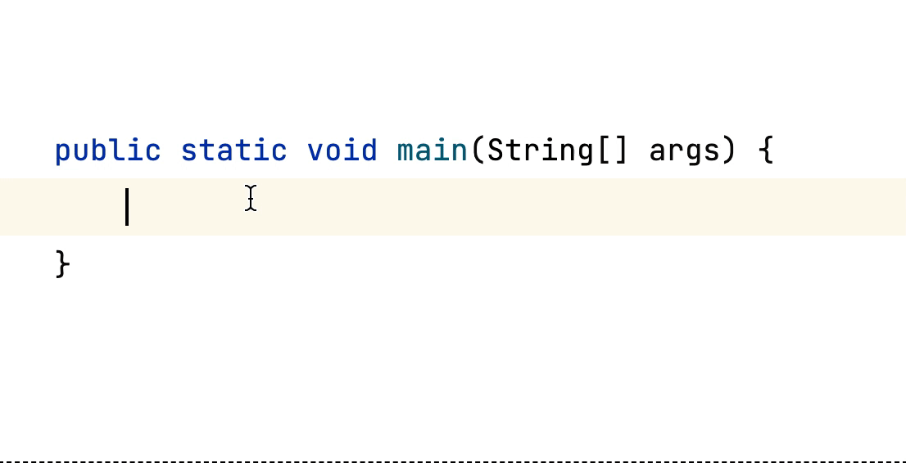
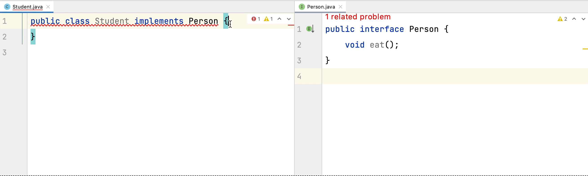
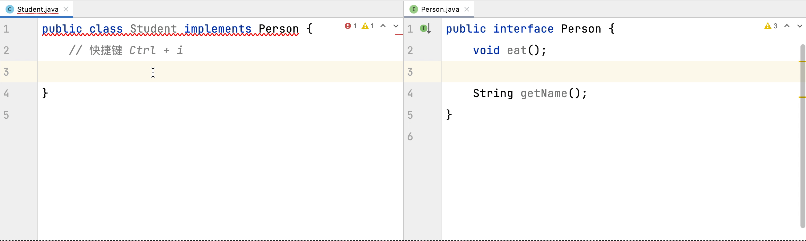

## 前言
能直接快速提升开发效率的方式是什么？ 答：掌握快捷键，快捷键又或者可以说为 **快捷方式**

> 子曰：“工欲善其事，必先利其器。居是邦也，事其大夫之贤者，友其士之仁者。”

虽然对于我们开发而言，其实真正是否能写出高质量的代码，其实是跟我们用什么工具是没关系的。

在我们最开始学习程序的时候，最开始接触肯定也是简单的编辑器比如 Editplus、Notepad++ 这样的编辑器。

但是随着学习内容的升级 肯定最后都会转移到响应语言的编辑器去比如 JS 可能 用 VsCode，C# 用 VisualStudio，Java 用 IntelliJ IDEA。

总的来说，对工具的快捷键或者是快捷方式熟悉之后，也可以节约编码环节的大量时间。

## 操作对比
> 下面列举出的不一定是针对快捷键，总的中心思想就是更加快捷的完成编码。

### 输出 "Hello World"
正常编码  利用 Code Template 

### 实现接口
正常编码  使用快捷键  