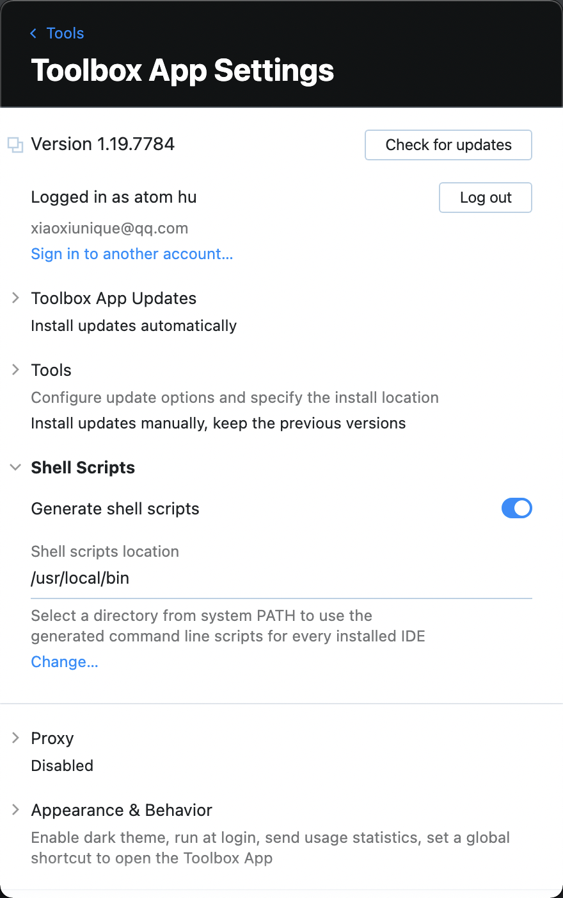

#### 当您只需要编辑一个文件而不需要在 IntelliJ IDEA 中创建或加载整个项目时，可以使用 LightEdit 模式。（我个人一般是搭配 VSCode 使用)

### 打开方式
```shell
idea -e file
```
不过当你第一次使用的时候，那么系统会提示你当前命令找不到
```shell
idea -e list.json 
zsh: command not found: idea
```
因为我们需要对 idea 支持命令行调用进行配置才可使用
> 配置地址：[https://www.jetbrains.com/help/idea/working-with-the-ide-features-from-command-line.html](https://www.jetbrains.com/help/idea/working-with-the-ide-features-from-command-line.html)


也可直接利用 Tool Box 生成命令<br /><br />生成之后就可以投入使用了


### 