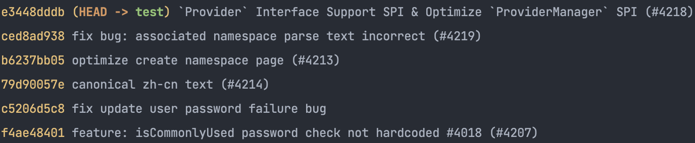
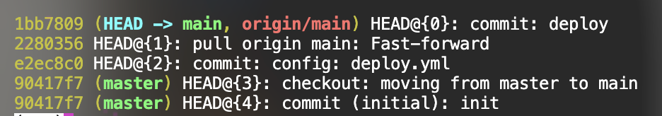
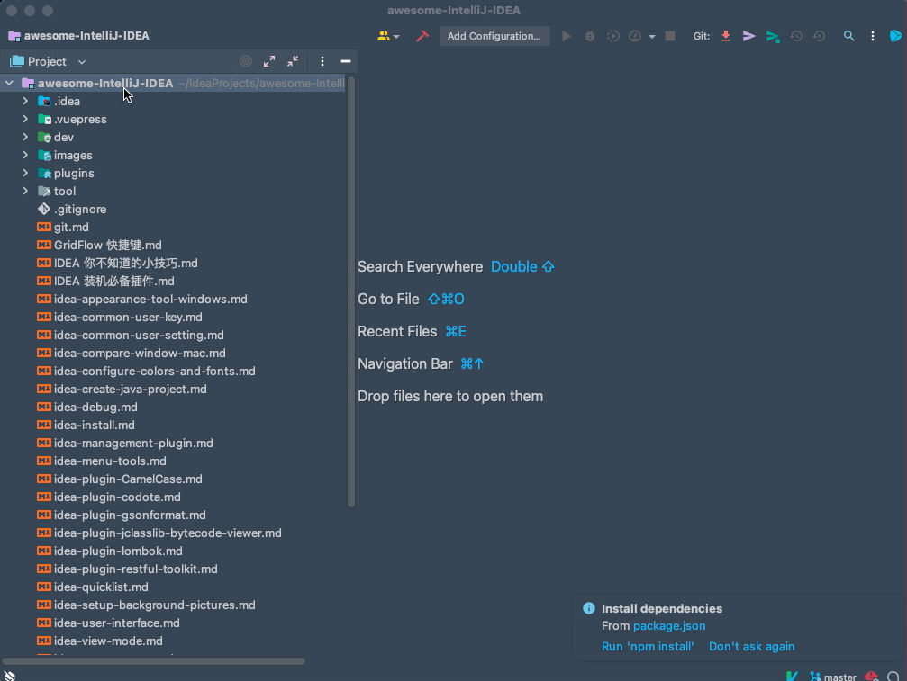
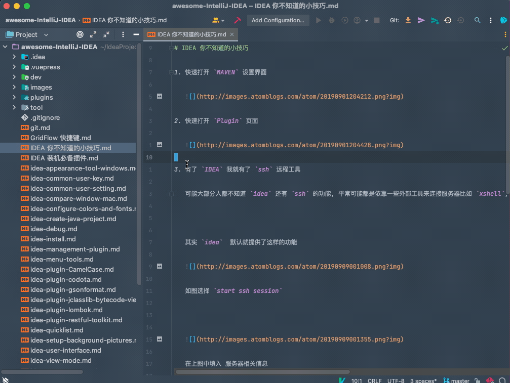
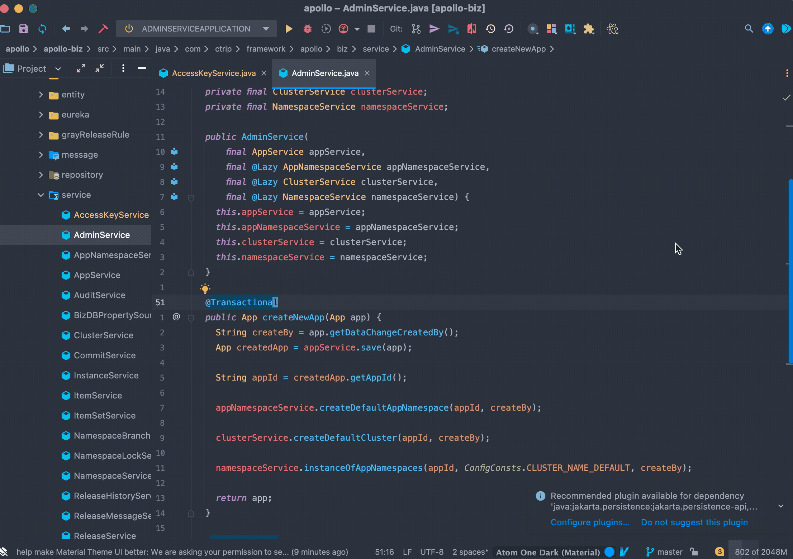
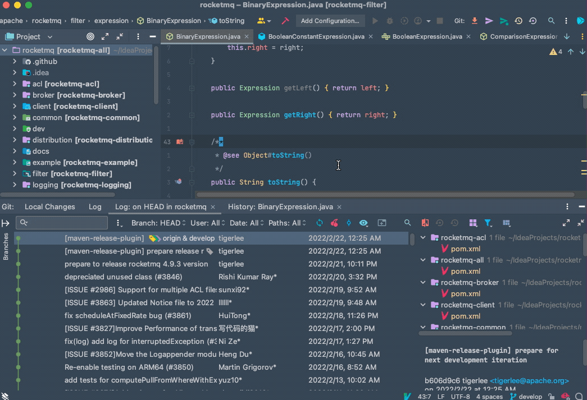
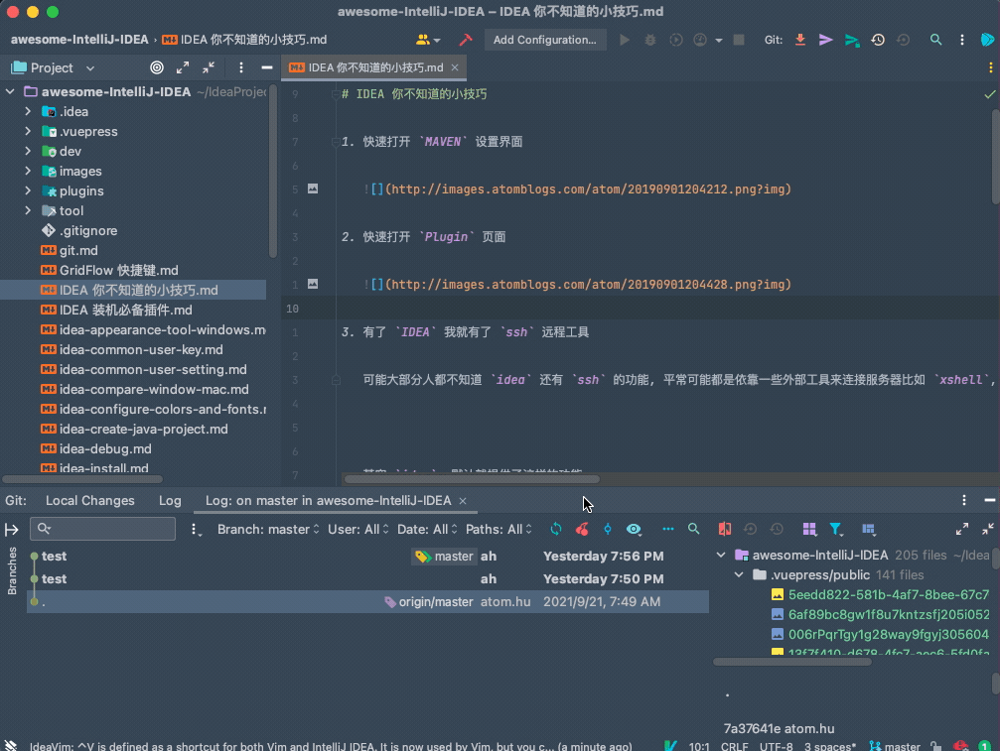
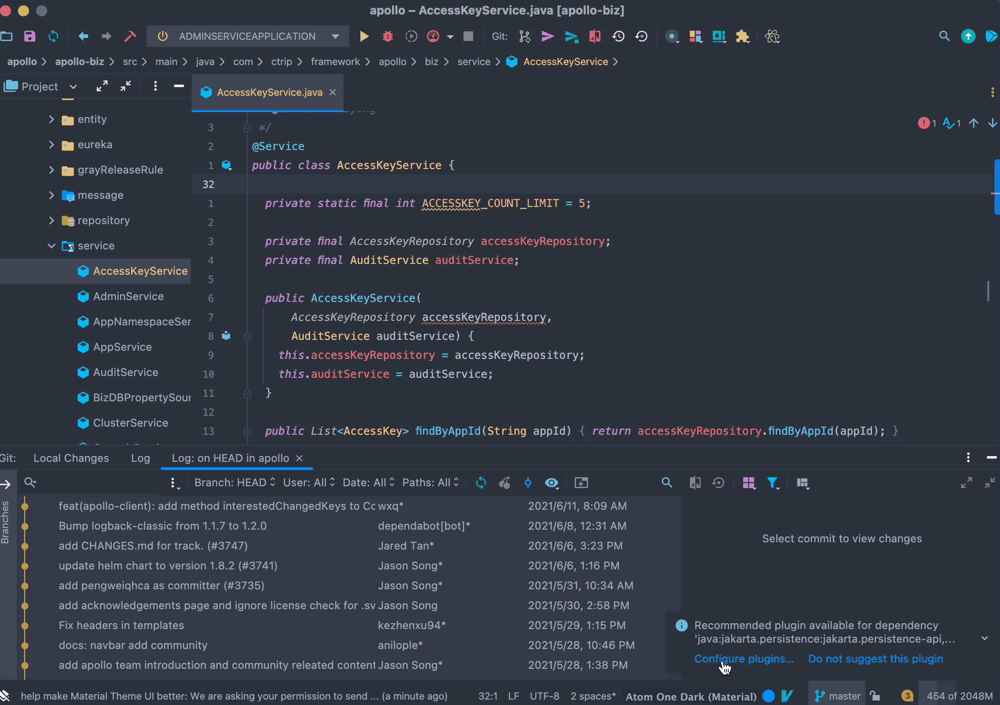
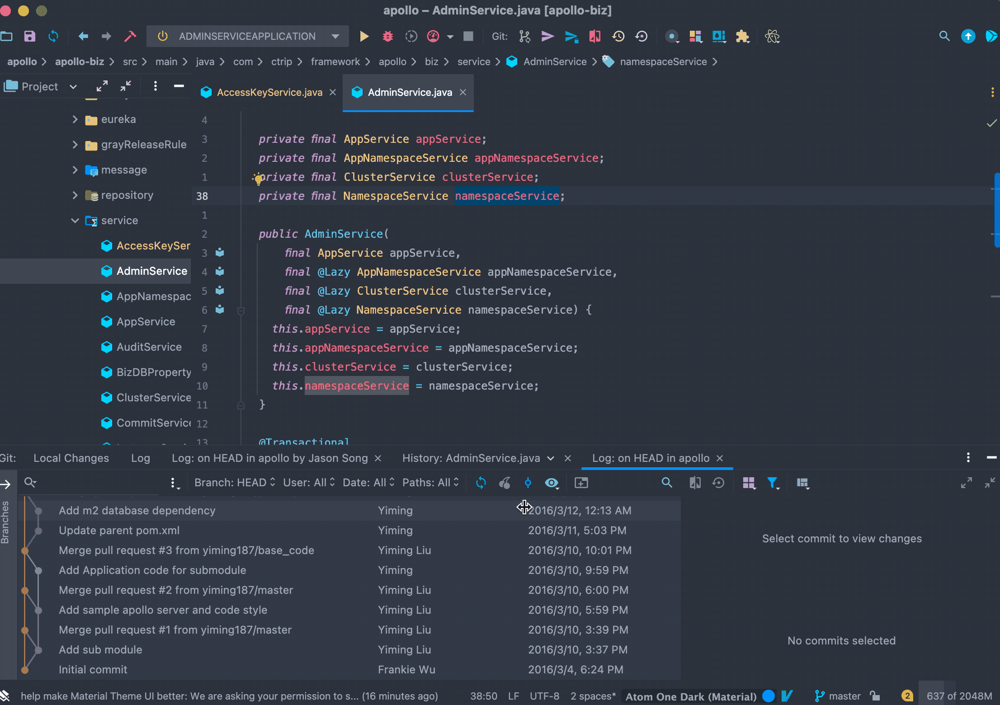

## 背景
日志在我们软件中尤其重要，如果你没有日志，很难想象你的开发生活能怎样进行下去。

试想一下如果后端服务上线后，用户在线上发现异常，然后现在日志没有啥也没有，那就可以直接当场死亡了。

对于 Git 也一样，这是我们每天都在使用的东西，无论是修改 Bug 也好，还是添加新功能也好 每天都会有很多的更新，那么 log 在整个 Git 的提交中也是非常的重要。

## Git 基础
在 命令行中我们可以使用 git log 查看项目日志<br />
```shell
git log
```
如果感觉这样这样比较杂乱的感觉，那么可以使用<br />
```shell
git log --oneline
```
<br />也可以使用 git reflog 查看带提交编号的 log

对于我这样的手残党来说，处理一些简单的 log 还是可以，要是在复杂一点那就不行了。我自己更多的还是在「IntelliJ IDEA」中进行查看。
## 「IntelliJ IDEA」基本操作
<br />查看整个项目日志<br /><br />查看单文件日志

<br />也可以点击右上方按钮, 查看当文件

<br />查看当前文件最近修改人,  这个真的算是非常效率的一个功能了，这个我敢说很多人都不知道。

<br />查看分支日志

<br />查看某个人提交记录

<br />在 git log 历史中搜索内容, 如果提交日志比较规范的话 就可以通过日志搜索看到最近修复了哪些 Bug，和新增了哪些配置。

## 回滚到指定位置
<br />如上图所示，我们在 Apollo 项目这里，直接回退到第一次代码提交的位置，这样我们可以看一看他地址第一次提交的样子，这样在阅读源码的时候非常有用，一般最开始的样子比较简单，容易看懂，理解了大致结构之后，后面也会比较好理解。

## 从指定位置迁出分支

<br />有的时候为了排查问题，我们需要从历史上某个点来排查，这个时候最好是从某个日志点上回退回来比较好。

## 总结
今天主要简单介绍了一下「IntelliJ IDEA」中 log 的查看，内容其实非常简单，可能你扫一秒就看完了，但是还是那个观点，知道的人就觉得很简单，不知道的人怎么也不会想到还会有这么方便的功能。