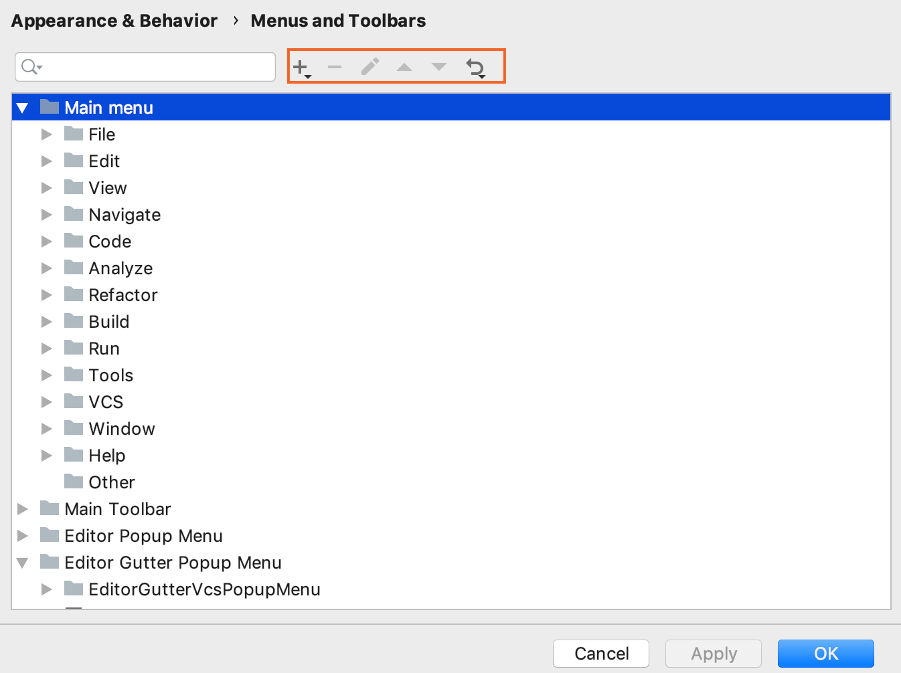
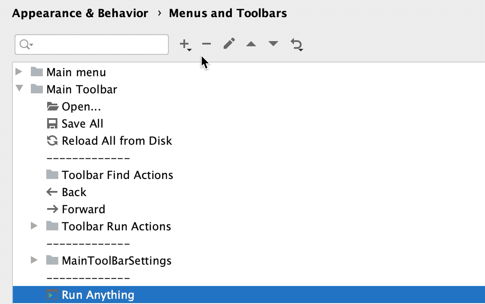
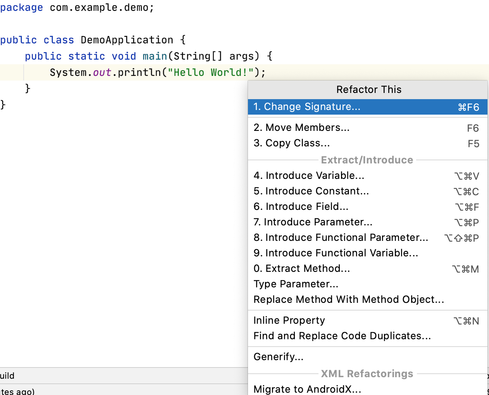
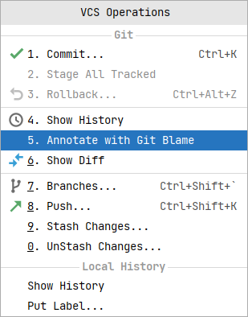
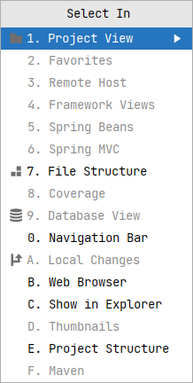
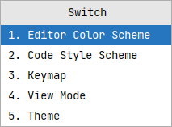

当您使用 IDE 时，您执行某些操作的频率要高于其他操作。

为了最大限度地提高你的工作效率，学习你最喜欢的动作的默认快捷方式，或者为它们指定快捷方式。您还可以自定义菜单和工具栏，使其仅包含您需要的操作，重新组合它们，并配置它们的图标。

例如，如果您使用的是 Java 项目，您可能希望从 File | New 菜单中删除其他不使用的框架文件，以缩短该部分菜单，只留下所需的选项。

## 自定义菜单和工具栏
> Setting | Appearance & Behavior | Menus and Toolbars

在可用的菜单和工具栏列表中，展开要自定义的节点并选择所需的项。

- 单击此处可在选定项下添加操作或分隔符。
- 单击此处可删除所选项。
- 单击此处可添加或更改所选操作的图标。您只能使用 PNG 或 SVG 文件作为图标。
- 单击 或 上移或下移所选项目。
- 单击此处可将选定的操作或所有操作还原为默认设置。

## Quick List 
快速列表是一个弹出窗口，其中包含一组自定义的 IntelliJ IDEA 操作。可以将其视为自定义菜单或工具栏，可以为其指定快捷方式以进行快速访问。您可以根据需要创建任意多个快速列表。快速列表中的每个操作都由 0 到 9 之间的数字标识。

**重构**
> Windows: Ctrl + Alt + T
> Mac：⌃ T

**VCS**
> Windows: Alt + `
> MAC：Ctrl + V

**Select In**
> Windows: Alt + F1
> Mac: 

**Switch**
> Windows: Ctrl + `
> Mac: 

上方所提到的快捷键都是对日常开发中极大提升开发效率，建议熟读并背诵

