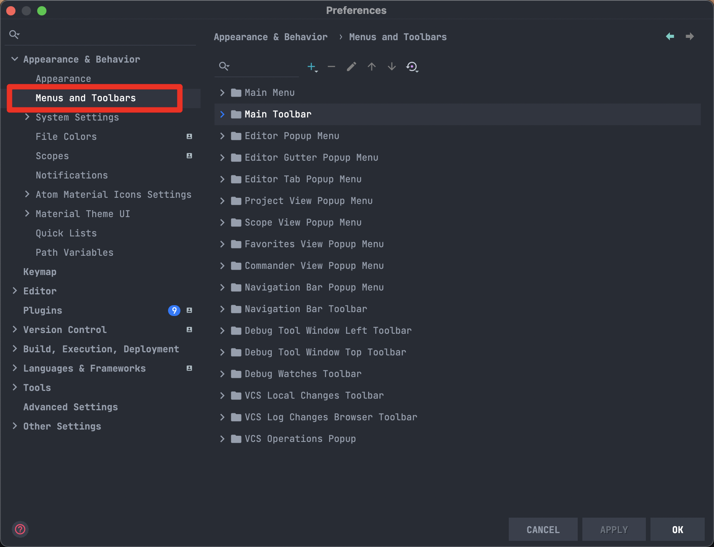
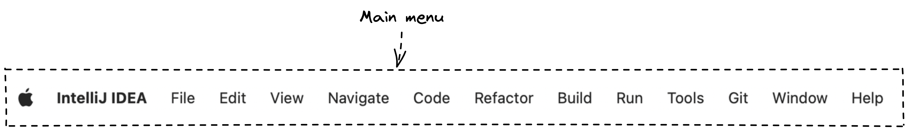
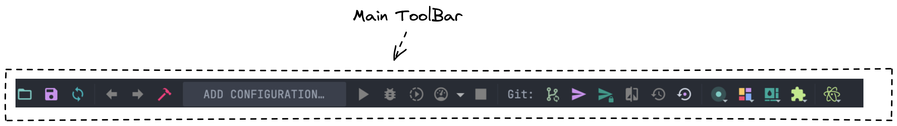
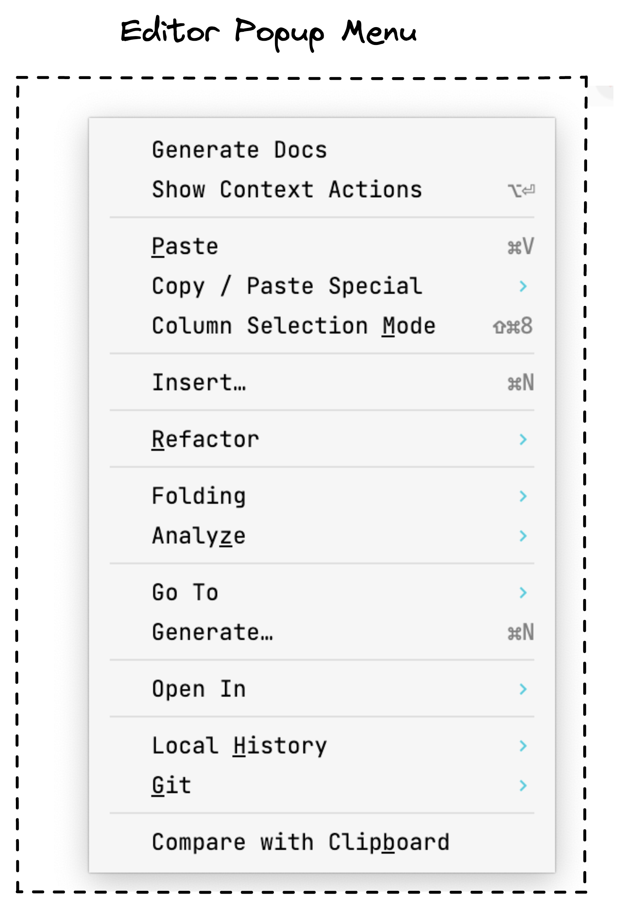
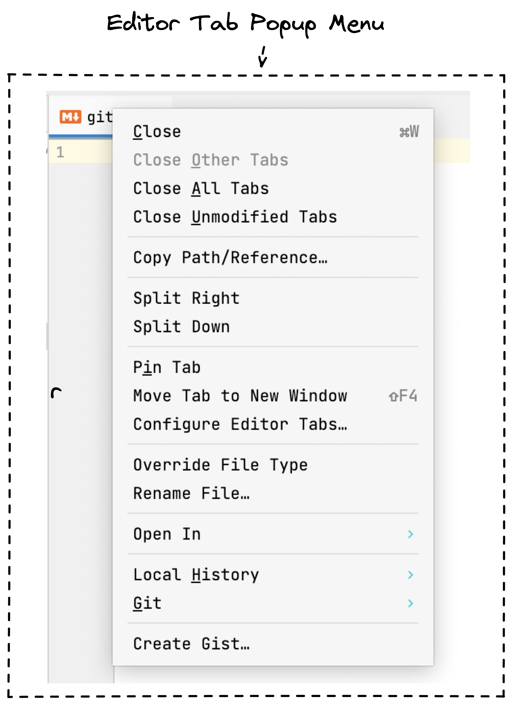
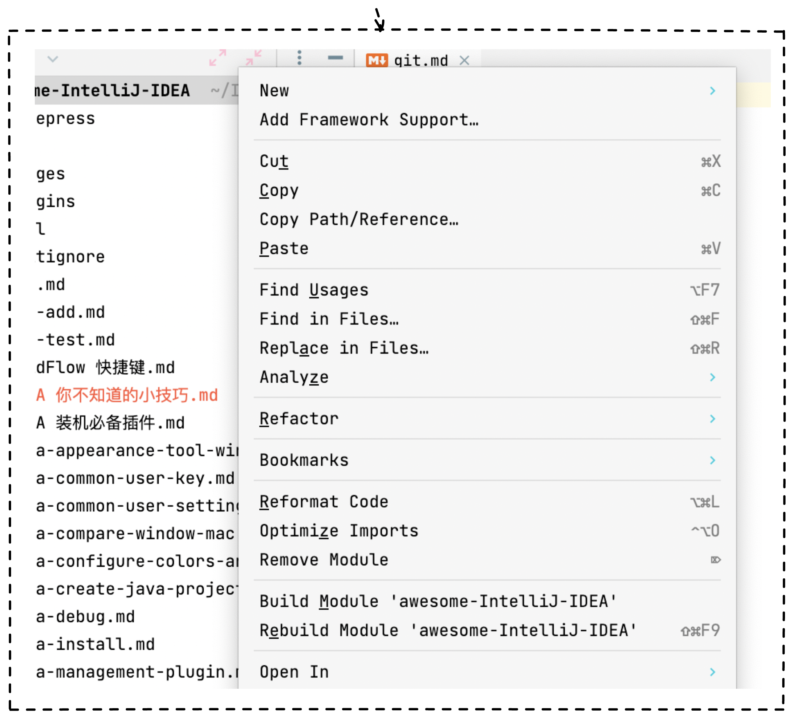
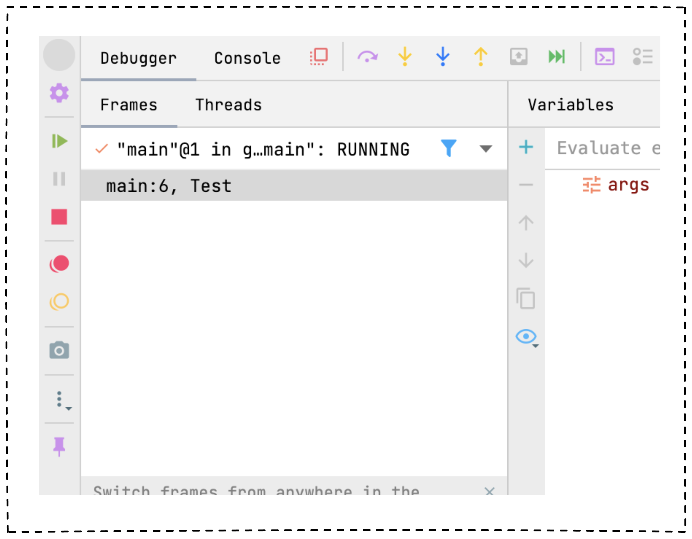
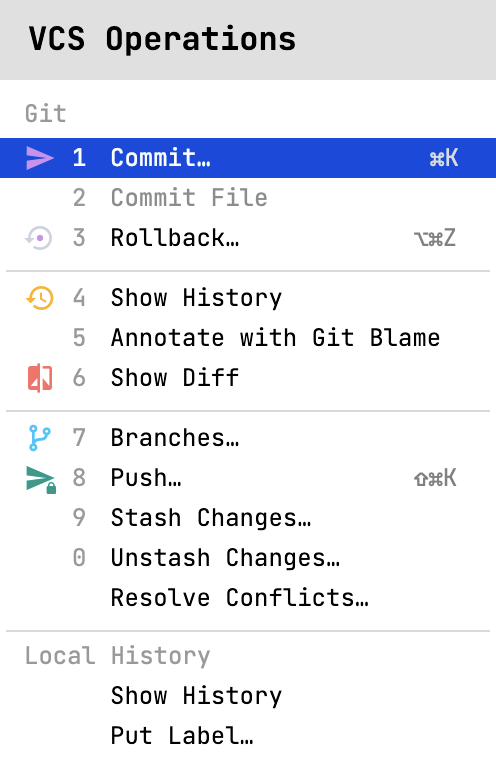

## 
今天主要分享 Setting -> Appearance & Behavior -> Menus and Toolbars 的设置，从设置名字可以猜测到，这个模块下更多是针对菜单和工具栏的配置。  这个判断可以用来调整菜单的顺序，其实我们 大部分的时候都不需要所有的功能，有时候功能太多了反而影响事业

举个例子，如果你是做 Java 服务端开发的，那你根本就不需要「IntelliJ IDEA」 的前端能力，这样你完全可以将这些内容从「菜单栏」「工具栏」和右键移除掉，这样整个「IDE」会更加的干净。
## Main Menu
 Main menu 中主要对应了上方菜单栏中的选项，可以根据你自己的需要进行设置和移动位置，将你自己更加常用的设置上移。

## Main Toolbar
 Main Toolbar 中主要配置「IDE」中菜单栏中的内容，默认比较常用的是「Debug」操作框和 「VCS」操作框 其实像打开文件，保存，刷新 上方的三个按钮我自己从来没用过，这样我可能就会将它隐藏掉。从而添加一些更加合适的内容。

## Editor Popup
 Editor Popup Menu 中主要是针对，在编辑器中右键弹框中显示的元素以及顺序。可按需调整。

## Editor Tab Popup Menu
 「Editor Tab Popup Menu」主要正对在编辑器 Tab 上右击显示内容配置。

## Project View Popup Menu
 项目上右键显示内容

## Debug Tool Window Left Toolbar & Debug Tool Window Top Toolbar
 分别配置 Debugger 中左侧和上方的功能按钮。

## VCS Operations Popup
 配置 VCS Operations  的弹框显示内容。

## 总结
今天的设置板块中包含了 常用显示的菜单和工具栏配置。可以根据这里的配置结合自己的需求进行自定义。

> 这是我是用「IntelliJ IDEA」的第五年，因为自己比较热爱去探索一些可以减少繁琐工作的方法，所以对「IntelliJ IDEA」 了解的会稍微多一些，工作 自己也经常会整理一些文档，但是因为自己总体来说比较懒散，所以一直没有将整理的文章完成的梳理。
> 
> 所以今年我自己搭建了这个公众号给自己定了 工作日 每天早上 9 点分享技巧，原生程序员写作 肯定会有写的不好 或者逻辑不同的地方，如果你有任何意见或者你有建议欢迎添加我的微信一起讨论。
> 
> 