## What is Merge?
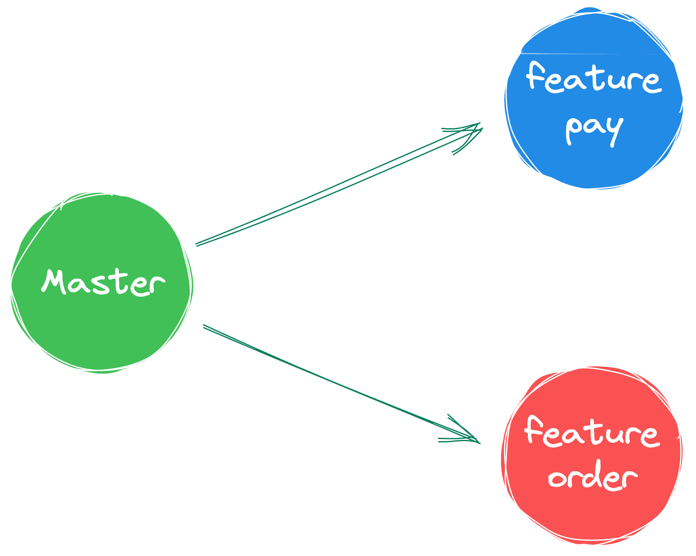<br />一般情况下 一个项目都是需要多人进行开发共同合作，但是每个人开发的功能点并不同，所以一般来说大家会根据主分支分别创建出自己对应的功能分支。

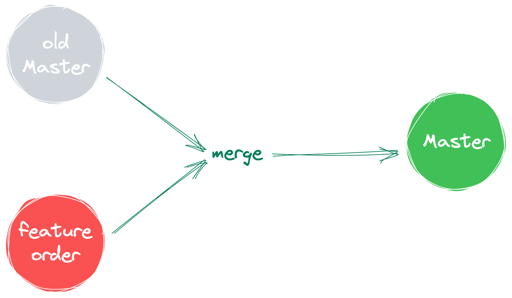<br />当大家的功能都做完测试过之后 在合并会主分支。


## resolve merge
```shell
// master
git merge feature/order;
```

在命令行中我们处理合并，会用到 merge 命令，如果你想要合并某个分支，就直接在当前分支使用语法 git merge <target_branch> 就可以了。

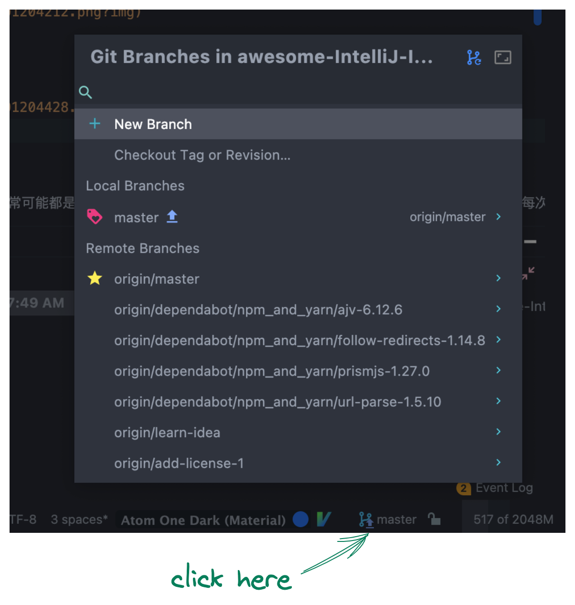<br />在 iji「IntelliJ IDEA」 窗口的右下角会显示当前的分支，点击分支会现在当前本地分支和远程分支<br />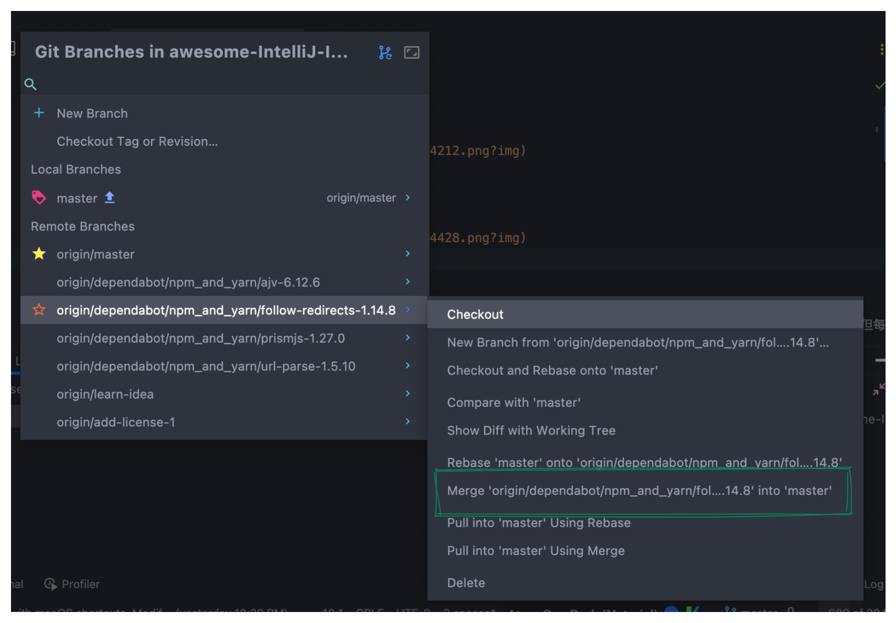<br />选择对应的分支，然后选择 merge xx into current_branch 就可以完成合并

## conflict
正常情况下大家做各自的功能，相互不影响 这样就能直接进行合并 不需要进行额外操作。<br />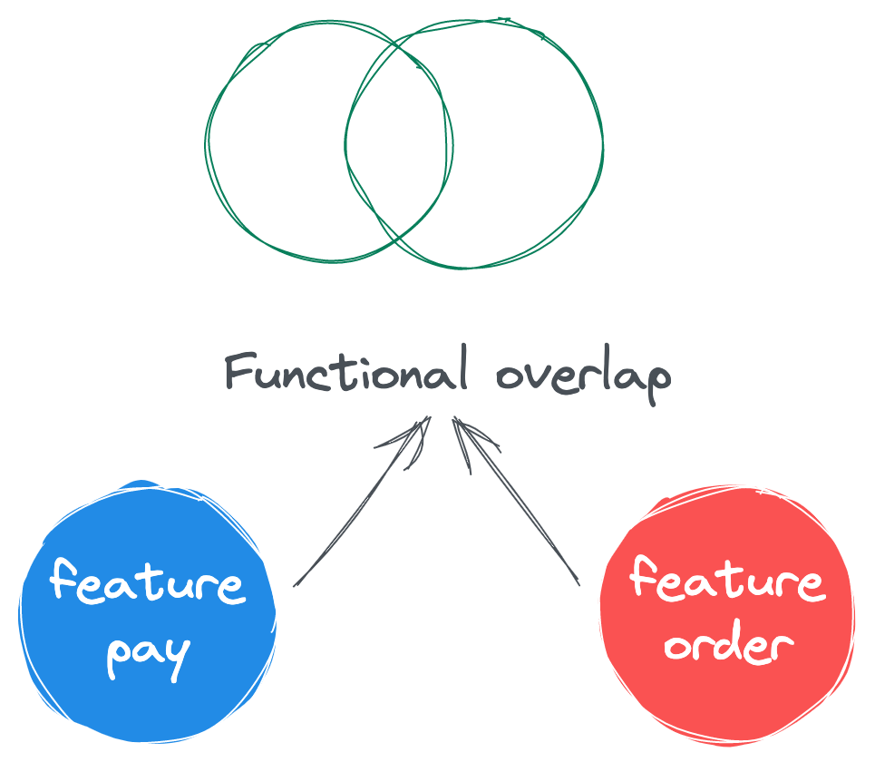<br />不多另一种比较常见的情况就是大家互相开发的功能分支有冲突，大家有了共同修改的部分。这个时候在使用 git merge 在进行合并的时候就会存在「冲突」。

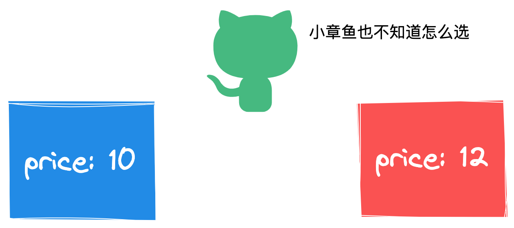<br />因为对于 GIt 而言，两次都对同一个文件做了修改，它自己也不能判断该用哪个文件。

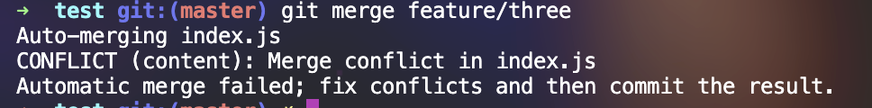<br />如上图所示，在命令行进行 merge 的时候，产生了一个冲突。在这种情况下

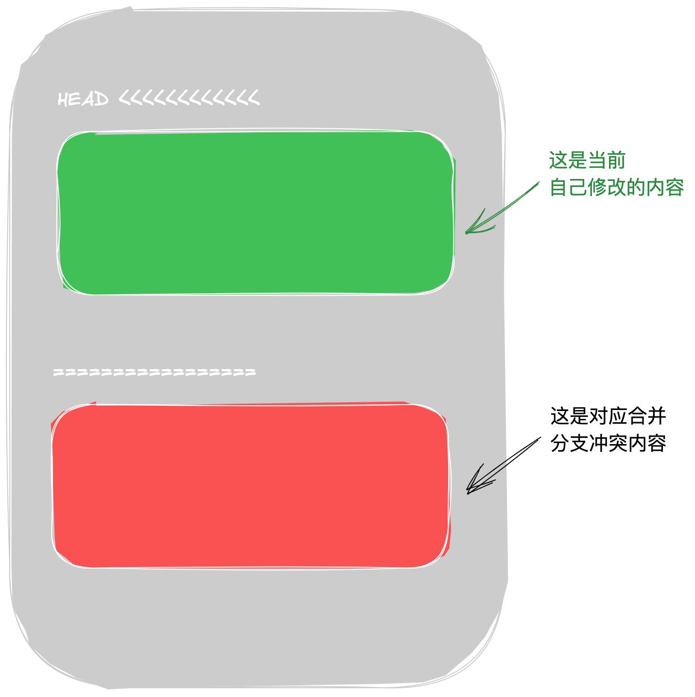<br />有冲突的文件结构如下图所示，一般来说可以通过 >>>>>>>   =========== 来判断冲突代码 >>>>> 下的代码是自己本地的内容 ======== 下的代码是合并的内容。

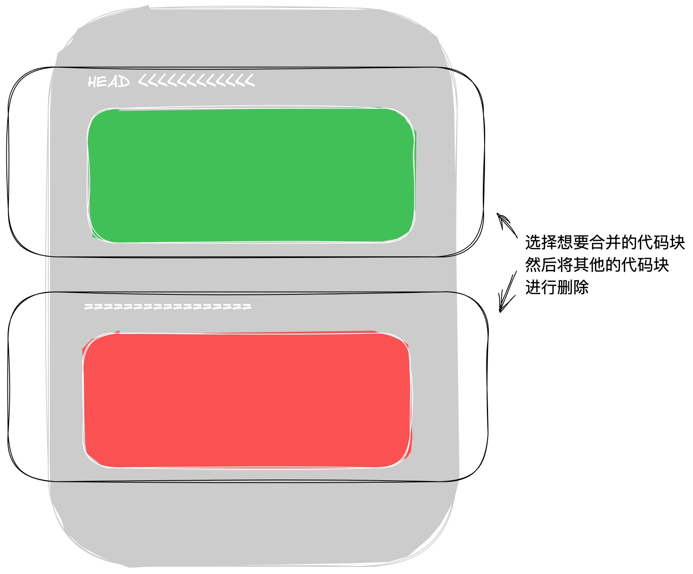<br />选择对应的内容进行删除，注意 <<<<<< ======= 也需要进行删除。这个就是 terminal 里面处理冲突的方法，处理简单的文件一点问题没有，非常简单快速。

不过真正的企业级项目中一个是修改文件多，项目多，在遇到冲突的时候大部分都是很多的文件同时冲突。这个时候在使用这种方式就显得有点麻瓜了。

## resolve conflict in「IntelliJ IDEA」
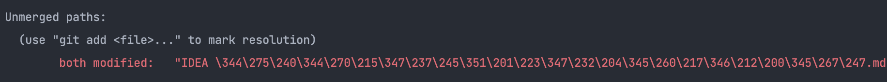<br />在命令行中我们可以通过 git status 看到文件的状态显示 both modified 代表这个文件发生了冲突。

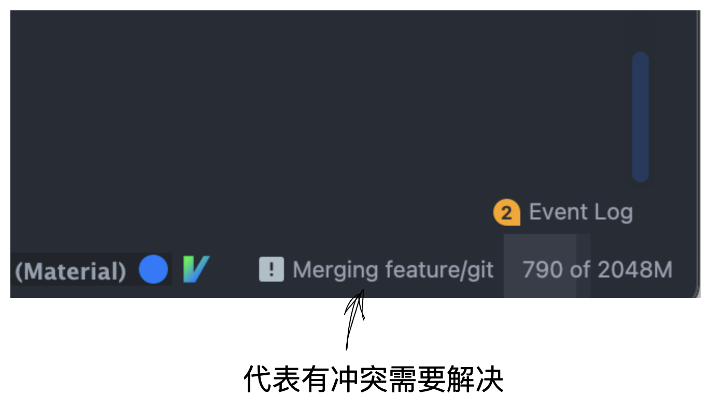<br />在「IntelliJ IDEA」 窗口右下角会显示当前分支状态。

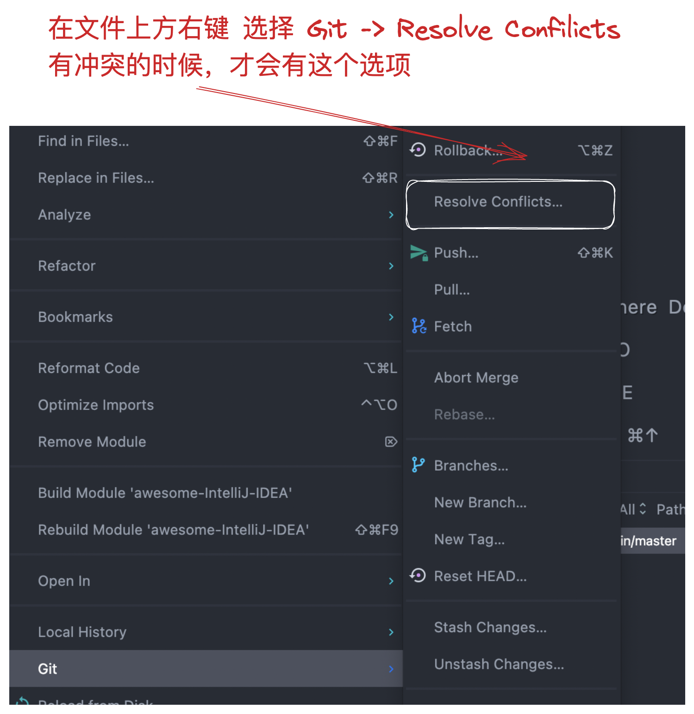<br />当我们发现冲突的时候可以点击项目文件 右键 Git -> Resolve Conflicts 

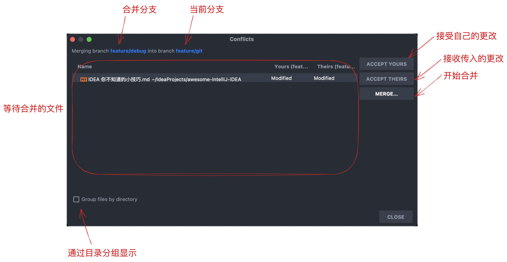<br />点击 Resolve Conflicts 会弹出 冲突窗口可以看到

- 合并分支
- 当前分支
- 等待合并的文件

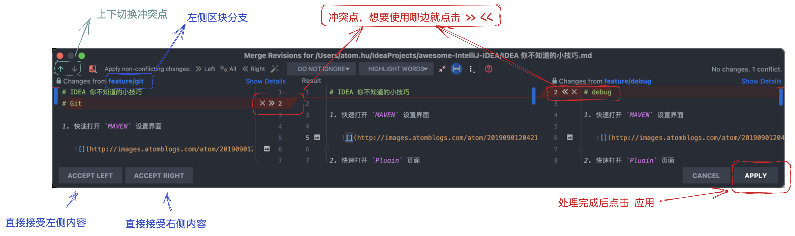<br />上面就是详细的合并的窗口主要就是处理合并的内容，直接还是非常的房间，简单，直观。

## 小插曲
曾经在公司里面遇到过这种情况，在我去之前那个项目，所有的人都是使用命令行的方式处理，不借助任何的 GUI 处理冲突，

有一天我看见我们公司的同事在讨论合并代码怎么怎么不舒服，不方便。就是每次合并都很难搞的样子。<br /><br />我说 这不是用 Idea 很简单就处理好了吗。后面我了解到，他们在处理代码冲突的时候都是通过手动处理冲突的。我惊了<br />

## summary
今天介绍了 Git merge 的基本操作，还有就是对于冲突的处理，其实还是那么简单。基本上就是你知不知道的问题，你知道 那就很简单，你不知道 那就有点恼火。