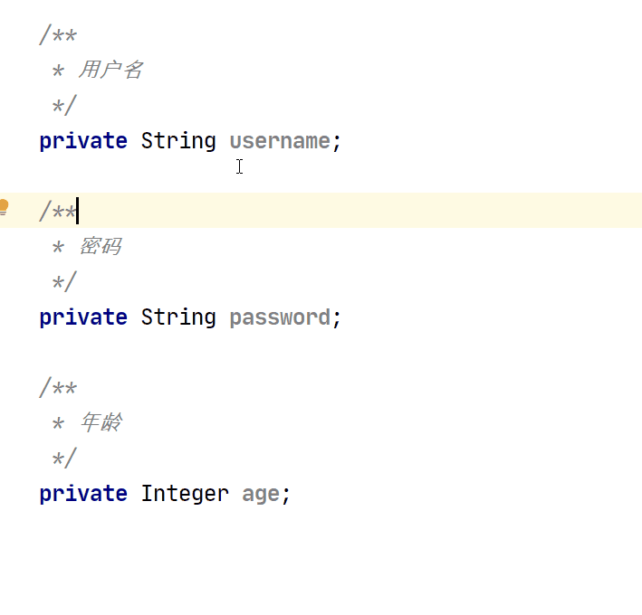

## Inteillj Idea 

### 基础操作 | 通过鼠标拖动
## 
## 
### 基础操作 | 数列光标
## 

### 基础操作 | 行尾添加光标
## 
### 
### 案例 | 通过注释批量添加 Swagger 注解
### 案例 | 批量提取 JSON 内容
## 

### 案例 | 批量代码格式化
## 
##  
## 
### 案例 | 匈牙利转驼峰
## 
### 案例 | 批量提取10月订单
## 
### 
### 案例 | 注释优化
## 

## VsCode

### 基础操作 | 在相容内容下添加光标，单个添加

### 基础操作 | 选中所有的相同内容
### 
### 基础操作 | 行位添加光标 通过快捷键
### 基础操作 | 行位添加光标 通过鼠标拖动
### 基础操作 | 数列光标 通过键盘添加

### 基础操作 | 数列光标 通过鼠标拖动
### 

## Sublime

### 基础操作 | 选中所有内容

### 基础操作 | 行位光标，通过鼠标拖动

### 基础操作 | 行尾光标 键盘

### 基础操作 | 在相容内容后添加光标

## Atom

> Atom 我自己使用的不多，不过算是对这篇文章完善性的一个补偿，我自己去查找了一下资料，发现官网也是支持的。通过插件的方式

官网文档地址：[https://atom.io/packages/multi-cursor](https://atom.io/packages/multi-cursor) 

## Notepad ++
这个软件在 Windows 上的用的可能多一些，它其实也是具备多光标编辑功能的，只不过需要手动开启一下 

## 总结
总来来说我个人感觉 VsCode 的多光标是支持的最好的，功能最全的，Inteillj Idea 相对来说是最弱的。它的行位光标不能通过快捷键触发，只能通过鼠标拖动，算是一种模拟了.