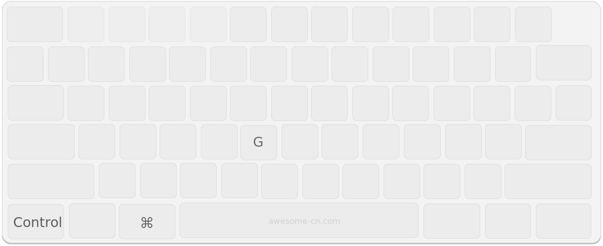
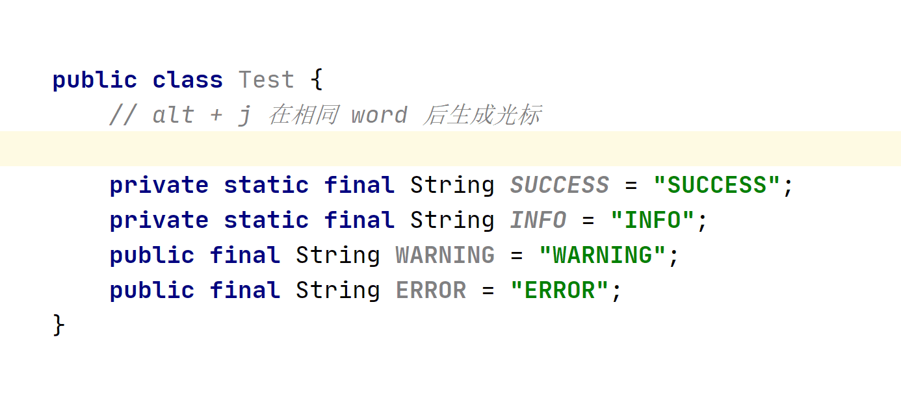
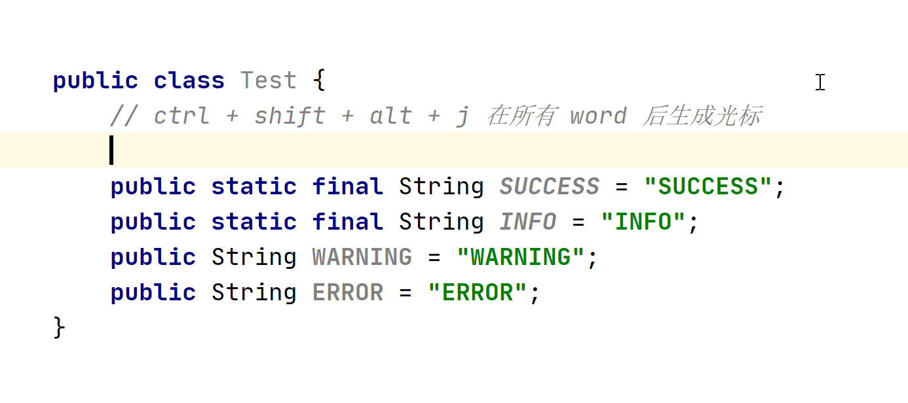
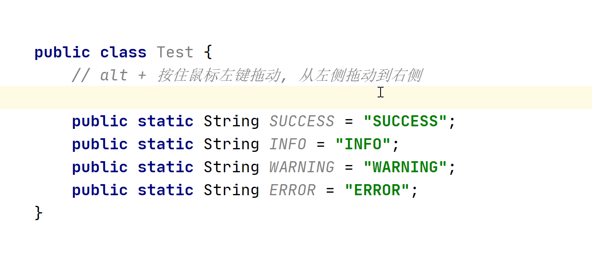
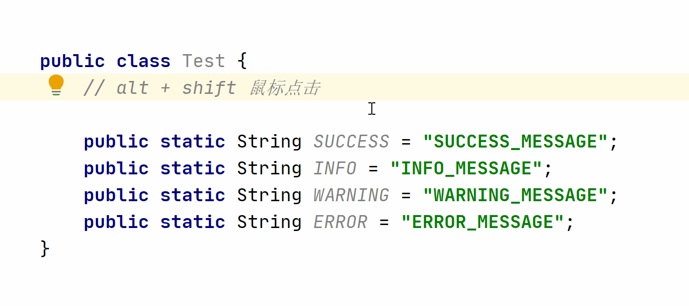
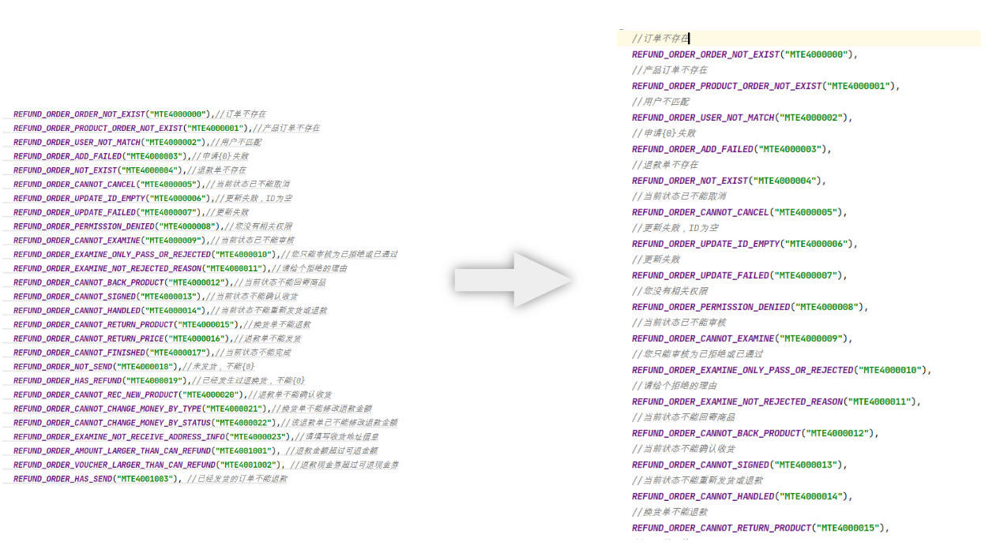
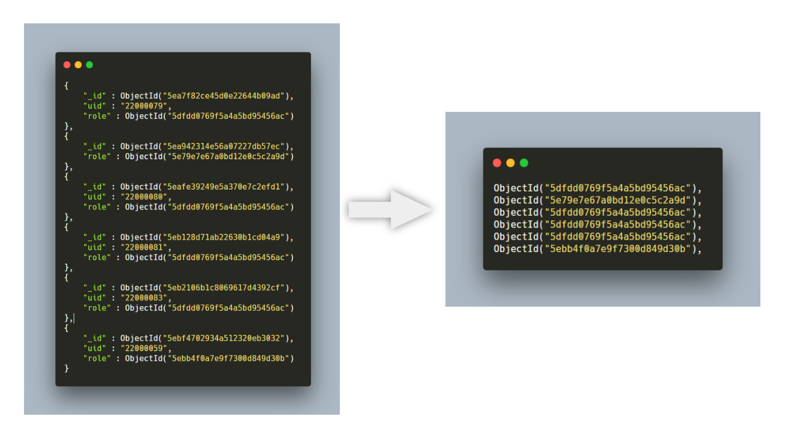
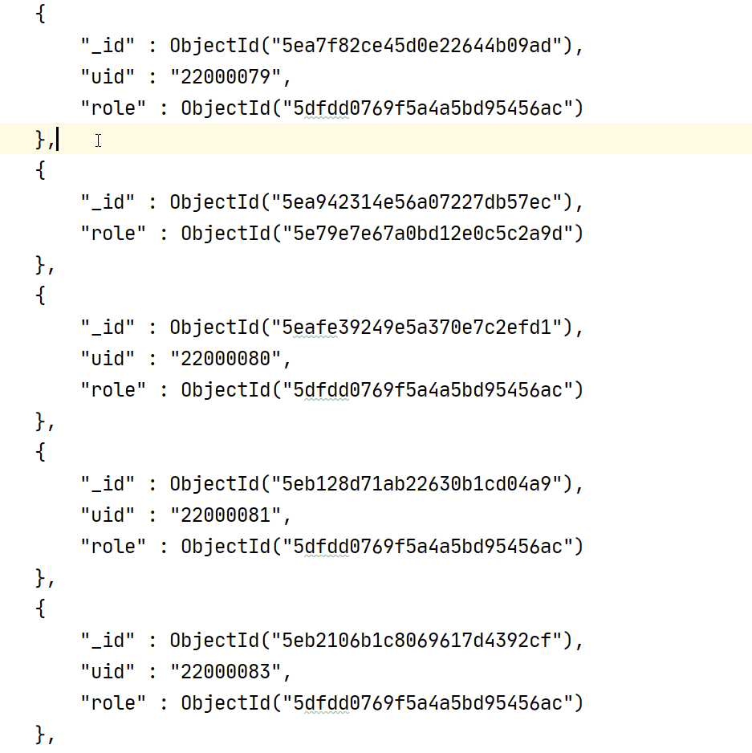

## 
## 操作基础

**在相同内容后生成光标，一个一个选择**  [点击图片可放大]

> Windows: Alt + J
> Mac: Ctrl + G

## 在所有的相同的内容后添加光标，一步到位 

> Windows: `Ctrl + Shift + Alt + J`
> Mac: `Ctrl + Command + G`

## 数列光标

## 行尾添加光标

## 在指定位置添加光标操作

## 格式批量调整

将上访左侧的代码批量变为右侧代码

> ctrl + alt + enter 将光标移动到当前行的上一行

## 批量添加 Swagger 属性注释

将上图左侧只有注释的类，添加上 swagger 信息

## 在多个相同结构 Json 中提取某字段信息

## 提取左侧 Json 中所有的 role 字段

