 Jetbrains 系列的软件好用无可置疑，但是毕竟它和 Eclipse 不一样，Jetbrains 属于是商业化产品，作为商业化产品就肯定是以营收为目标的。就肯定不会像 eclipse 一样作为开源项目免费的。

## 专业版

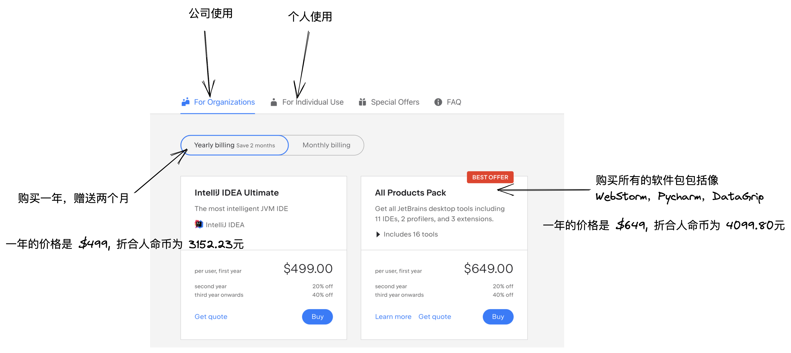 上面是专业版一年的价格，如果只购买「IntelliJ IDEA」一套的价格为 3152.23，如果是购买全套「Jetbrains」的产品的话每年的价格是 4099 元，这个是专业版。

在第二年的时候价格会减少 20%，那么第二年的价格就是「3279.2」

第三年的价格会在第一年的基础之上减少 40%，那么第三年的价格就是 「2459.4」

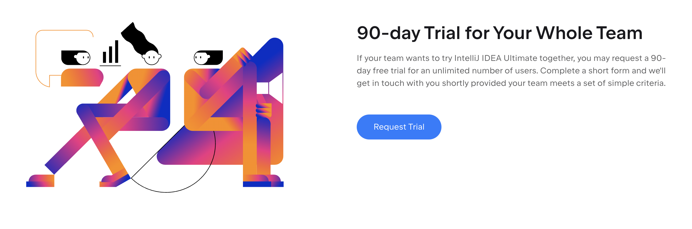 针对专业版，公司可以发起 90 天试用申请。

## 个人版
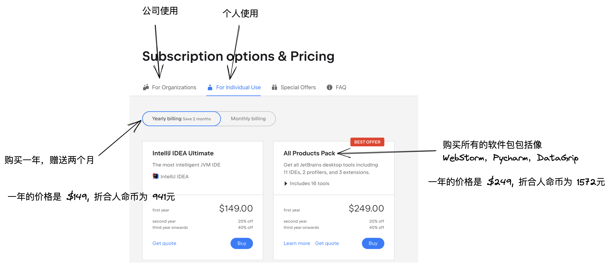

上面是个人版本一年的价格，如果只购买「IntelliJ IDEA」一键的价格为 941，如果是购买全套「Jetbrains」的产品的话每年的价格是 1572 元，这个是个人版。

在第二年的时候价格会减少 20%，那么第二年的价格就是752.8

第三年的价格会在第一年的基础之上减少 40%，那么第三年的价格就是 564

是不是感觉到了第三年其实就不是很多了。500 多元能使用这么好的产品，每次都能保持到最新版本。

## 付费意识
个人愚见，其实无论是专业版对于公司，还是个人版对于个人，其实这个价格都不是很贵。

但是因为可能大家的软件付费意思不是很强烈，所以对于这样的软件付费，从内心里面还是比较抵触的。

这样就导致了如果下载一个「IntelliJ IDEA」多了一个月之后，你就会去百度搜索 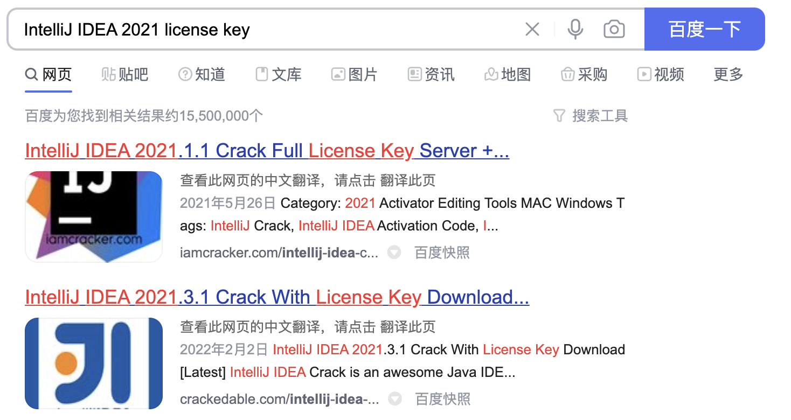或者是利用 Google 这样 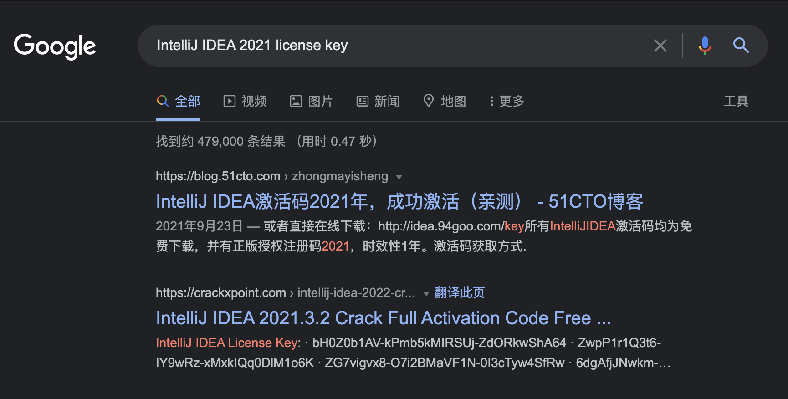 先不论上面的这些方法是否可以成功，其实我见过好多同事在项目非常紧急的时候，突然工具失效 然后网上倒腾半天才能搞好，说实话在一些关键时刻还是很影响心态的。

不过话说回来，不知道大家有没有这样一个问题，按理来说，学生有教育版可以申请，然后企业版按理来说应该是公司负责采购，怎么还会导致市面上有这么多需要激活码，或者是说需要盗版的现象呢？

「真像只有一个」那就是其实大部分的企业老板也是能省则省，他们认为其实给你提供了电脑这个基本设施就 OK 了，根本不会想到你这些软件还是公司投入呢。也不能说绝对是这样吧，但是至少大部分是这样。

我曾经遇到过这样的一个案例，一个上市公司因为 photoshop 使用盗版，然后被 photoshop 官方发邮件警告⚠️，公司的设计部有 photoshop 需求大概有 20 多人吧，后面因为被警告所以被迫买了一个专业版。也不是人人都能使用到，这还是上市公司。后面我记得 Navicat 官方也发来的警告函，最后供应链负责采购来进行统计，最后有没有采购我不知道，反正我是没用上，哈哈哈哈哈哈哈。

我自己的付费意思也不是很强烈，让我花 1000 多元买一个软件，我可以还需要一段时间来接受一下，哈哈哈哈哈哈哈。不过从我从「InteillJ IDEA」以来，大概就只有前面刚开始用的时候用过几个月盗版的，后面我就从来没有用过了。

主要是盗版有一个问题那就是只能处理一个版本，比如我现在正在使用的版本是 「IntelliJ IDEA 2021.3」，或许我这个版本是可以破解的，但是出了新版本我不能升级，不能体验新特性。一旦升级就 GG。

## 一些方案
这里分享一些能够使用正版的一些方法，你可以根据自身的情况选择一种。

### 教育邮箱注册
 如果你还是在校学生，可以通过学校提供的教育邮箱免费申请 1 年的使用权，而且到期之后还可以继续申请。我们有同事就是在他毕业后但是他学校的教育邮箱没有被注销，就在这样的场景下，这已经是他 N 年使用教育邮箱申请授权了，哈哈哈哈哈哈哈。 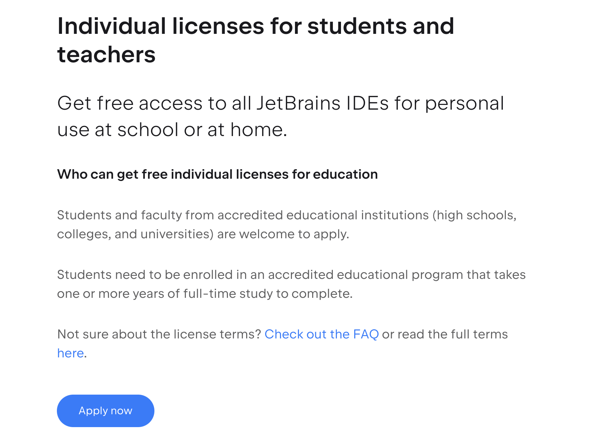 [地址](https://www.jetbrains.com/community/education/#students) 访问这里进入注册页，点击 Apply now 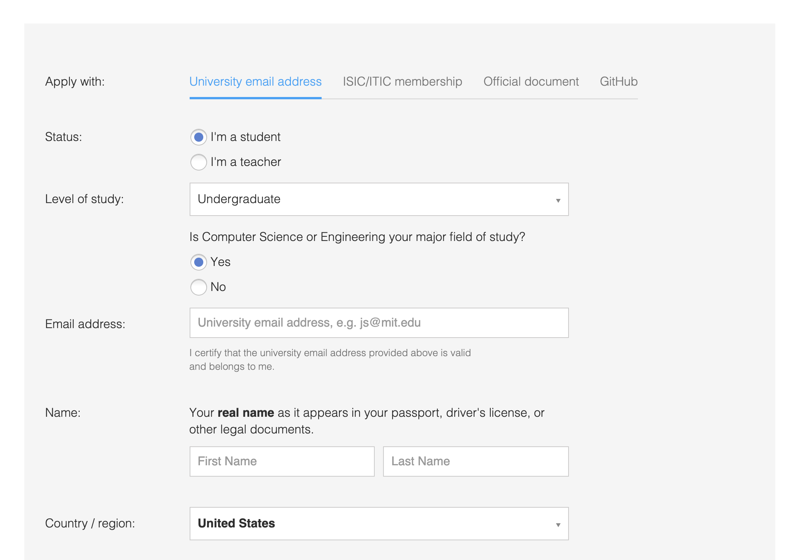 依次填写好对应的信息之后完成信息填写。顺利的话，你的邮箱就会收到对应的申请通过的邮件。

**「一个小插曲」**  这是知乎上的一个问题，提问者说他自己的教育邮箱后面有 .cn 后缀，申请不了教育版本。

 我建议遇到这种情况，直接在页面最下方点击 Support，然后给官方发邮件，如实说明自己的情况，然后 JetBrains 官方会根据你自己的情况进行核实，最后等待官方的回复就可以了。

### Community
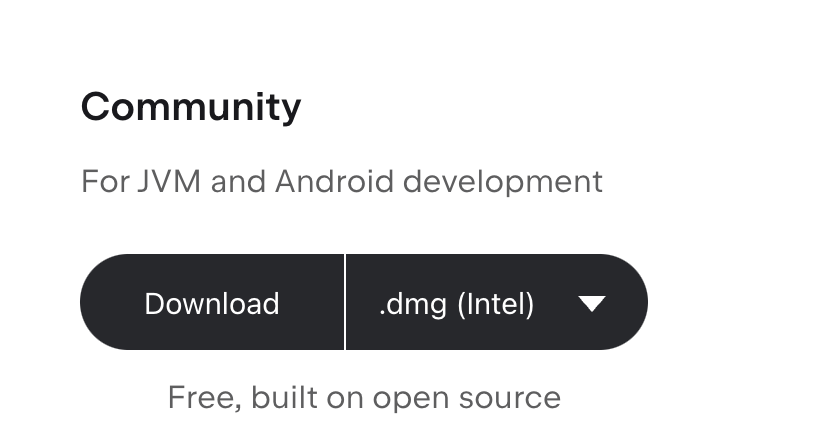 如果你是刚开始转到 Java 这边过来，或者是正在学习 Java SE，我感觉完全没有必要直接过来就上专业版，社区版就完全能够满足需求了，而且还是开源免费的。[下载地址](https://www.jetbrains.com/idea/download/#section=mac)

### EAP
[Early Access Program](https://www.jetbrains.com/idea/nextversion/#section=mac) 早起访问版，也可以理解为内测版本，在这里可以体验到最新的即将要发布的功能，而且免费，因为是 Beta 版本 所以就会存在在某些方面会有不稳定性「主要集中在新功能方面」，因为上面的问题，所以 EAP 版本是免费的，就算你没有购买 也是能够免费使用的。

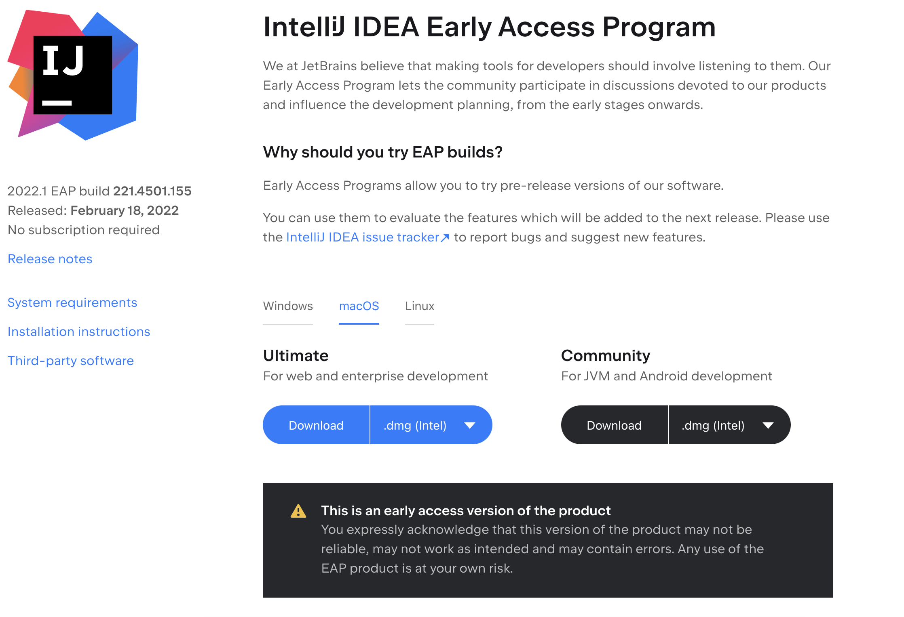 也因为是 Beta 版本，所以这里会有一个限制，就是每 30 天必须重新下载一下。这也是主要的问题，对于某些同学来说这个可能非常麻烦，因为国内的网络环境导致本身访问 「Jetbrains」官网就比较费劲了，还要每个月去下载确实有点麻烦。

不过我最开始就说了，根据自己的场景选择适合你自己的方案。

有解决麻烦的，肯定也有这本来就不是问题的，所以因人而异。毕竟是用免费的东西，肯定还是需要付出点代价的。

### 开源授权
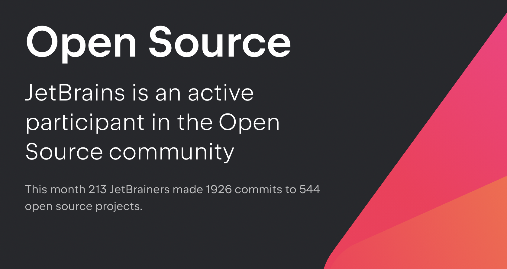 开源授权版本是「Jetbrains」针对开源项目提供的支持，用你自己的开源项目可以去申请获取得到 JetBrains 一年账号使用的权限。

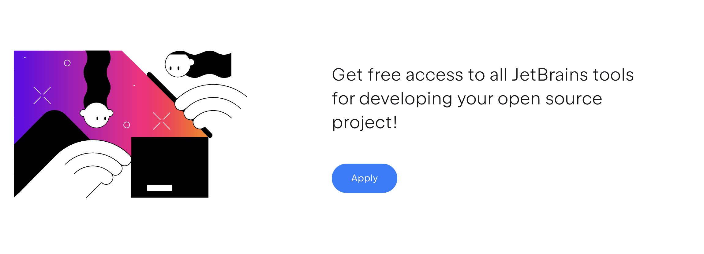 我自己就是使用这种通过开源项目申请的方式，用这个方法坚持了好多年，哈哈哈哈哈。开源授权版本也只有一年的时间，一年时间到期后，需要重新申请，可以拿着以前的项目，也可以用新项目。用开源项目的版本不止你自己可以申请，而是你的成员也是可以申请的，意思是一个开源项目项目可以申请好多个授权账号。

「[申请界面](https://www.jetbrains.com/shop/eform/opensource)」 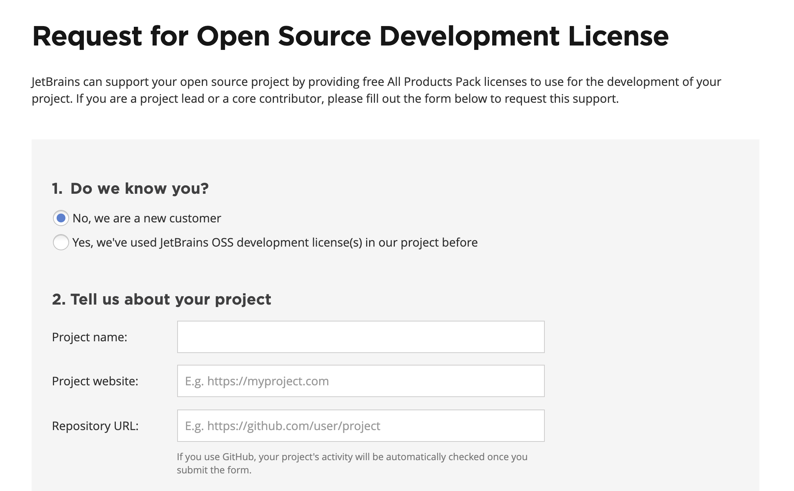

有的同学可能要想，申请这个项目是不是需要那种 star  很多，然后特别牛逼的项目啊？Jetbrains 开源项目申请，是有要求，但是不是对 star  的要求。

申请开源项目必须满足以下条件

- 活跃项目「你的项目必须在 3 个月内有提交」
- 因为是开源项目，所以你必须指定你的 **License URL**「这个在 Github 创建好后，填写对应的地址即可」
- 申请数量「因为之前说过一个开源项目，可以申请多个账号，但是多个账号必须是项目的活跃贡献者才可以」

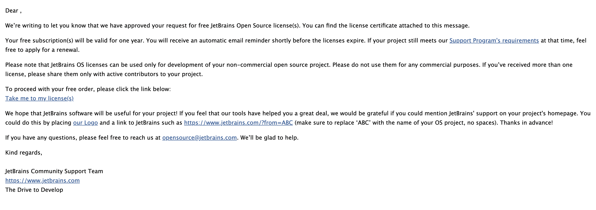 当你完成填写之后，不出意外你会受到上面这样的一封邮件。点击邮件里面的地址「Take me to my license(s)」，然后对你的 JetBrains 账号进行激活即可。

### 万能的淘宝
上面介绍了一共 4 种方法如果你既不是学生，又不想使用社区版，然后又不想每一个月下载一次 EAP 版本，然后觉得 Github 要去处理开源项目也太麻烦了，那就只能尝试下面这种了。

大家也看到了，因为我们不是用的付费版本，所以想要免费得到专业版，肯定是需要付出相应的代价的，无论是教育邮箱申请也好，或者是 EAP 版本。

既然你不想花时间去倒腾那些东西，那你就只能说花点小钱，去用人家倒腾好的。 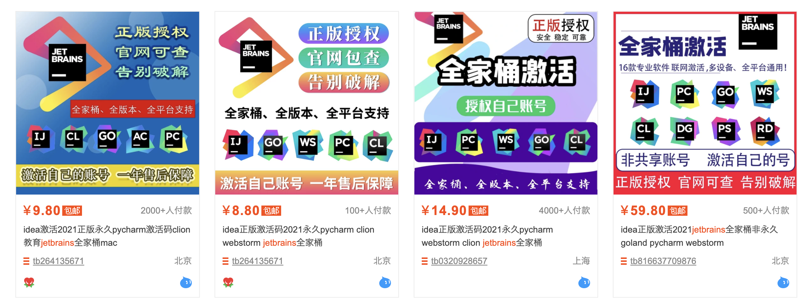 在很久很久之前，我记得我在淘宝上花过 15 块钱在 淘宝上买过一个账号，然后好像没用多久，账号就不能使用了。然后在去找卖家，卖家直接整个店都不在了。 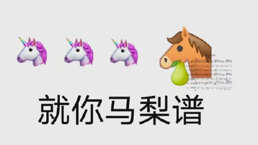 好像那个时候他们是通过那种教育账号然后给你弄，特别不稳定「其实现在也不稳定」  现在也有这样的服务，他们提供账号可以直接使用一年，或者是提供你的账号他们给你申请授权。我去研究了一下，我发现他们提供的账号其实就是附属在某个开源项目下的。其实应该就是开源项目的原理，只不过他们都处理好了。你只需要使用就可以了。

毕竟如果不想费时间去倒腾，那肯定是需要花点小钱的。

## 总结
今天介绍了 5 种申请开源项目的方法，大家可以根据自己的情况选择。

> 目前更新的时间为每周一到周五早上 9 点定时在公众号《玩转 IDEA》更新，周六我会思考下周主题，周天会进行写作。我会保证更新质量与频率，因为我对「IntelliJ IDEA」有兴趣，热爱，喜欢倒腾，如果你觉得对你有用，请帮忙点赞，谢谢。