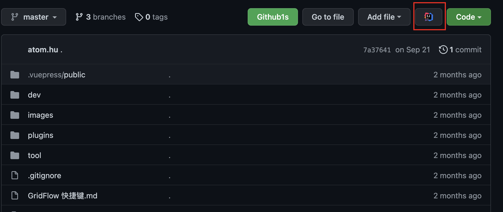
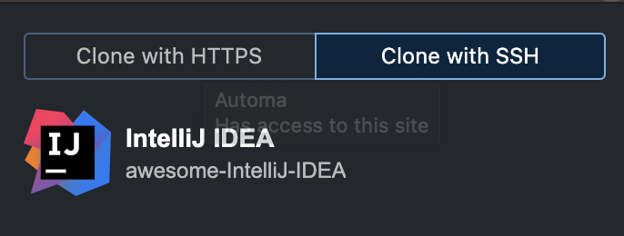

## Chrome JetBrains 插件

 安装了这个插件之后，在 Github 项目页面会显示 idea 的图标「看下图」  点击就可以直接 clone 到本地。  可以在浏览器插件处选择通过 http 的方式，还是 ssh 的方式。

## 

## TypingCat
###  
TypingCat（打字猫） 是一个Idea 单词命名提示补全插件。 Github 地址 [https://github.com/huxin1997/TypingCat](https://github.com/huxin1997/TypingCat)
### Feature

- 包含1万个常用单词
- 支持应用于代码命名：局部变量、常量、方法名、方法参数、类名
- 支持模糊搜索
- 基于代码补全，使用快捷键 "Ctrl + space"
- 离线模式，响应更快

第一次提交还是在 6 天前。我自己安装来试用了一下，感觉非常好用，原理应该也是非常简单，词库前缀匹配。但是想法很好 推荐给大家。

> 其实这里还可以延展更多，例如通过机器学习 去 Github 上学习变量命名，然后词库就可以慢慢完善。作者加油。