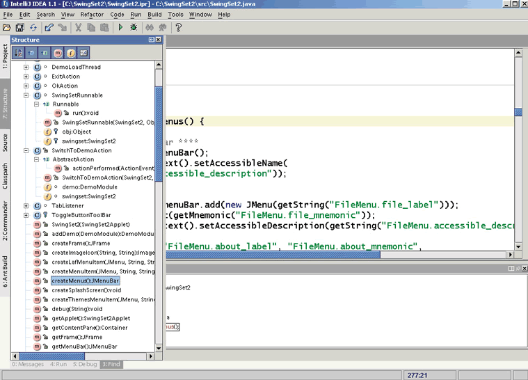
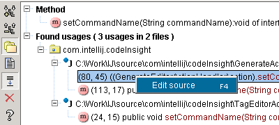
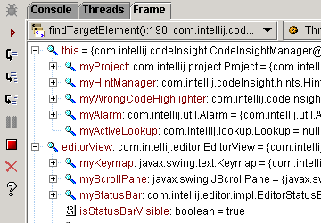
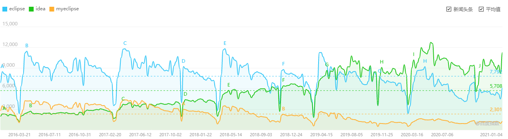
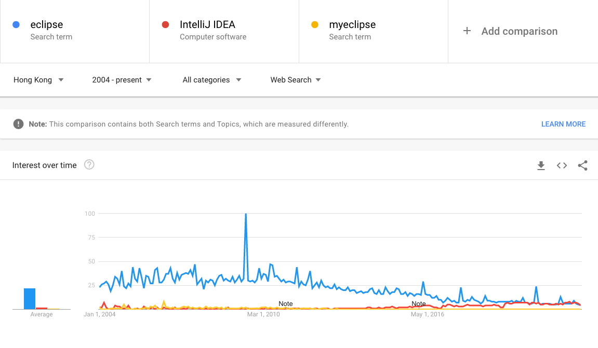
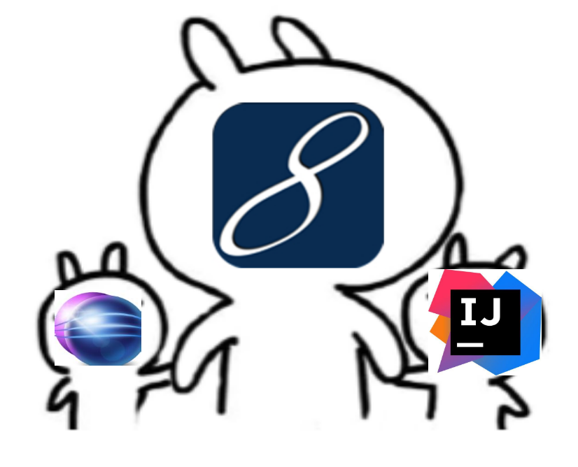

## 从 IntelliJ IDEA 说起

**IntelliJ IDEA **是一种商业化销售的[Java](https://zh.wikipedia.org/wiki/Java)[集成开发环境](https://zh.wikipedia.org/wiki/%E9%9B%86%E6%88%90%E5%BC%80%E5%8F%91%E7%8E%AF%E5%A2%83)（Integrated Development Environment，IDE）工具[软件](https://zh.wikipedia.org/wiki/%E8%BD%AF%E4%BB%B6)，由[JetBrains](https://zh.wikipedia.org/wiki/JetBrains%E5%85%AC%E5%8F%B8)软件公司（前称为IntelliJ）开发，提供[Apache 2.0](https://zh.wikipedia.org/wiki/Apache_License)开放式授权的社区版本以及[专有软件](https://zh.wikipedia.org/wiki/%E5%B0%88%E6%9C%89%E8%BB%9F%E4%BB%B6)的商业版本，开发者可选择其所需来下载使用。

最初版于2001年1月时推出，当时是少数使用前阶代码浏览及[代码重构](https://zh.wikipedia.org/wiki/%E4%BB%A3%E7%A0%81%E9%87%8D%E6%9E%84)的 Java 集成开发环境之一。

 IntelliJ IDEA、Eclipse、MyEclipse 2016 - 2020 年 百度关键词检索变化 

记得还是在 15 年的时候，那个时候 Eclipse 和 MyEclipse 还是如日中天。 

印象中那个时候最火就是 MyEclipse 了，很多组件都是集成好的, 不过也是需要收费的。  而 Eclipse 是开源免费的，但是插件少，需要自己安装。

                                         在那个年代 MyEclipse 是当之无愧的大哥

我自己第一次使用 **IntelliJ IDEA** 还是在学习 Scala 的时候，刚开始我是非常排斥的，不过没办法那个 时候好像就只有「IntelliJ IDEA」有插件支持，确实没办法，那个时候心里想，这软件配置是真的麻烦啊，我自己想要打一个 **Jar** 包，感觉要比 **Eclipse** 复杂一万倍。

不过那个时候也是能感觉到 大家慢慢的在往 **IntelliJ IDEA **上面转，后面就有意的使用 **IntelliJ IDEA**。 当我使用一段时间之后。

我只想说，王境泽定律无处不在！！！ 

> 如果想了解更多 IDEA 相关知识，欢迎关注公众号 IIIIIIIIIDEA , 工作日每天早上 9 点分享使用技巧。