都是一样的编程 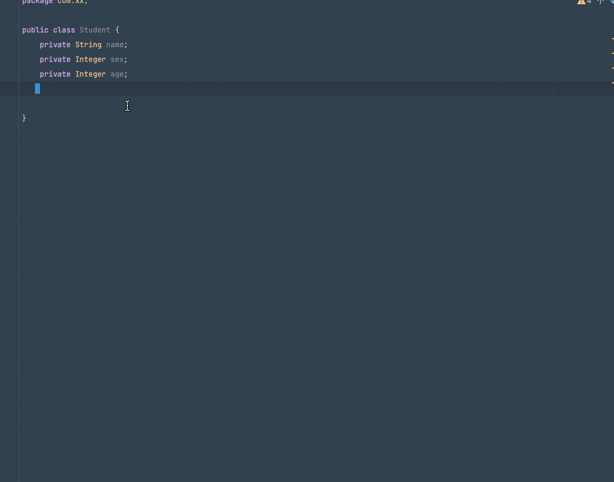 你的 getter  setter

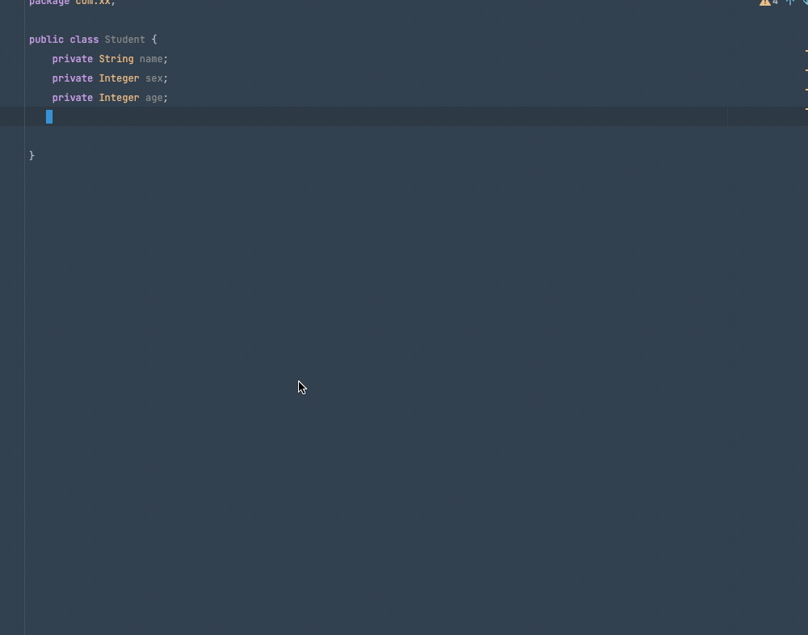 人家的 getter setter

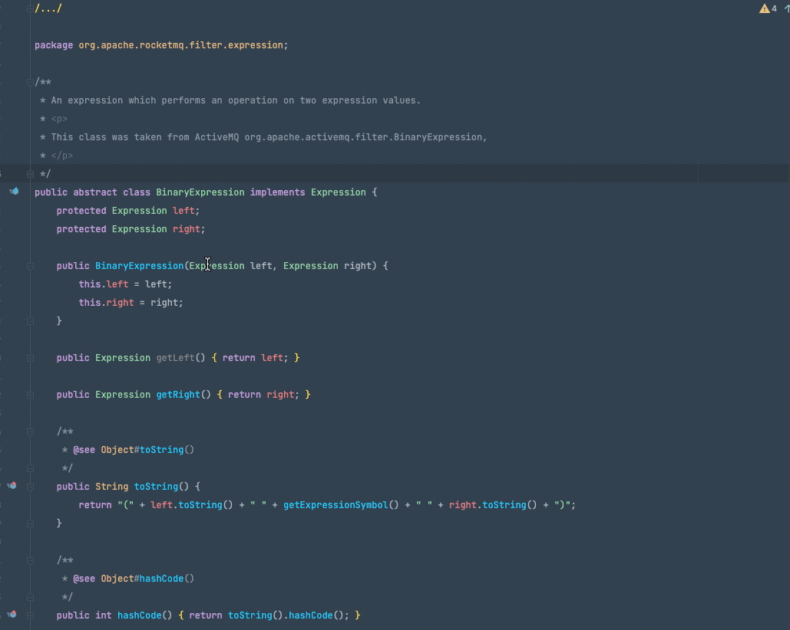 你是怎样查看 git log

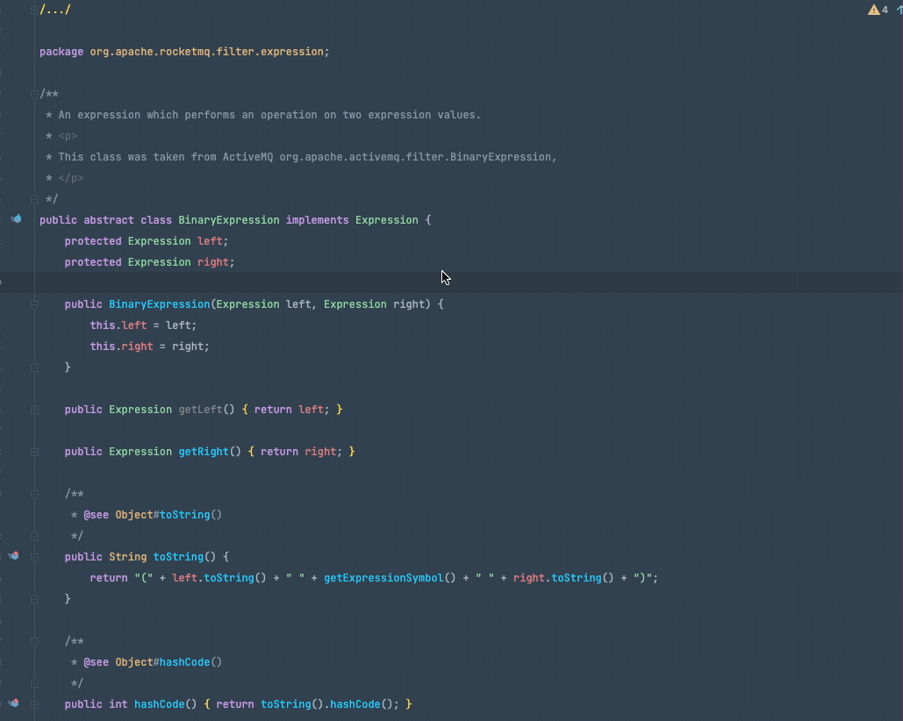 人家是怎样查看 git log quick list 

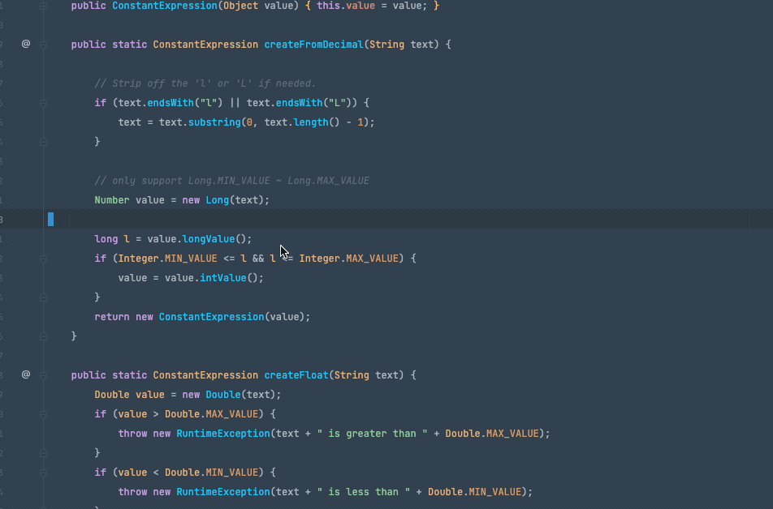 你是这样添加 try catch 的 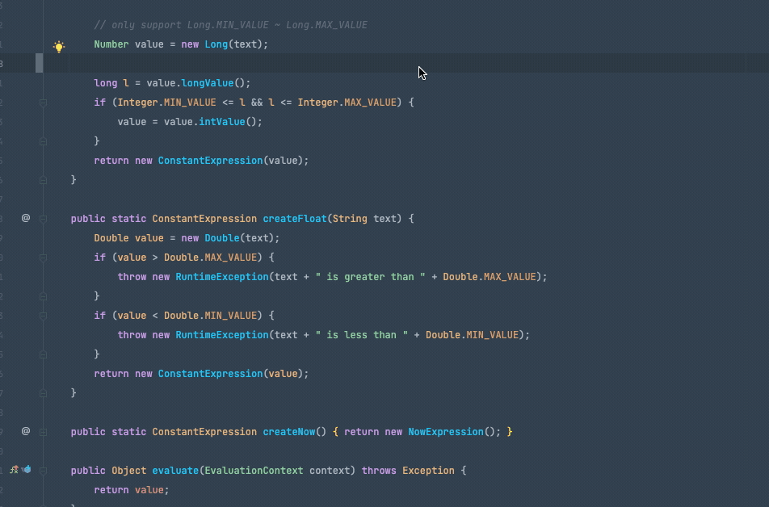人家是这样添加 try catch 的

## File Colors
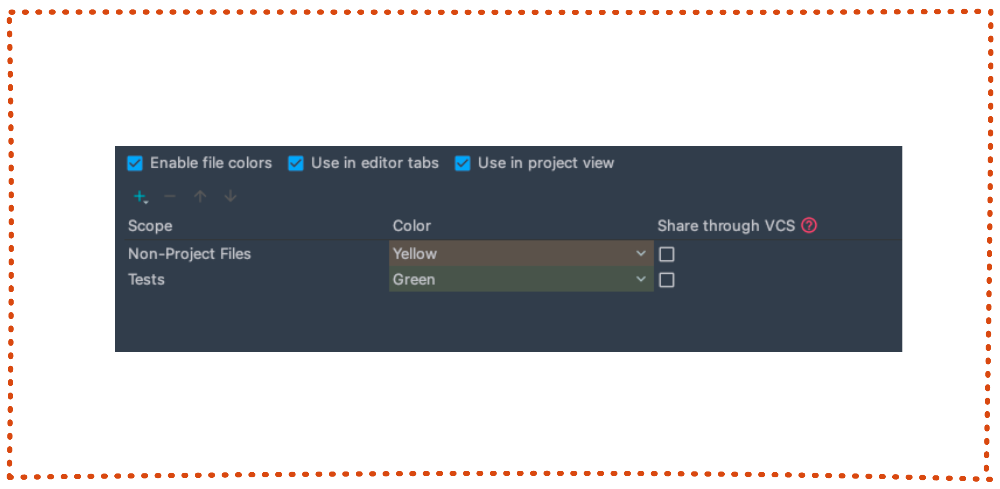 File Colors 中可以用来配置不同类型的文件夹的颜色。如果是测试文件就是绿色，如果是黄色那么就不是项目中的文件。如果你有自己特殊的需求，可以配置你自己想要的颜色。

## Scopes
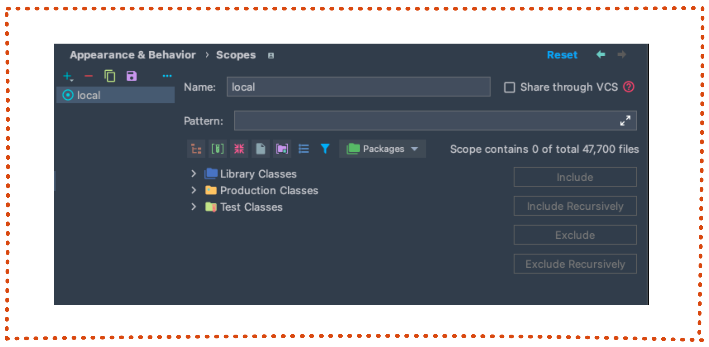 Scopes 可以配置当前项目中 包含 和 移除的文件。像一般的测试文件我们一般是会将它移除掉的。

## Notificatios
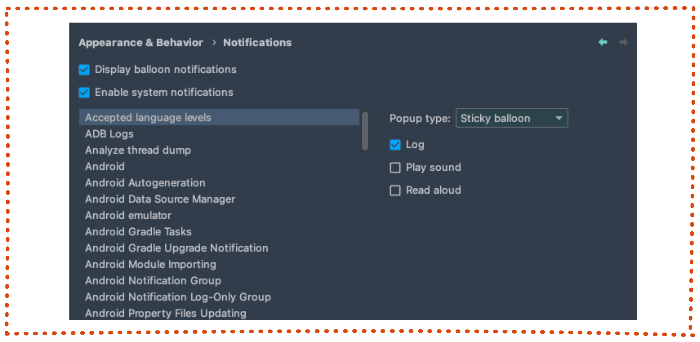

## Path Variables
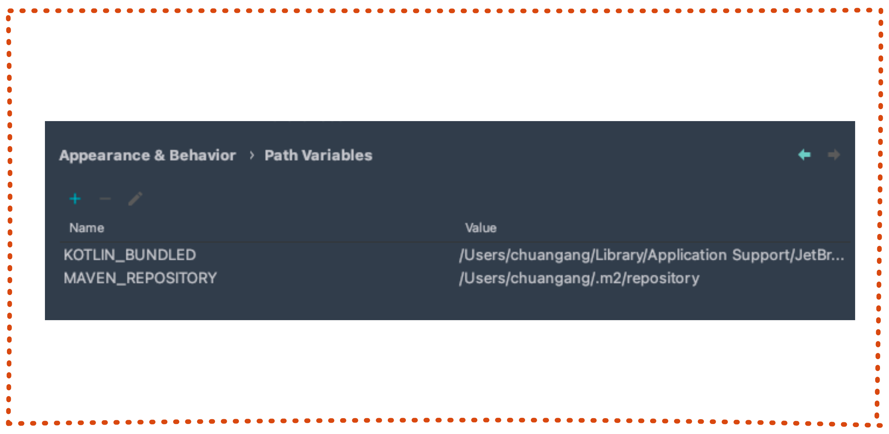

## QuickList
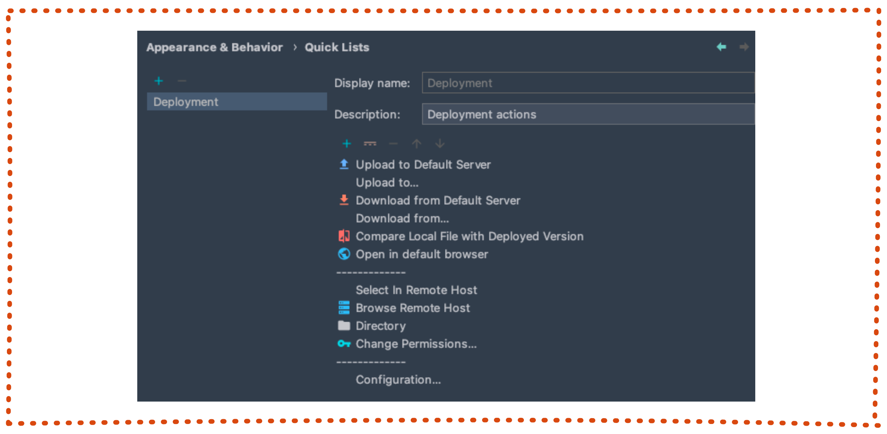 QuickList 是今天的重头戏，顾名思义，简单理解就是 可快速访问的列表，就像本文刚开始演示的那样子。我们可以通过非常多快捷的方式来访问诸如 VSC 操作框，getter setter 或者是 try catch 操作。

官方也对此功能提供来扩展，可以用户进行配置，基本上你可以配置任何想要的功能组合。

**配置流程** 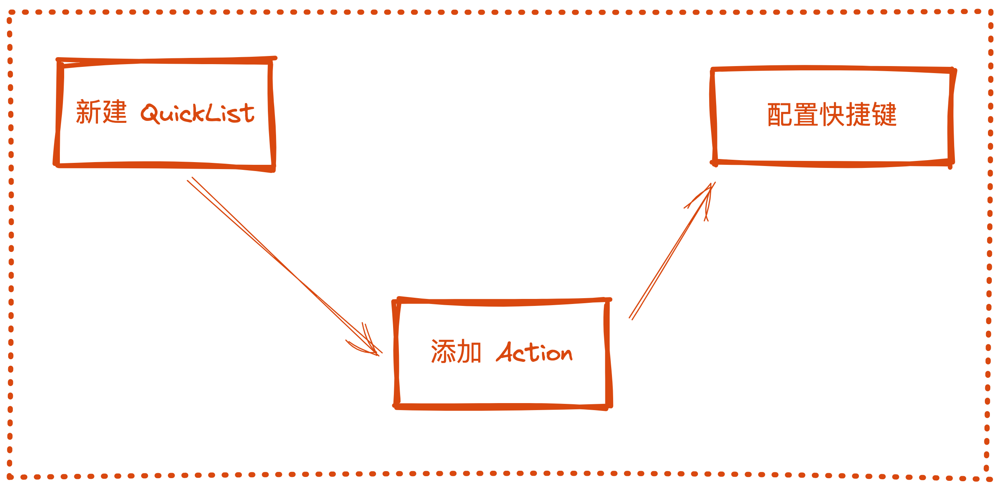

### 添加 QuickList & add Action
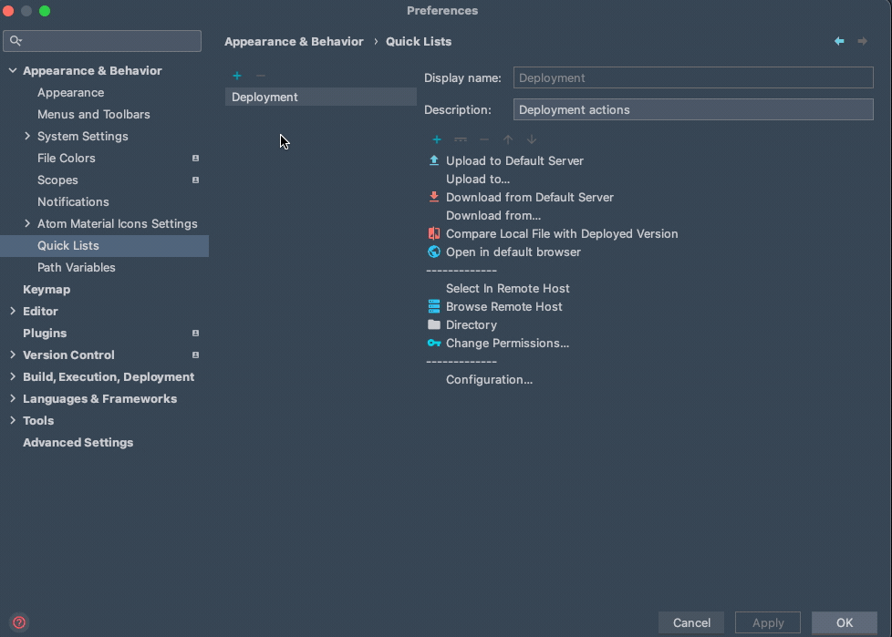

### 配置快捷键
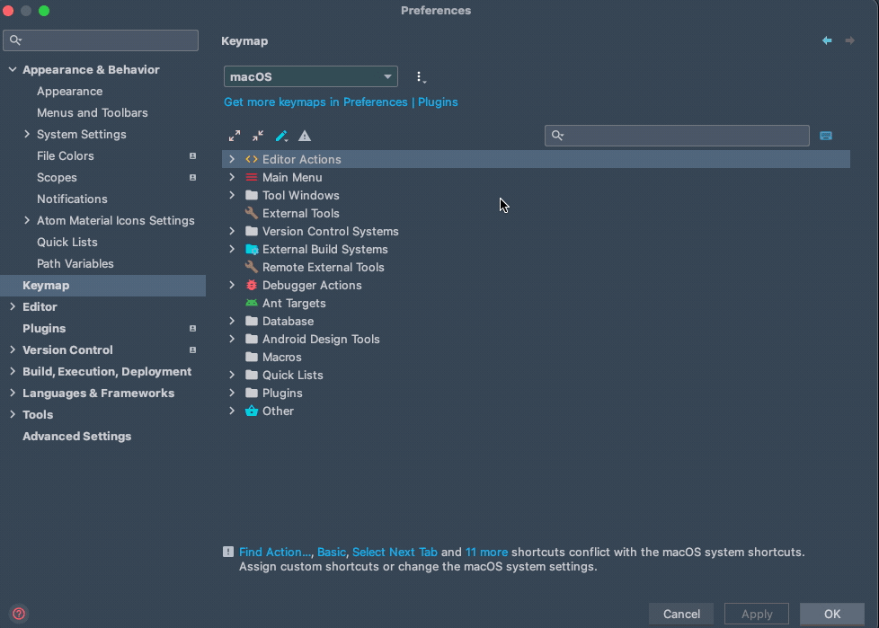

### 最后效果
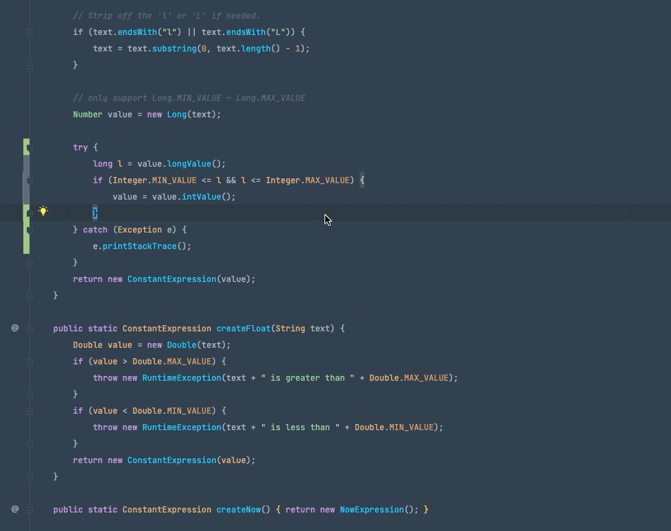