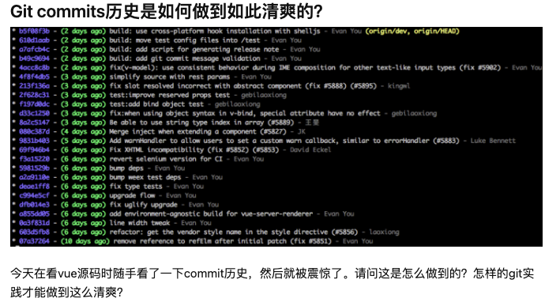
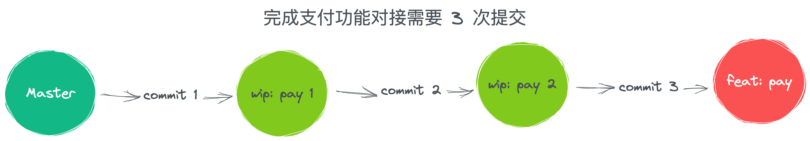
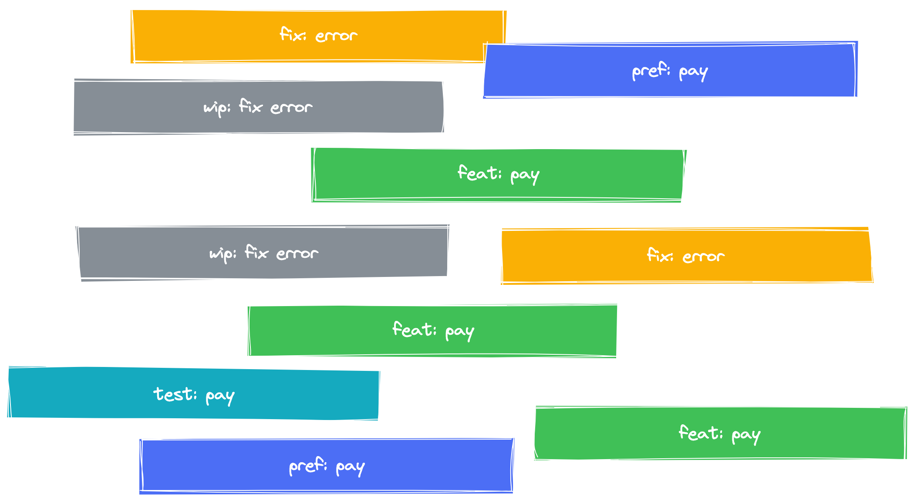
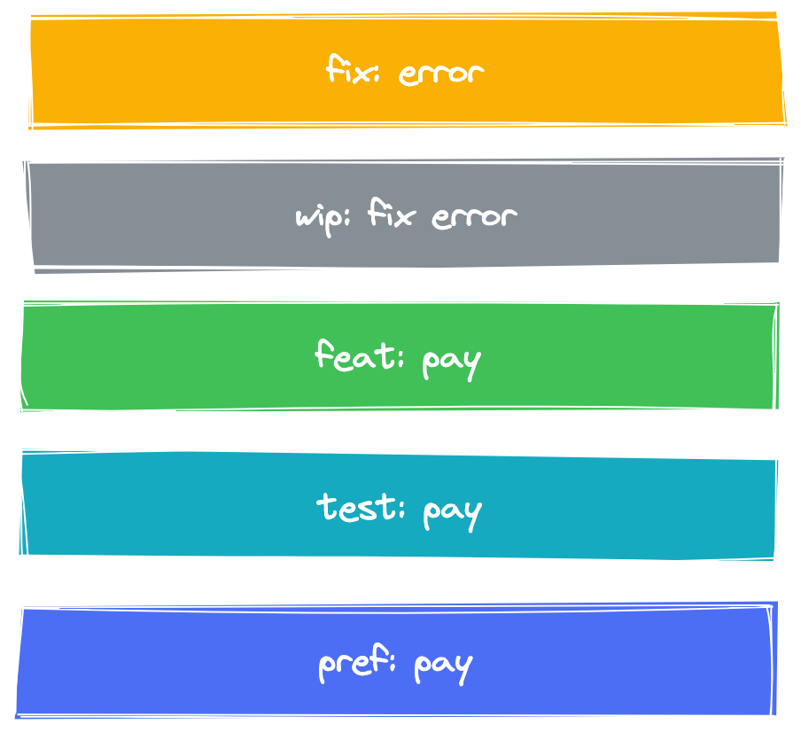
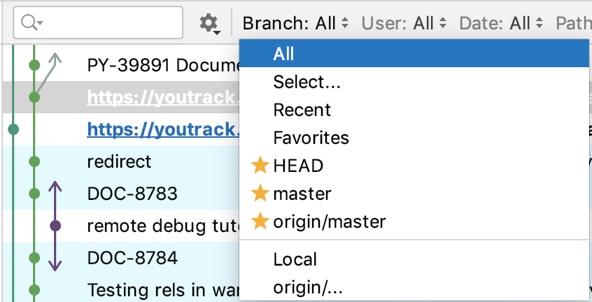
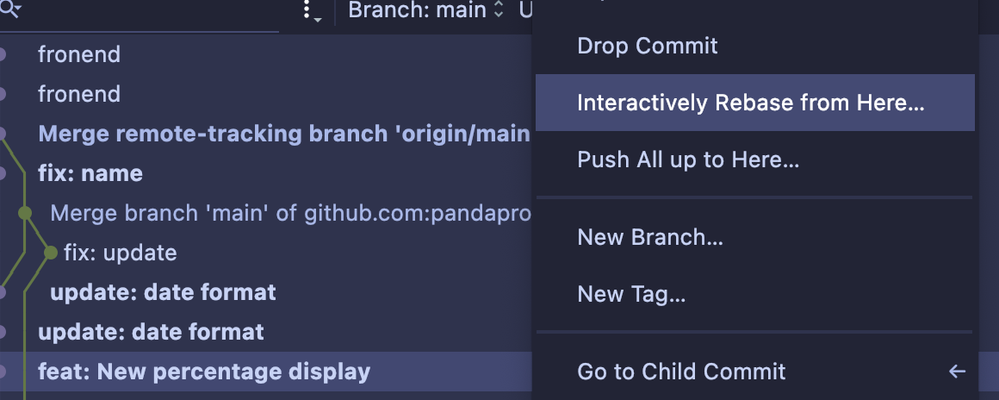
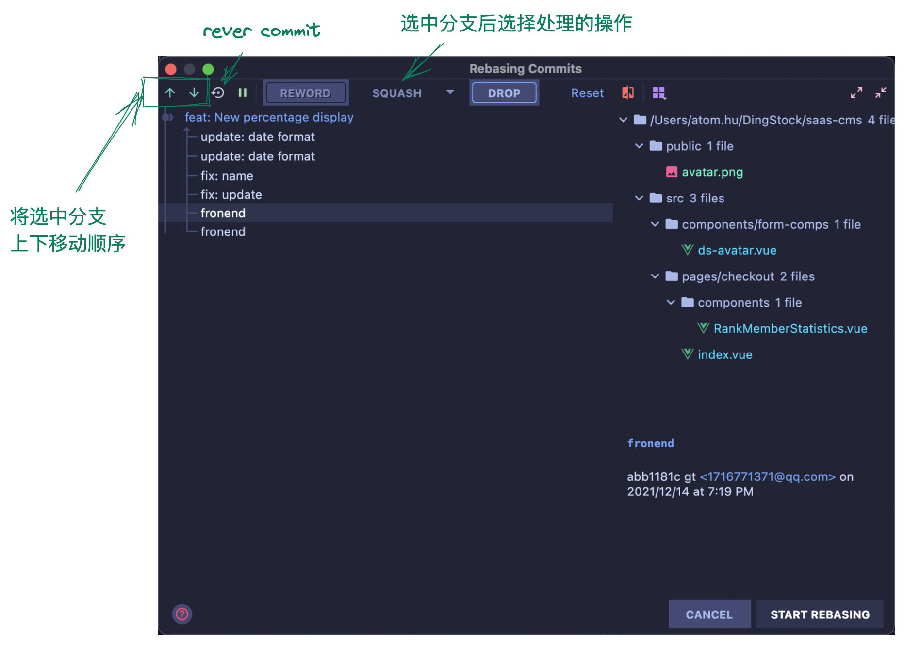

 e

这是知乎上的一个问题[《Git commits历史是如何做到如此清爽的?》](https://www.zhihu.com/question/61283395)<br />作者翻看 Vue 的源码，发现 Vue 的源码非常的干净, 本问题下其实可以改变为 merge 和 rebase 的区别。

## 1. What is rebase？
rebase 中文译为「变基」，本质上和「merge」一样，都是来处理分支之间的合并，只不过「rebase」本身具有更加强大的历史重写功能，就像上面知乎问题中提交的那样，会让「git log 」整个历史看起来比较清爽 干净。


## rebase multiple commit
<br />Rebase 的第一场景就是合并多个 commit，以上图完成一个 支付功能为例，我们完成整个支付功能的开发，需要三次提交，并不能一气呵成就能把代码写完，应该提测之后还会有 bug 还要做修改，等到最后上线之后才能能算是真正的没有问题。

<br />上面是针对功能开发，其实修复 bug 也是这样的道理，修复一个 Bug 因为各种原因 我们会进行修改多次，但是本质都是针对一个问题的连续修复。

<br />如果 Git 项目一直保持这种提交状态，那么我们的 log 历史看起来就会是这样的。就是比较杂乱，不太好进行代码回溯。<br /><br />我们使用 rebase 可以将它整理成这个样子。上面的模拟 log 的图是不是看上去就要清爽很多了。

## rebase in terminal
先看看用原生 git rebase 命令是怎样处理的。
```shell
mkdir test; cd test; git init;

touch file1.txt; git commit -am 'wip(pay): add file1.txt';
touch file2.txt; git commit -am 'wip(pay): add file2.txt';
touch file3.txt; git commit -am 'wip(pay): add file3.txt';
```

git rebae -i HEAD~3 <br />在命令行中输入上述命令之后，会进入到一个可编辑文件中，进行选择对应的 commit 需要怎么处理

- p, pick  = use commit
- r, reword  = use commit, but edit the commit message
- e, edit  = use commit, but stop for amending
- s, squash  = use commit, but meld into previous commit
- f, fixup  = like "squash", but discard this commit's log message
- x, exec  = run command (the rest of the line) using shell
- b, break = stop here (continue rebase later with 'git rebase --continue')
- d, drop  = remove commit
- l, label  = label current HEAD with a name
- t, reset  = reset HEAD to a label
- m, merge [-C  | -c ]  [ - ]

最后在修改一下 提交信息就可以了。

## rebase in「IntelliJ IDEA」
截下来看看在 iji「IntelliJ IDEA」 如何使用 rebase 来处理多个提交

<br />首先打开日志窗口，然后选择我们自己当前所在的分支。

<br />在历史的提交中选择你要处理到的历史提交，就比如说开发功能，就是开发功能的第一提交，因为我们需要 rebase 到这里。在对应位置右键 选择 Interactively Rebase from Here<br /><br />然后就会弹出处理窗口，然后我们选中每一个分支进行它的处理方式，

双击 commit 可以直接修改提交信息，说实话 简直不要太方便。

选择完成后点击 START REBASING 然后 rebase 就完成啦。

## summary
今天介绍了 交互式变基 在「IntelliJ IDEA」 里面的使用，这个功能相比于命令行来说 那可以方便太多了。

不过其实 rebase 不只是用在多个 commit 上，也可以用在 多分支合并上。这个就放到周末补一篇文章来介绍。