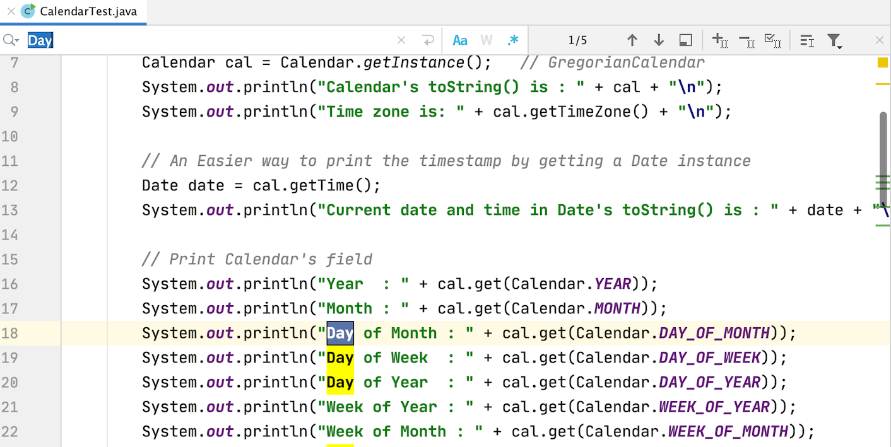
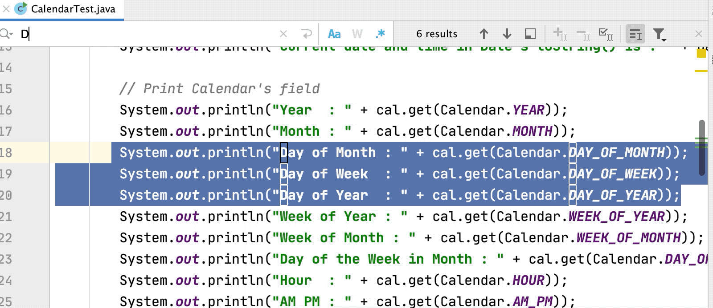
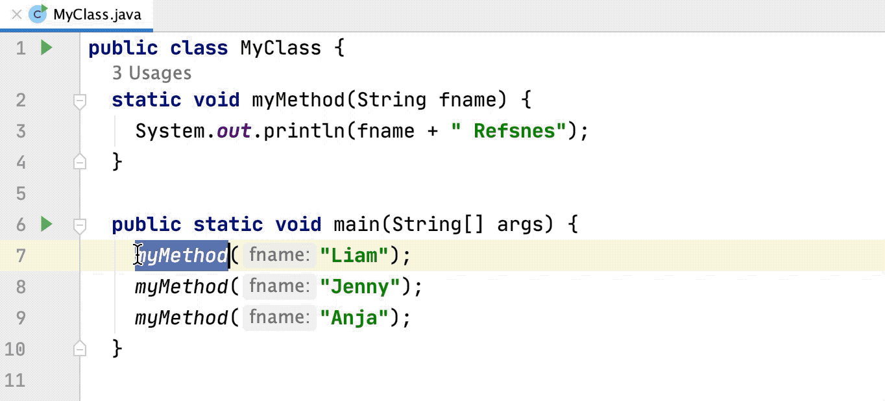
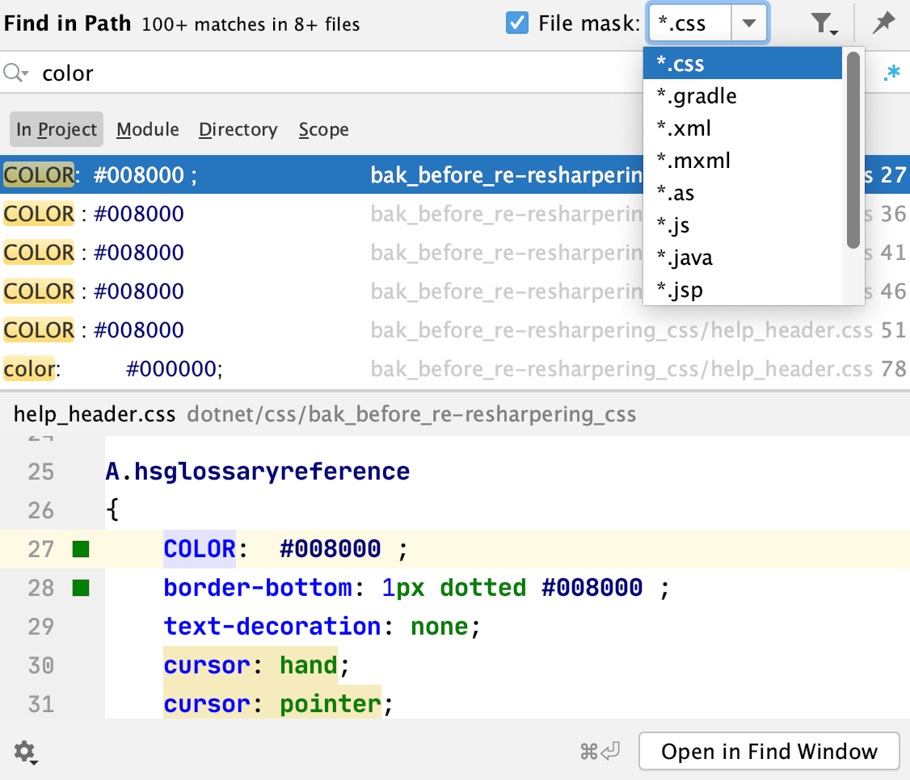
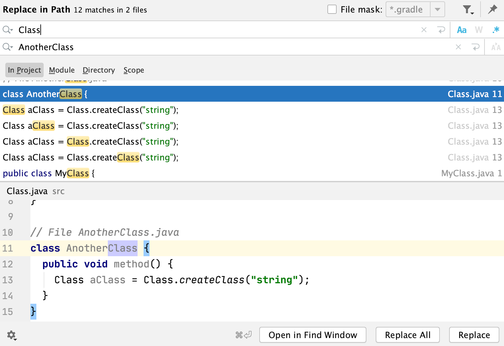
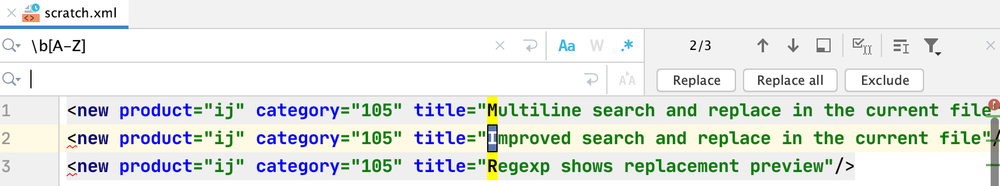

### 在文件中搜索
Command + F 

### 在文件块中搜索
在输入完搜索内容之后 点击 , 然后搜索的内容都在在 选中快中进行搜索的。 

### 选中相中的内容 #效率

- Ctrl + G

### 选中所有相同的内容 并在后追加光标 #效率

- Ctrl + Command + G

### 在工程中 全局搜索  #效率

- Command + Shift + F

### 针对指定的类型进行 搜索

### 对项目中所有的文件进行替换

- Command + Shift + R

### 正则替换

### 查看类在哪里被使用
## TODO: [https://www.jetbrains.com/help/idea/find-highlight-usages.html#find-usages](https://www.jetbrains.com/help/idea/find-highlight-usages.html#find-usages)