分步 是控制程序逐步执行的过程。<br />IntelliJ IDEA 提供了一组步进操作，具体取决于您的策略使用（例如，您是否需要直接进入下一行或在此途中输入调用的方法）。<br />步进按钮位于“调试”工具窗口工具栏上。<br />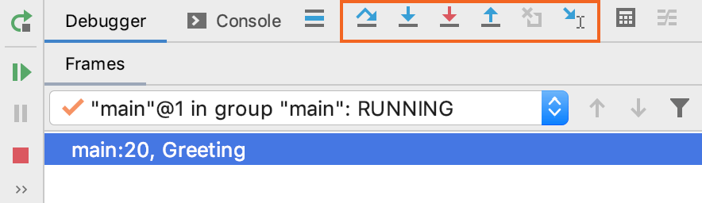
##      越过 「Step Over 」
即使当前突出显示的行中包含方法调用，也将单步执行到当前代码行并带您到下一行。方法的实现将被跳过，您将直接移至调用者方法的下一行。

- 单击“**Step Over**”按钮  或按 **F8**。

在该示例中，将执行第5行。如果您跳过，调试器将直接移至第6行，而无需跳入该`count()`方法。<br /><br />如果跳过的方法中有断点，调试器将在它们处停止。要跳过途中的任何断点，请使用“[强制跨步” (opens new window)](https://jetbrains.com/help/idea/stepping-through-the-program.html#force-step-over)。<br />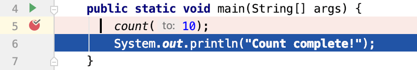
## 步入「step into」
逐步介绍该方法中发生的事情。如果不确定方法是否返回正确的结果，请使用此选项。

- 单击 Step into 执行按钮  或按 F7。

在该示例中，将执行第5行。如果您介入，调试器将跳入该`count(int to)`方法的实现，使您可以详细检查其结果是如何产生的。<br />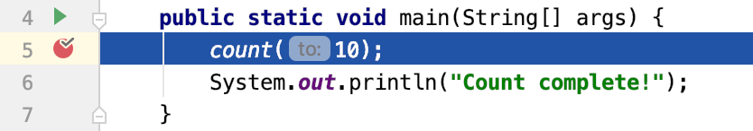<br />如果线路上有多个方法调用，则IntelliJ IDEA会询问您要输入哪种方法。此功能称为“[智能步进” (opens new window)](https://jetbrains.com/help/idea/stepping-through-the-program.html#smart-step-into)。<br />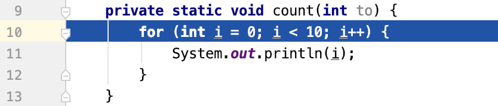<br />您可以将Smart Step Into配置为在线路上有多个方法调用时自动使用。或者，仅当您[明确地 (opens new window)](https://jetbrains.com/help/idea/stepping-through-the-program.html#smart-step-into)调用时，才可以调用它 。要配置此功能，请转到 “设置/首选项” |“设置”。构建，执行，部署| 调试器 步进 并设置始终做智能步入根据需要选择。<br />由于通常不需要调试它们，因此 某些方法（例如的标准Java类方法`System`）会被Step跳过。此列表可以在“构建，执行，部署” |“发布”中进行微调。调试器 步进的页面设置/首选项对话框 ⌘,。
## 
## 智能步入 「Smart step into」
当一行上有多个方法调用，并且您想具体说明要输入哪种方法时，智能步入很有用。此功能使您可以选择感兴趣的方法调用。

1. 从主菜单中，选择Run | Debugging Actions | Smart Step Into 或 按⇧F7。<br />
1. 单击方法。您也可以使用箭头键或选项卡选择它，然后按⏎/ F7。<br /><br />

每次在线上有多个方法调用时，都 可以配置要使用的智能步进而不是常规 步进。这是在 **Settings/Preferences | Build, Execution, Deployment | Debugger | Stepping .**
## 
## 走出去「Step out」
退出当前方法，然后转到调用者方法。

- 单击“单步执行”按钮  或按 ⇧F8。

在示例中，单步执行将跳过循环的所有迭代，并直接进入`main`方法（调用方）。<br />
## 跳出代码块「Step out of code block」
退出当前执行的代码块。这使您可以跳过剩余的迭代 `while`，`for`并且都没有离开封闭的方法。

- 从主菜单中，选择 Run | Debugging Actions | Step Out of Code Block.

在该示例中，该动作退出`for`循环，并带我们到第12行。请注意，循环无论如何都已执行，并且输出在控制台中可见，就像我们逐步完成了每个迭代一样。<br />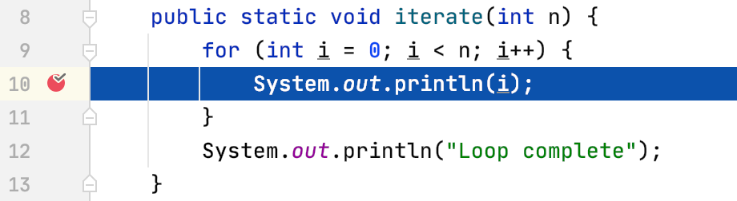
## 运行到光标「Run to cursor」
继续执行直到插入符号的位置。

1. 将插入号放在您要程序暂停的行上。<br />
1. 单击运行至光标按钮  或按 ⌥F9。<br />另外，您可以通过单击装订线中的行号来运行到光标。<br />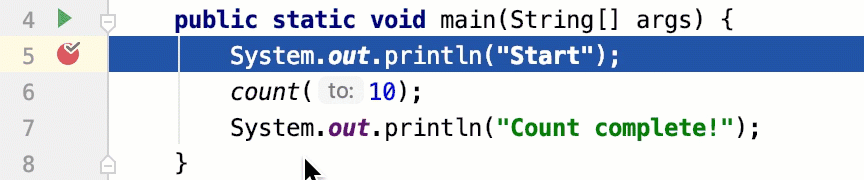<br />

您可以配置是否要运行“游标”以单击“设置/首选项” |“行”中的行号。 构建，执行，部署| 调试器。<br />在该示例中，“运行到游标”将继续执行并在第7行停止，就好像存在断点一样。如果方法中有断点`count()` ，则程序将在那里暂停。<br />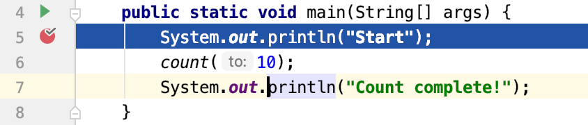<br />要跳过途中的任何断点，请使用[强制运行到光标 (opens new window)](https://jetbrains.com/help/idea/stepping-through-the-program.html#force-run-to-cursor)。
## 
## 强制进入「Force step into」
即使常规Step Into[跳过 (opens new window)](https://jetbrains.com/help/idea/stepping-through-the-program.html#configuring-skipped-list)了此方法，也要执行该方法中的步骤。

- 单击“强制进入”按钮  或按 ⌥⇧F7。

在该示例中，执行将在要调用的行之前暂停 `System.out.println()`。<br />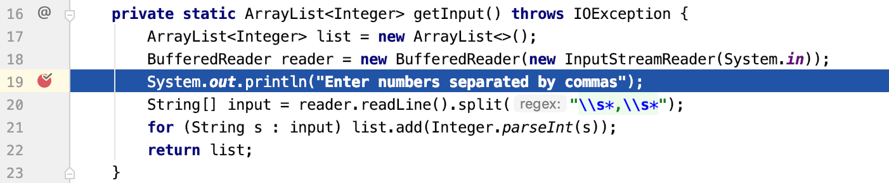<br />使用Force Step Into，我们可以直接进入`System.out.println()` 方法的实现 ，而常规的Step Into将使我们进入第20行。<br />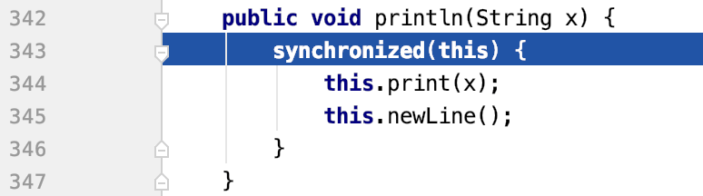
## 强制运行到光标「Force run to cursor」
继续执行直到插入符号的位置。途中的所有断点都将被忽略。

1. 将插入号放在您要程序暂停的行上。<br />
1. 从主菜单中，选择 Run | Debugging Actions | Force Run to Cursor 或按 ⌥⌘F9。<br />

在该示例中，“强制运行至光标”将继续执行并在第7行停止，就好像有一个断点一样。内部的断点`count()`将不起作用。<br />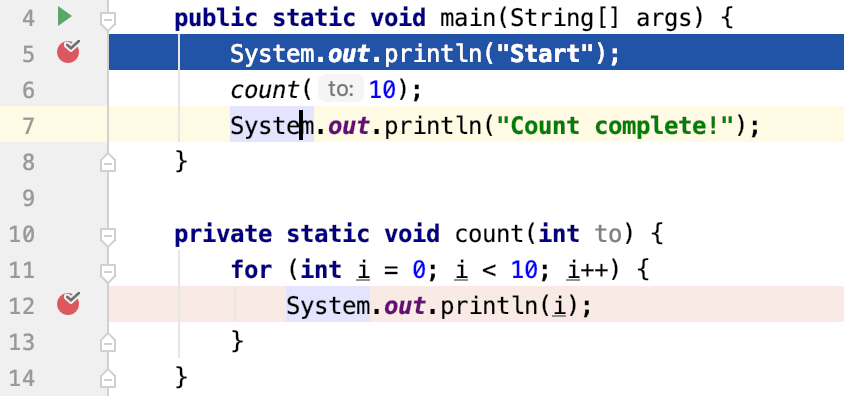
## 强制越过「force-step-over」
即使当前突出显示的行中包含方法调用，也将单步执行到当前代码行并带您到下一行。如果被调用的方法中有断点，则将其忽略。

- 从主菜单中，选择 运行| 强制跨步 或按 ⌥⇧F8。

在该示例中，即使`count()`方法中有断点，强制步进也会将您带到第6行的打印语句，否则，如果使用步进，则会在循环的所有迭代中暂停应用程序。<br />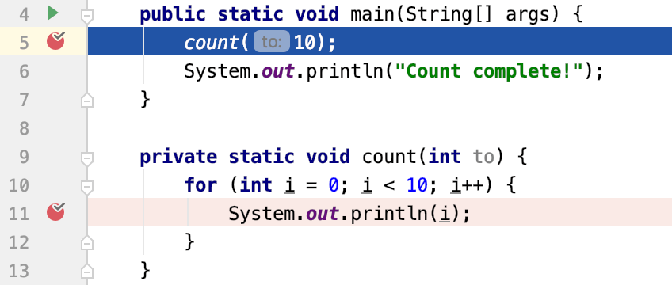
## 落架「drop-frame」
允许您撤消最后一帧并恢复堆栈中的前一帧。例如，如果您错误地走得太远，或者想重新进入错过关键点的功能，这可能会很有用。<br />请注意，此选项仅影响局部变量，不会恢复程序的整体状态，因为它不会还原静态变量和实例变量的值。这可能会导致程序流程更改。

- 单击“落帧”按钮 。

在示例中，放下框架将使您返回到调用方方法，就好像`count`从未执行过一样。<br />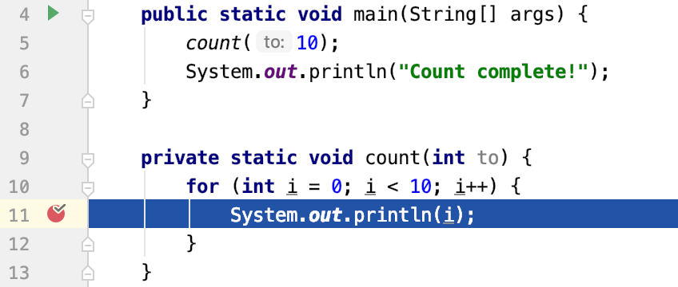<br />没有受影响的静态或实例变量，但是控制台输出保持不变。
```
0
1
2
```
> ### 注意
> 丢帧 不等于回到过去。在调试应用程序时，请记住这一点。