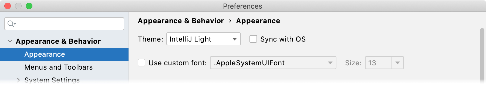
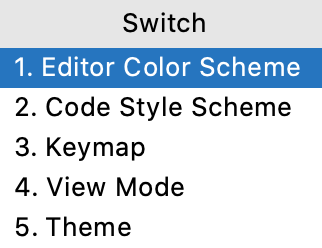

界面主题定义窗口、对话框、按钮和用户界面的所有可视元素的外观。缺省情况下，IntelliJ IDEA 使用 Darcula 主题，除非您在第一次运行时更改它。

## 更改 UI 主题
在 设置/首选项 对话框 something 中，选择外观和行为 | 外观。

从主题列表中选择 UI 主题:

IntelliJ Light: 基于 IntellijIDE 的传统光主题 macOS Light 或 Windows 10 Light: 特定于操作系统的灯光主题作为一个绑定插件提供 Darcula 默认的黑暗主题 High contrast: 为用户设计的主题色盲

也可以选择 Sync with OS 让 IntelliJ IDEA 检测当前系统设置，并相应地使用默认的黑色或亮色主题

## 🧐👩‍💻🙋🏻‍♂️
可以使用 Switch 弹窗快速修改 **主题** 

## 一些主题下载站

- [http://www.color-themes.com/?view=index](http://www.color-themes.com/?view=index)
- [http://www.riaway.com/theme.php?page=2](http://www.riaway.com/theme.php?page=2)