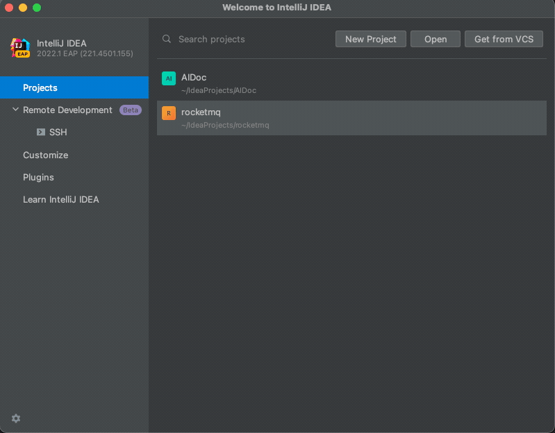
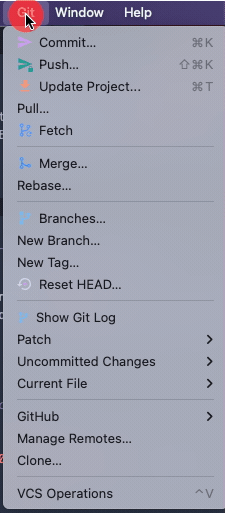
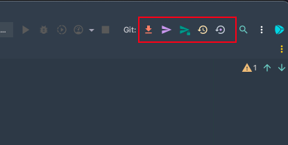
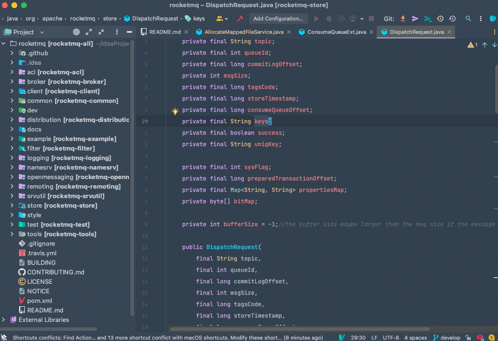
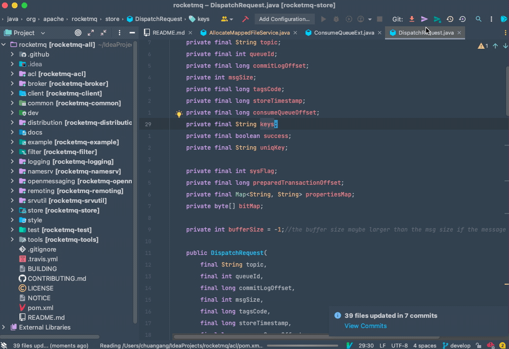
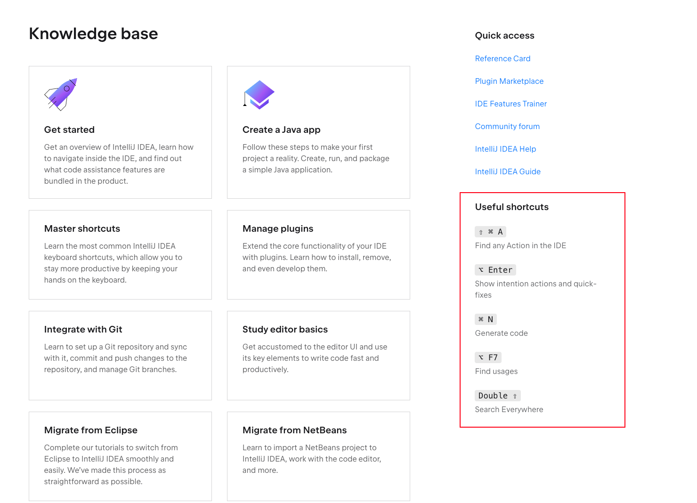
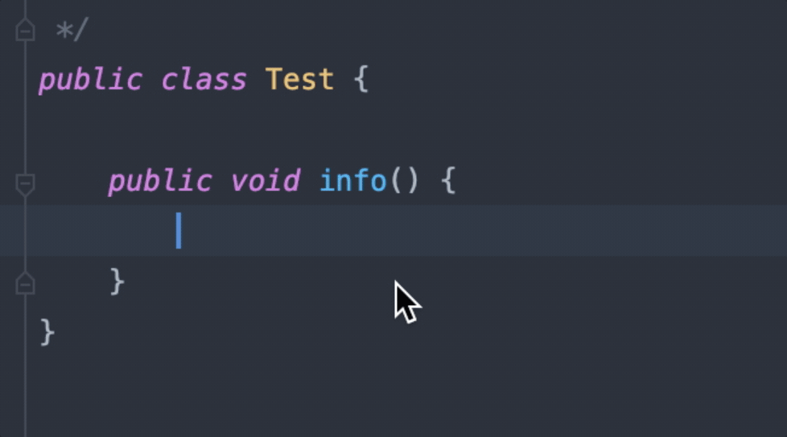

现在我们已经完成了软件的安装和创建了第一个 Java 项目, 接下来我们就可以开始尝试学习更多的使用 。

### 接下来可能会遇到这样几个问题

1. 我们的项目都是使用 Git 管理的，我怎样通过 IntelliJ IDEA 拉取 Git 仓库上的代码？

2. 我是从 Eclipse 上转移过来的，其实对于编辑器这块不是很陌生，我怎么快速迁移？

3. 尝试学会最基本的小技巧，提升工作效率。

### 集成 Git

在启动页面，可以直接选择 Get from VCS ，然后填入仓库的地址即可。

如果是在项目里面执行，也可以在上方菜单栏中选择 Code 然后选择 Clone 

对于一个开始使用 IntelliJ IDEA 的用户来说，你只需要使用上图中的几个图标就可以完成基本的工作了。

| icon | 功能             | 对应命令        |
| ---- | ---------------- | --------------- |
|      | 更新项目         | git pull        |
|      | 提交项目         | git commit      |
|      | 推送到远端       | git push        |
|      | 查看文件改动历史 | git history     |
|      | 取消修改         | git checkout  . |

查看项目的修改历史，如果是在某个文件中点击此按钮，那么显示的就是这个文件的历史内容，然后点击左侧的 Log Tab栏，就可以看到项目的整体的日志，还可以根据分支查看。

更新项目，可以选择是用过 merge 的方式 还是 rebase 的方式。这个主要看团队的规范，并没有强制的规定。

提交项目，就是 git commit

### 最常用的快捷键

首先我们打开官方文档首页，右下角就有5个非常醒目的快捷键，可想而知，官方将它放在这个位置，足以说明它的重要性。

#### Find any Action in the IDE

简单来讲 IntelliJ IDEA 中大部分的命令都可以转换为一个 Action。就比如说上面提到的 git pull, git rebase。

可通过 快捷键 command + shift + A 呼出搜索框。

也可点击项目上方的搜索图标呼出

注意看上图中，我们其实没有点击什么按钮，而是直接呼出了一个搜索框，然后输入 git clone 然后也能进行 git clone

通过 Action 查看当前项目分支

#### Show intention actions and quick-fixes [展示意图行动和快速修复]

简单讲就是可以快速修改代码。

