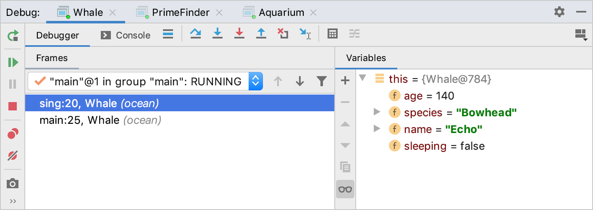
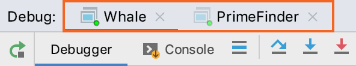
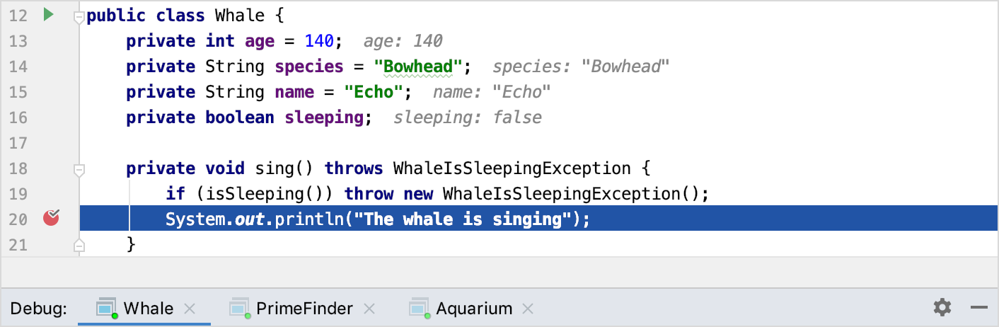
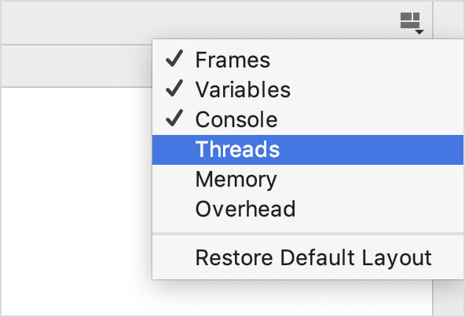
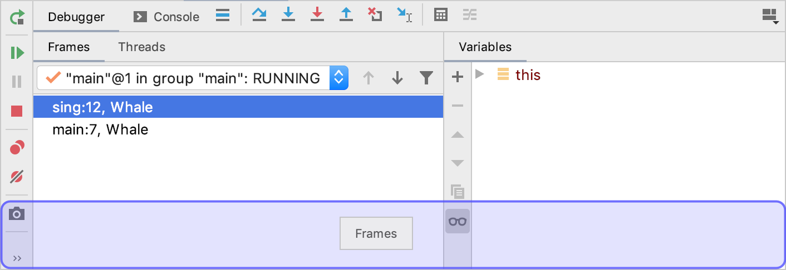
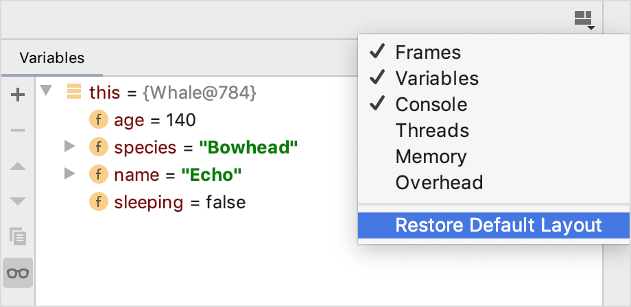

默认情况下，当您的程序遇到断点时，“**调试**工具”窗口将打开，而在会话终止时则不会隐藏。要更改此行为，请清除 “**构建，执行，部署” |“**在断点上**显示调试窗口在断点上”**复选框。**设置/首选项的 **调试器**页面。 
## 
## 会话
可用的调试会话在“调试工具”窗口的顶部被分隔为选项卡。  如果为特定的运行/调试配置启用“服务”窗口，则在调试这些配置时，“调试”窗口的整个视图将显示在“服务”窗口中。 所选会话选项卡将显示所有信息，如内联变量值和执行点。如果要并行运行多个使用相同类的调试会话，则这一点很重要。 
## 标签
**调试**工具窗口为每个会话显示以下选项卡：

- [框架 (opens new window)](https://www.jetbrains.com/help/idea/examining-suspended-program.html#examine-frames)：使您可以在线程的调用堆栈中导航。 
- [变量 (opens new window)](https://www.jetbrains.com/help/idea/examining-suspended-program.html#variables)：列出当前上下文中可用的变量，并让您分析和修改程序状态。 
- [手表 (opens new window)](https://www.jetbrains.com/help/idea/examining-suspended-program.html#watches)：让您管理手表。默认情况下，监视显示在“**变量”**选项卡上，以更有效地利用屏幕空间。如果您有很多手表，请考虑在单独的标签中查看它们。 
- 控制台：显示程序输出。 对于本地会话，该选项卡的作用与您在未连接调试器的情况下运行该程序的作用相同。唯一的区别是调试器输出（例如，来自断点的日志消息）已添加到控制台。 当您附加到进程时，程序输出不会重定向，并且调试器控制台中仅显示调试器输出。 
- [线程 (opens new window)](https://www.jetbrains.com/help/idea/examining-suspended-program.html#examine-frames)：显示活动线程列表，并允许您在它们之间切换。在此选项卡中，您可以以文本格式导出线程信息。 
- [内存 (opens new window)](https://www.jetbrains.com/help/idea/analyze-objects-in-the-jvm-heap.html)：提供有关堆上当前可用对象的信息，并允许您监视和分析它们的生存期。 
- [开销 (opens new window)](https://www.jetbrains.com/help/idea/monitor-debugger-overhead.html)：允许您监视特定调试器功能消耗的资源并优化调试器性能。 
### 
### 显示/隐藏标签

### 移动标签

### 恢复默认布局
