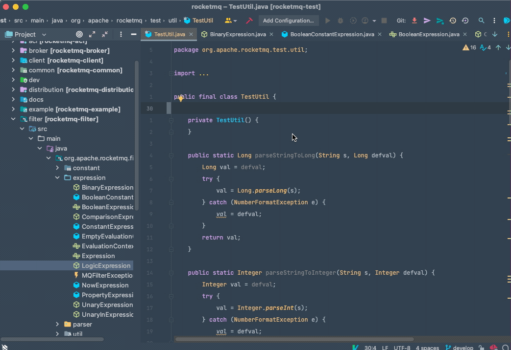
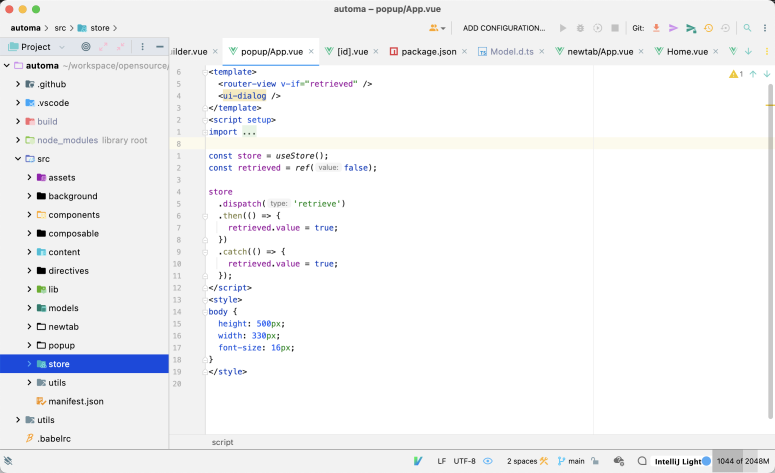
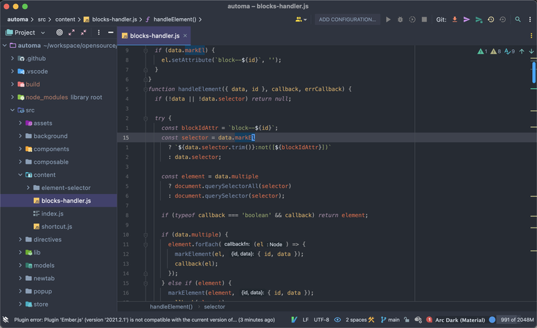
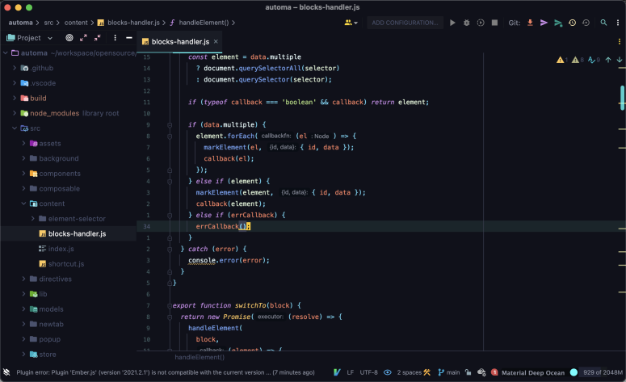
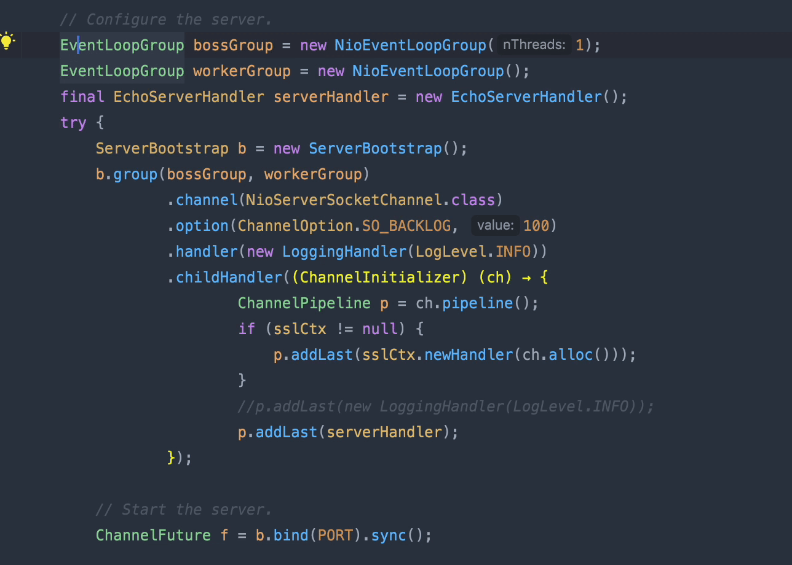

### 快速回到上一次编辑处

不知道大家有没有这样的场景，我正在某处编码，但是我需要去看看其他的代码的位置，可能短时间内浏览了几个文件，最后我要切换到我刚开始编辑的地方。

上图 GIF 步骤

- 随便找一个文件 写一个 main 方法，写下 todo 注释 模拟长场景
- 然后浏览文件，多浏览几个
- 然后通过快捷键回到刚在正在编辑的位置。

### 主题

大家每天大部分的时间都是在用编辑器开发功能也好修改Bug 也好，有的时候换换主题换换风格，也会给人一种不一样的感觉，有的时候瞬间感觉 代码都变得好看了，修改 Bug 的效率更高了。

> 下面随便放几个例子。

IntelliJ Light

Acr Dark

### 多光标

多光标是属于奇淫技巧了，在关键时刻能派上大用处，处理简单的数据结构，我只能说 YYDS

### 代码片断

我演示的也只是冰山一角，真正好用的功能还待发掘。

### Vim

在 IntelliJ IDEA 中使用 Git 是我在这些编辑器里面体验感觉最好的。如果你平常用 Vim 编辑器，那么在切换到 IntelliJ IDEA 下面真的真的 会非常舒服。

### Git

IntelliJ IDEA 中的 Git 也是非常的强大，真的是能解决你所有的场景。

